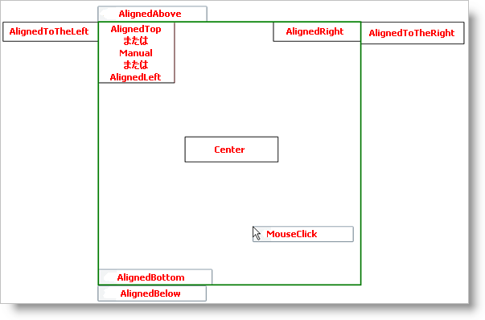

////

|metadata|
{
    "name": "xamcontextmenu-set-xamcontextmenus-location",
    "controlName": ["xamContextMenu"],
    "tags": ["Getting Started","How Do I","Layouts"],
    "guid": "{3EA876B1-A547-402E-8730-54D674A67D01}",  
    "buildFlags": [],
    "createdOn": "2016-05-25T18:21:54.8120989Z"
}
|metadata|
////

= xamContextMenu の位置を設定

xamContextMenu™ コントロールは、Microsoft® {PlatformName}™ で ContextMenu コントロールの配置をエミュレートするいくつかのプロパティを公開します。xamContextMenu コントロールの配置は、以下の配置関連のプロパティの組み合わせによって決定されます。

* link:{ApiPlatform}controls.menus.xammenu{ApiVersion}~infragistics.controls.menus.xamcontextmenu~placement.html[配置] - 配置ターゲットに相対して xamContextMenu の配置を決定します。ただし、このプロパティを明示的に設定しなければ、デフォルトで MouseClick に設定され、PlacementTarget プロパティと PlacementRectangle プロパティは無視されます。以下のスクリーンショットは、異なる PlacementMode 列挙値の場所を示します。スクリーンショットの緑の四角形は、配置ターゲットを表します。

ifdef::sl[]
[NOTE]
====
*注:* Silverlight プラグイン オブジェクトが、エンドユーザーがそれを開いた時に xamContextMenu コントロールをクリップする場合、xamContextMenu コントロールは自動的にそれ自体を配置するので、すべてのメニュー項目が表示できます。
====
endif::sl[]

* link:{ApiPlatform}controls.menus.xammenu{ApiVersion}~infragistics.controls.menus.xamcontextmenu~placementtarget.html[PlacementTarget] - 他の配置関連のプロパティを適用する前に xamContextMenu が開始場所として使用する UIElement を決定します。このプロパティを明示的に設定しなければ、xamContextMenu を添付するコントロールがデフォルトの配置ターゲットとなります。
* link:{ApiPlatform}controls.menus.xammenu{ApiVersion}~infragistics.controls.menus.xamcontextmenu~placementrectangle.html[PlacementRectangle] - このプロパティを Rect 構造に設定して、コンテキスト メニューが配置に使用する配置ターゲットに相対する四角形領域を定義できます。XAML では、最初の値を左の x 軸、二番目の値を上の y 軸、三番目の値を幅、そして四番目の値を高さというように、このプロパティをコンマで区切られた値の文字列に設定することができます。
* link:{ApiPlatform}controls.menus.xammenu{ApiVersion}~infragistics.controls.menus.xamcontextmenu~horizontaloffset.html[HorizontalOffset] - このプロパティを正の数値に設定して、コンテキスト メニューとその配置の水平方向の間隔を決定することができます。Placement、PlacementTarget、および PlacementRectangle プロパティが適用された後で水平方向のオフセットが適用されます。
* link:{ApiPlatform}controls.menus.xammenu{ApiVersion}~infragistics.controls.menus.xamcontextmenu~verticaloffset.html[VerticalOffset] - このプロパティを正の数値に設定して、コンテキスト メニューとその配置の垂直方向の間隔を決定することができます。Placement、PlacementTarget、および PlacementRectangle プロパティが適用された後で垂直方向のオフセットが適用されます。

以下の例のコードは、xamContextMenu の配置を設定する方法を示します。xamContextMenu を添付するコードは、便宜的に省略されています。xamContextMenu をコントロールに添付するコード例については、 link:xamcontextmenu-getting-started-with-xamcontextmenu.html[「xamContextMenu をコントロールに追加」]を参照してください。

*XAML の場合:*

----
<ig:XamContextMenu Placement="AlignedBottom">
    <!--TODO: ここに XamMenuItem オブジェクトを追加します-->
</ig:XamContextMenu>
----

*Visual Basic の場合:*

----
Dim xamContextMenu1 As New XamContextMenu With {.Placement = PlacementMode.AlignedBottom}
'TODO: xamMenuItem オブジェクトをコンテキスト メニューに追加します
----

*C# の場合:*

----
XamContextMenu xamContextMenu1 = new XamContextMenu
{
    Placement = PlacementMode.AlignedBottom
};
//TODO: XamMenuItem オブジェクトをコンテキスト メニューに追加します
----

== 関連トピック

link:xamcontextmenu-opening-and-showing-xamcontextmenu.html[xamContextMenu を開いて表示]

link:xamcontextmenu-set-xamcontextmenus-location.html[xamContextMenu の位置を設定]

link:xammenu-binding-to-data.html[データにバインドする]

link:xammenu-adding-and-removing-items.html[項目の追加と削除]

link:xammenu-adding-separators-between-xammenuitems.html[セパレーターを XamMenuItems 間に追加]

link:xammenu-adding-icons-to-xammenuitems.html[アイコンを XamMenuItems に追加]

link:xammenu-adding-check-boxes-to-xammenuitems.html[チェックボックスを XamMenuItems に追加]