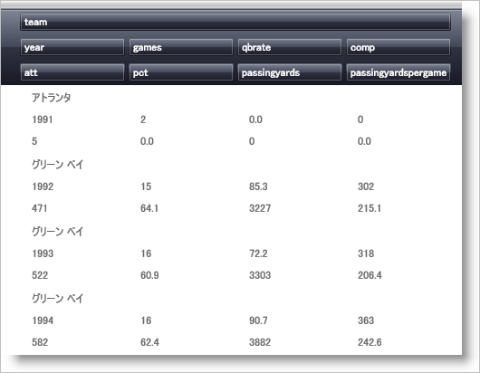

////

|metadata|
{
    "name": "xamdata-arranging-cells-within-the-record",
    "controlName": ["xamDataPresenter"],
    "tags": ["Editing","Templating"],
    "guid": "{1223FF2A-82A7-4CF2-A034-323D15EBC889}",  
    "buildFlags": [],
    "createdOn": "2012-01-30T19:39:52.4898511Z"
}
|metadata|
////

= レコード内にセルを配置

xamDataPresenter コントロールは、レコード内のセルのシンプルな配置と複雑な配置の両方をサポートします。配置は手動で (明示的に) 指定する、または自動生成する ("AutoArrange") のいずれかが可能です。link:{ApiPlatform}datapresenter{ApiVersion}~infragistics.windows.datapresenter.datapresenterbase~fieldlayoutsettings.html[FieldLayoutSettings] の link:{ApiPlatform}datapresenter{ApiVersion}~infragistics.windows.datapresenter.fieldlayoutsettings~autoarrangecells.html[AutoArrangeCells] プロパティを LeftToRight または TopToBottom のいずれかに設定することによって、AutoArrange 機能を有効にできます。このプロパティを Never に設定することで、AutoArrange 機能は無効になります。

[NOTE]
====
*注:* ビューは、このプロパティの最終的なデフォルトを提供します。たとえば、カルーセル ビューでは AutoArrange プロパティを TopToBottom にデフォルト設定しますが、グリッド ビューでは link:{ApiPlatform}datapresenter{ApiVersion}~infragistics.windows.datapresenter.gridviewsettings~orientation.html[Orientation] 設定に基づいてデフォルトを変更します。Vertical の方向では AutoArrangeCells が LeftToRight にデフォルトで設定されますが、Horizontal の方向では AutoArrangeCells は TopToBottom にデフォルトで設定されます。
====

== AutoArrange 機能

AutoArrange 機能は、プレフィックス "AutoArrange" で始まる link:{ApiPlatform}datapresenter{ApiVersion}~infragistics.windows.datapresenter.fieldlayoutsettings.html[FieldLayoutSettings] 上のプロパティによって制御されます。プロパティは以下のとおりです。

* link:{ApiPlatform}datapresenter{ApiVersion}~infragistics.windows.datapresenter.fieldlayoutsettings~autoarrangecells.html[AutoArrangeCells] -- 上記のとおりです。
* link:{ApiPlatform}datapresenter{ApiVersion}~infragistics.windows.datapresenter.fieldlayoutsettings~autoarrangemaxcolumns.html[AutoArrangeMaxColumns] -- 各 link:{ApiPlatform}datapresenter{ApiVersion}~infragistics.windows.datapresenter.datarecord.html[DataRecord] の link:{ApiPlatform}datapresenter{ApiVersion}~infragistics.windows.datapresenter.datarecordcellarea.html[DataRecordCellArea] 内のグリッドに生成される列の最大数を決定します。各 Field に 1 列スロットが割り当てられます。
* link:{ApiPlatform}datapresenter{ApiVersion}~infragistics.windows.datapresenter.fieldlayoutsettings~autoarrangemaxrows.html[AutoArrangeMaxRows] -- 各 DataRecord の DataRecordCellArea 内のグリッドに生成される行の最大数を決定します。各 Field に 1 行スロットが割り当てられます。
* link:{ApiPlatform}datapresenter{ApiVersion}~infragistics.windows.datapresenter.fieldlayoutsettings~autoarrangeprimaryfieldreservation.html[AutoArrangePrimaryFieldReservation] -- 主要なフィールドの最初の行または列全体を予約できます。デフォルトで、主要フィールドは link:{ApiPlatform}datapresenter{ApiVersion}~infragistics.windows.datapresenter.fieldlayout~fields.html[Fields] コレクション内の最初のフィールドです。ただし、 link:{ApiPlatform}datapresenter{ApiVersion}~infragistics.windows.datapresenter.field~isprimary.html[IsPrimary] プロパティを True を設定することによって、任意フィールドを主要フィールドにすることができます。

以下の例の XAML は、AutoArrange 機能を使用する方法を例示します。

----
<igDP:XamDataGrid> 
        <igDP:XamDataGrid.FieldLayoutSettings> 
                <igDP:FieldLayoutSettings 
                  AutoArrangeCells="LeftToRight" 
                  AutoArrangeMaxColumns="4" 
                  AutoArrangeMaxRows="3"
                  AutoArrangePrimaryFieldReservation="ReserveFirstRow"/> 
                </igDP:XamDataGrid.FieldLayoutSettings> 
        <igDP:XamDataGrid.FieldLayouts> 
                <igDP:FieldLayout> 
                        <igDP:FieldLayout.Fields> 
                                <igDP:Field Name="team" IsPrimary="True"/> 
                        </igDP:FieldLayout.Fields> 
                </igDP:FieldLayout> 
        </igDP:XamDataGrid.FieldLayouts> 
</igDP:XamDataGrid>
----

主要フィールドの予約を処理した後で、AutoArrangeCells が TopToBottom に解決される場合、前のフィールドよりも 1 つ大きい行番号が各フィールドに割り当てられます (順序は Fields コレクション内のフィールドの順序によって決定します)。AutoArrangeMaxRows に達すると、行番号がリセットされ列番号が大きくなります。AutoArrangeMaxColumns に達するまでこのプロセスは繰り返します。これは「蛇行」パターンでセルを効果的にレイアウトします。もちろん、AutoArrangeCells が LeftToRight に解決する場合、列番号は行番号の前に大きくなります。これによって異なる蛇行パターンを作成します。

[NOTE]
====
*注:* ビューも、AutoArrangeMaxColumns プロパティと AutoArrangeMaxRows プロパティ両方に最終的なデフォルトを提供します。たとえば、カルーセル ビューでは AutoArrangeMaxColumns プロパティが "1" にデフォルトで設定され、AutoArrangeMaxRows プロパティが "3" に設定されます。グリッド ビューでは、これら両方のプロパティは "0" にデフォルトで設定され、これは最大が適用されないことを意味します。
====

== 手動 (または明示的) のセルのレイアウト

FieldLayoutSettings の AutoArrangeCells プロパティが Never に設定される場合、AutoArrange 機能は無効になり、各フィールドのセル位置は手動で指定する必要があります。デフォルトで、各 Field セルはセル領域内の 0/0 列/行スロットを占めます。複数フィールドがある時には、互いの上にすべてのセルをスタックすることをおそらく望ましくないでしょう。幸運なことに、Field は link:{ApiPlatform}datapresenter{ApiVersion}~infragistics.windows.datapresenter.fielditem~column.html[Column]、 link:{ApiPlatform}datapresenter{ApiVersion}~infragistics.windows.datapresenter.fielditem~columnspan.html[ColumnSpan]、 link:{ApiPlatform}datapresenter{ApiVersion}~infragistics.windows.datapresenter.fielditem~row.html[Row]、および link:{ApiPlatform}datapresenter{ApiVersion}~infragistics.windows.datapresenter.fielditem~rowspan.html[RowSpan] プロパティを公開しており、これらによって希望通り任意にセルを配置することができます。

[NOTE]
====
*注:* AutoArrangeCells プロパティが Never に設定されない限り、これらのプロパティは無視されます。詳細は、 link:xamdatagrid-changing-the-default-column-and-row-definitions.html[デフォルトの列と行の定義を変更]を参照してください。
====

以下の例のコードは、コードの下の画像に示したセルの配置を定義します。

----
<igDP:XamDataGrid> 
        <igDP:XamDataGrid.FieldLayoutSettings> 
                <igDP:FieldLayoutSettings 
                  AutoArrangeCells="Never"/> 
        </igDP:XamDataGrid.FieldLayoutSettings> 
        <igDP:XamDataGrid.FieldLayouts> 
                <igDP:FieldLayout> 
                        <igDP:FieldLayout.Fields> 
                                <igDP:Field Name="ProductName" ColumnSpan="2"/> 
                                <igDP:Field Name="CostPerUnit" Row="1"/> 
                                <igDP:Field Name="Quantity" Row="1" Column="1"/> 
                                <igDP:Field Name="ShipAndHandle" Row="2"/> 
                                <igDP:Field Name="Discount" Row="2" Column="1"/> 
                                <igDP:Field Name="Total" Row="3" ColumnSpan="2"/> 
                        </igDP:FieldLayout.Fields> 
                </igDP:FieldLayout> 
        </igDP:XamDataGrid.FieldLayouts> 
</igDP:XamDataGrid>
----

image::images/xamDataGrid_Changing_the_Default_Column_and_Row_Definitions_01.png[自動配置が無効効にされてるときに xamDataGrid でフィールドの配置]

== AutoFit 機能

DataPresenterBase クラスはデフォルトに設定可能なブール値の link:{ApiPlatform}datapresenter{ApiVersion}~infragistics.windows.datapresenter.datapresenterbase~autofit.html[AutoFit] プロパティを公開します。AutoFit が設定されていない場合には、ビューが適切なデフォルト値を提供します。たとえば、グリッド ビューはデフォルトで False に設定されますが、カルーセル ビューはデフォルトで True に設定されます。

以下の例のコードは、XAML で AutoFit プロパティを設定する方法を示しています。

----
<igDP:XamDataGrid AutoFit="True"/>
----

[NOTE]
====
*注:* サイズ項目がレコードごとに使用可能なサイズを指示するビュー (たとえば、カルーセル ビュー) に対して AutoFit プロパティが True に設定されると、View の link:{ApiPlatform}datapresenter{ApiVersion}~infragistics.windows.datapresenter.viewbase.html[IsAutoFitHeightSupported] プロパティと link:{ApiPlatform}datapresenter{ApiVersion}~infragistics.windows.datapresenter.viewbase.html[IsAutoFitWidthSupported] プロパティに基づいていずれかまたは両方の寸法でレコード内に収まるようにセルのサイズを変更します。
====

グリッド ビューなどのビューで、すべてのレコードは、その link:{ApiPlatform}datapresenter{ApiVersion}~infragistics.windows.datapresenter.gridviewsettings~orientation.html[Orientation] に基づいてひとつの次元に制限されます。たとえば、Orientation プロパティが Vertical に設定されていると、すべての link:{ApiPlatform}datapresenter{ApiVersion}~infragistics.windows.datapresenter.recordpresenter.html[RecordPresenter] の幅はコントロール内にきちんと収まるように設定されます。これによって水平スクロール バーはなくなります。同様に、Orientation プロパティが Horizontal に設定されていると、高さはコントロール内にきちんと収まるように設定されます。これによって垂直スクロール バーはなくなります。

== 高度なセルのレイアウト

通常とは異なるレイアウトの設定のために以下のプロパティが link:{ApiPlatform}datapresenter{ApiVersion}~infragistics.windows.datapresenter.fieldlayoutsettings.html[FieldLayoutSettings] クラスから公開されています。

* link:{ApiPlatform}datapresenter{ApiVersion}~infragistics.windows.datapresenter.fieldlayoutsettings~datarecordcellareagridtemplate.html[DataRecordCellAreaGridTemplate] -- DataRecordCellArea 内で使用されるグリッドのテンプレートを指定します。このテンプレート グリッドに設定されるプロパティ (Row 定義と Column 定義がある場合にはそれらを含む) は、セル領域にセルを配置するために実際的に使用される Grid要素を作成するために、xamDataPresenter によって使用されます。これによって、セルの配置方法に対する多数の制御を提供します。提供するグリッドにすべてのセルを保持するために十分な列と行の両方またはいずれか一方が含まれない場合、xamDataPresenter は link:{ApiPlatform}datapresenter{ApiVersion}~infragistics.windows.datapresenter.fieldlayoutsettings~defaultcolumndefinition.html[DefaultColumnDefinition] および link:{ApiPlatform}datapresenter{ApiVersion}~infragistics.windows.datapresenter.fieldlayoutsettings~defaultrowdefinition.html[DefaultRowDefinition] プロパティが指定されている場合にこれらのプロパティを使用して必要な数だけ追加の行と列を作成します (これらのプロパティの説明は以下の 2 項目を参照してください)。これらのデフォルトのいずれかまたは両方が指定されていない場合、xamDataPresenter は内部のデフォルトを使用します。提供するグリッドに必要以上の列と行の両方またはいずれか一方が含まれる場合、追加の列と行の両方またはいずれか一方は無視されます。
* DefaultColumnDefinition -- この列定義での設定は、セル領域にセルを配置するために使用されるグリッド内のあらゆる列に使用されるデフォルト設定より優先します。
* DefaultRowDefinition -- この行定義での設定は、セル領域にセルを配置するために使用されるグリッド内のあらゆる行に使用されるデフォルト設定より優先します。

以下は例の XAML で高度なセルのレイアウトを実行する方法を示します。

----
<igDP:XamDataGrid> 
        <igDP:XamDataGrid.FieldLayoutSettings> 
                <igDP:FieldLayoutSettings> 
                        <igDP:FieldLayoutSettings.DefaultColumnDefinition> 
                                <ColumnDefinition Width="200"/> 
                        </igDP:FieldLayoutSettings.DefaultColumnDefinition> 
                </igDP:FieldLayoutSettings> 
        </igDP:XamDataGrid.FieldLayoutSettings> 
</igDP:XamDataGrid>
----