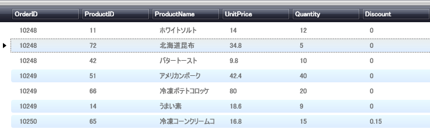

////

|metadata|
{
    "name": "xamdata-changing-field-record-cell-selection-behavior",
    "controlName": ["xamDataPresenter"],
    "tags": ["How Do I"],
    "guid": "{F6623ADF-05F6-4467-BF00-9A5EC8D8F025}",  
    "buildFlags": [],
    "createdOn": "2012-01-30T19:39:52.4968525Z"
}
|metadata|
////

= フィールド、レコード、またはセル選択の動作を変更

DataPresenter コントロールの link:{ApiPlatform}datapresenter{ApiVersion}~infragistics.windows.datapresenter.cell.html[Cell]、 link:{ApiPlatform}datapresenter{ApiVersion}~infragistics.windows.datapresenter.record.html[Record]、および link:{ApiPlatform}datapresenter{ApiVersion}~infragistics.windows.datapresenter.field.html[Field] の選択機能を修正できます。link:{RootAssembly}{ApiVersion}~infragistics.windows.controls.selectiontype.html[SelectionType] 列挙体を使用して、アプリケーションに最も適している選択方式を選ぶことができます。link:{ApiPlatform}datapresenter{ApiVersion}~infragistics.windows.datapresenter.fieldlayoutsettings.html[FieldLayoutSettings] オブジェクトの link:{ApiPlatform}datapresenter{ApiVersion}~infragistics.windows.datapresenter.fieldlayoutsettings~selectiontypecell.html[SelectionTypeCell]、 link:{ApiPlatform}datapresenter{ApiVersion}~infragistics.windows.datapresenter.fieldlayoutsettings~selectiontyperecord.html[SelectionTypeRecord]、または link:{ApiPlatform}datapresenter{ApiVersion}~infragistics.windows.datapresenter.fieldlayoutsettings~selectiontypefield.html[SelectionTypeField] プロパティを設定することによって選択を制御します。

以下の手順は、選択動作を変更したいデータ バインドされた xamDataGrid を持っていることが前提となります。xamDataGrid のデータ バインディングの詳細は、 link:xamdatagrid-getting-started-with-xamdatagrid.html[xamDataGrid をページに追加]を参照してください。この手順の設定は、xamDataCarousel および xamDataPresenter の設定に似ています。

*セル、レコード、フィールドの選択タイプを変更するには、次の手順に従ってください。*

[start=1]
. SelectTypeCell プロパティと SelectionTypeRecord プロパティを xamDataGrid インスタンスの Extended に設定します。これらのプロパティによって、エンドユーザーは同時に複数のセルとレコードを選択することができます。エンドユーザーが一度に選択するフィールドをひとつにしたい場合には、SelectTypeField プロパティを Single に設定します。

[NOTE]
====
*注:* SelectTypeField 設定は、 link:{ApiPlatform}datapresenter{ApiVersion}~infragistics.windows.datapresenter.fieldsettings~labelclickaction.html[LabelClickAction] プロパティを SelectField にすでに設定した場合に限り機能します。
====

*XAML の場合:*

----
<igDP:XamDataGrid ... >
        <igDP:XamDataGrid.FieldLayoutSettings>
                <igDP:FieldLayoutSettings 
                  SelectionTypeCell="Extended" 
                  SelectionTypeRecord="Extended" 
                  SelectionTypeField="Single" />
        </igDP:XamDataGrid.FieldLayoutSettings>
</igDP:XamDataGrid>
----

[start=2]
. プロジェクトをビルドして実行します。CTRL または SHIFT キーのいずれかで複数のレコードを選択すると、以下の画像のようにレコードは強調表示されます。

