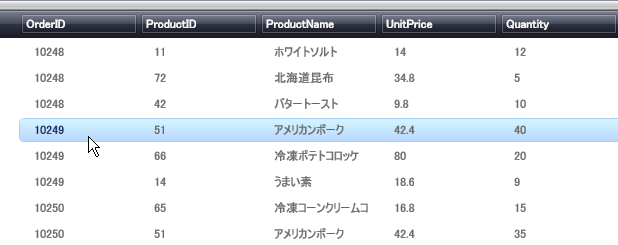

////

|metadata|
{
    "name": "xamdata-changing-the-record-hover-color",
    "controlName": ["xamDataPresenter"],
    "tags": ["How Do I"],
    "guid": "{1FF313CB-042C-4A96-BC31-17A86E17EA0F}",  
    "buildFlags": [],
    "createdOn": "2012-01-30T19:39:52.4998531Z"
}
|metadata|
////

= レコード ホバーの色の変更

DataPresenter コントロールによく行われるスタイリングの拡張は、エンドユーザーがレコード上にマウスオーバーした時に表示するホバーの色です。スタイルを制御する link:{ApiPlatform}datapresenter{ApiVersion}~infragistics.windows.datapresenter.datarecordcellarea~backgroundhover.html[BackgroundHover] プロパティを持っているため、この拡張は link:{ApiPlatform}datapresenter{ApiVersion}~infragistics.windows.datapresenter.datarecordcellarea.html[DataRecordCellArea] から設定されます。

以下の XAML は、DataRecordCellArea オブジェクトのスタイル方法を示します。スタイルに割り当てられた Key がないため、同じ Grid パネル内のすべての DataRecordCellArea オブジェクトがこのスタイルを使用することに注意してください。Grid パネルの Resources セクションにこのスタイルを配置します。

[NOTE]
====
*注:* このスタイルをより上位の Resources セクションに配置して、より多くの DataRecordCellArea オブジェクトに適用させることができます。たとえば、アプリケーションの Resource セクションにスタイルを配置すると、アプリケーション全体がこのスタイルを使用します。
====

*XAML の場合:*

----

----

link:xamdatagrid-getting-started-with-xamdatagrid.html[xamDataGrid をページに追加]で作成したコードと上記の XAML を Grid パネルの Resource セクションに配置すると、xamDataGrid にデータが格納されるのが確認できます。レコードの上にマウスを移動すると、以下の図のように青のグラデーションで強調表示されます。

