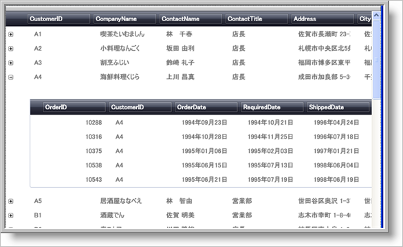

////

|metadata|
{
    "name": "xamdata-displaying-hierarchical-data",
    "controlName": ["xamDataPresenter"],
    "tags": ["How Do I"],
    "guid": "{B58FFDE4-17A4-4817-B230-29DCB2765446}",  
    "buildFlags": [],
    "createdOn": "2012-01-30T19:39:52.5058543Z"
}
|metadata|
////

= 階層データの表示

== トピックの概要

=== 目的

このトピックでは、階層データ、および link:{ApiPlatform}datapresenter{ApiVersion}~infragistics.windows.datapresenter.xamdatagrid.html[ _xamDataGrid_  ]™ コントロールによる階層データの表示方法を説明します。

=== 前提条件

このトピックを理解するために、以下のトピックを参照することをお勧めします。

[options="header", cols="a,a"]
|====
|トピック|目的

| link:xamdatagrid-understanding-xamdatagrid.html[ _xamDataGrid_ について]
|このトピックは、 _xamDataGrid_ コントロールの概要を提供し、要素のダイアグラムを含みます。

| link:xamdatapresenter-about-data-items-and-data-records.html[データ項目とデータ レコードについて]
|このトピックでは、データ項目とデータ レコードの違いを説明します。

| link:xamdatapresenter-define-a-field-layout.html[フィールド レイアウトの定義]
|このトピックでは、各レコードについて表示される列を手動で定義する方法を説明します。

|====

=== このトピックの内容

このトピックは、以下のセクションで構成されます。

* <<_Ref387411542, 階層データについて >>
* <<_Ref387411550, データ プレゼンターの階層データ認識プロセス >>
* <<_Ref387411554, データ プレゼンターに表示された階層データのスクリーンショット >>
* <<_Ref387411558, 関連コンテンツ >>

[[_Ref387411542]]
== 階層データについて

=== 階層データの概要

階層データは、情報をツリー構造のレコードに編成します。ツリー構造は、以下の親子関係で構成されます。

* 親はゼロ以上の子レコードを持つことができます (1:多数)
* 子レコードは親レコードを 1 つだけ持つことができます (1:1)

[[_Ref387411550]]
== データ プレゼンターの階層データ認識プロセス

=== 処理の概要

link:{ApiPlatform}datapresenter{ApiVersion}~infragistics.windows.datapresenter.xamdatacarousel.html[ _xamDataCarousel_  ]™、 link:{ApiPlatform}datapresenter{ApiVersion}~infragistics.windows.datapresenter.xamdatagrid.html[ _xamDataGrid_  ]™、および link:{ApiPlatform}datapresenter{ApiVersion}~infragistics.windows.datapresenter.xamdatapresenter.html[ _xamDataPresenter_  ]™ コントロールは、変更することなく、階層データを表示できます。フラット データ ソースへのバインド、階層データ ソースへのバインドに違いはありません。コントロールは、フラットであるか階層であるかに関係なく、データ ソースを解釈し、正しく表示します。

コントロールは、データ オブジェクトを表示する必要がある場合、それらのプロパティのタイプを検証し、以下の表に示すように、プロパティのタイプに応じて表示します。

[options="header", cols="a,a"]
|====
|タイプ|データ プレゼンター コントロールによる解釈

|`IEnumerable` インターフェイスを実装しないタイプのすべてのパブリック プロパティ、および `String` タイプ。
|これらのプロパティを 1 つのセルとしてレコード行に表示します。

|`IEnumerable` インターフェイスを実装しないタイプのすべてのパブリック プロパティ。ただし、`String` タイプを除きます。
|これらのプロパティを子レコードとして、つまり、階層的に表示します。

|====

このデフォルト動作は、 link:{ApiPlatform}datapresenter{ApiVersion}~infragistics.windows.datapresenter.field_members.html[Field] クラスから公開される link:{ApiPlatform}datapresenter{ApiVersion}~infragistics.windows.datapresenter.field~isexpandable.html[IsExpandable] プロパティによってオーバーライドできます。以下の表は、`IsExpandable` プロパティの使用方法を説明しています。

[options="header", cols="a,a,a"]
|====
|動作|使用するプロパティ|設定値

|このフィールドによって表示されるデータが、前述したように、フィールドのデータ型に基づいてフラット (セルの中に) または階層 (子レコード) として表示されます。
|`IsExpandable`
|`null` (デフォルト)

|フィールドのデータ型に関わらず、このフィールドのデータを子レコードではなく、セルの中に強制的に表示します。 

注: 

[NOTE] 

==== 

タイプが `IEnumerable` である場合、たとえばスパークラインやリストを使用した複雑な型を表示するために、 link:{ApiPlatform}datapresenter{ApiVersion}~infragistics.windows.datapresenter.cellvaluepresenter_members.html[CellValuePresenter] スタイルを提供することが必要になる可能性があります。 

====
|`IsExpandable`
|`false`

|フィールドのデータ型に関わらず、このフィールドのデータをセルの中ではなく、子レコードとして強制的に表示します。 

注: 

[NOTE] 

==== 

タイプが `IEnumerable` でない場合、データは単一の子レコードとして表示されます。 

====
|`IsExpandable`
|`true`

|====

特定のフィールドの表示される状態を確認するために、読み取り専用のブールの link:{ApiPlatform}datapresenter{ApiVersion}~infragistics.windows.datapresenter.field~isexpandableresolved.html[IsExpandableResolved] プロパティを使用することもできます。

注:

[NOTE]
====
link:{ApiPlatform}datapresenter{ApiVersion}~infragistics.windows.datapresenter.xamdatacards.html[ _xamDataCards_  ]™ コントロールは、階層データを表示しません。
====

[[_Ref387411554]]
== データ プレゼンターに表示された階層データのスクリーンショット

=== スクリーンショットの概要

以下のスクリーンショットは、階層データを表示する  _xamDataGrid_   コントロールを示します。

[[_Ref387411558]]
== 関連コンテンツ

=== トピック

このトピックの追加情報については、以下のトピックも合わせてご参照ください。

[options="header", cols="a,a"]
|====
|トピック|目的

| link:xamdatapresenter-bind-a-datapresenter-control-to-an-xmldataprovider.html[DataPresenter コントロールの XmlDataProvider へのバインド]
|このトピックでは、DataPresenter を XmlDataProvider にバインドする方法を説明します。

| link:xamdatapresenter-bind-a-datapresenter-control-to-a-collection.html[DataPresenter コントロールの Collection へのバインド]
|このトピックでは、DataPresenter を Collection にバインドする方法を説明します。

| link:xamdatapresenter-binding-a-datapresenter-control-to-a-dataset.html[DataPresenter コントロールの DataSet へのバインド]
|このトピックでは、DataPresenter を DataSet にバインドする方法を説明します。

| link:xamdatagrid-cellvaluepesenterstyleselector-reevaluated.html[条件付き書式のルール (xamDataGrid)]
|このトピックでは、 _xamDataGrid_ コントロールでセル値が変わる場合に異なったスタイルを適用する方法について説明します。

|====