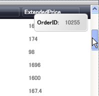

////

|metadata|
{
    "name": "xamdata-displaying-tooltips-while-scrolling-the-grid",
    "controlName": ["xamDataPresenter"],
    "tags": ["How Do I","Tips and Tricks"],
    "guid": "{67D38A37-117D-448C-87DD-DA16928914D7}",  
    "buildFlags": [],
    "createdOn": "2012-01-30T19:39:52.5088549Z"
}
|metadata|
////

= グリッドをスクロールする間にツールチップを表示

デフォルトで、xamDataGrid および xamDataPresenter のグリッド ビューは、リクエストされるまでレコードの作成を遅延します。さらに、スクロール バーのつまみをドラッグする間、 (link:{ApiPlatform}datapresenter{ApiVersion}~infragistics.windows.datapresenter.field~isscrolltipfield.html[IsScrollTipField] が True に設定されているのはどの Field かに基づいて) レコードのひとつのフィールドの値を表示するツールチップがスクロール バーの横に表示します。現在ドラッグされている位置にあるスクロール バーのつまみを放した場合にこのレコードが最も上のレコードになります。

link:{ApiPlatform}datapresenter{ApiVersion}~infragistics.windows.datapresenter.datapresenterbase~scrollingmode.html[ScrollingMode] プロパティを Deferred に変更することによって、遅延したスクロールのパフォーマンスを維持しながら、ツールチップを削除できます。ScrollingMode プロパティを Immediate に設定する場合には、スクロール バーのつまみをドラッグすると、グリッドは表示を更新して、ビューの新しいレコードを反映します。

[NOTE]
====
*注:* ScrollingMode プロパティを Immediate に設定することはパフォーマンスに対する影響のために推奨されません。
====