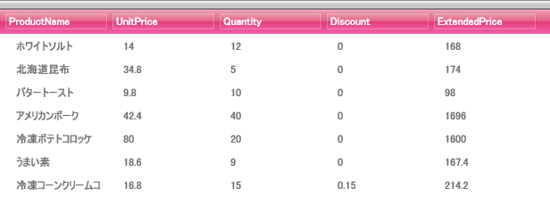

////

|metadata|
{
    "name": "xamdata-referencing-a-themepack-in-xaml",
    "controlName": ["xamDataPresenter"],
    "tags": ["Theming"],
    "guid": "{EA4335AF-AC33-4FFB-A01B-08B3B7AA7C6F}",  
    "buildFlags": [],
    "createdOn": "2012-01-30T19:39:52.5248581Z"
}
|metadata|
////

= XAML でテーマパックを参照

アプリケーション開発においてスタイリングは非常に重要なタスクであるため、{ProductName} コントロールはすべてスタイリングに使用できる組み込みテーマを含んでいます。また、{ProductName} コントロールは個別の ThemePacks も持っており、これはインストーラーに含まれています。ThemePacks はコンパイルされたアセンブリで、プロジェクトで参照する複雑性がなくなります。

以下の手順に従って、プロジェクトでテーマパックを参照します。

[start=1]
. テーマパックにより簡単にアクセスするために、以下の名前空間宣言を開始の Page タグまたは Window タグ内に追加します。

*XAML の場合:*

----
xmlns:igThemesLipStick="http://infragistics.com/Themes/Lipstick" 
----

[start=2]
. Page または Window の Resources セクションを作成し、ResourceDictionary を追加します。以下の XAML は、ResourceDictionary を Page の Resources セクションに追加します。

*XAML の場合:*

----
<Page.Resources>
	<ResourceDictionary>
      ...
	</ResourceDictionary>
</Page.Resources>
----

[start=3]
. ResourceDictionary 内で、MergedDictionaries セクションを定義します。

*XAML の場合:*

----
<Page.Resources>
	<ResourceDictionary>
		<ResourceDictionary.MergedDictionaries>
        	...
		</ResourceDictionary.MergedDictionaries>
	</ResourceDictionary>
</Page.Resources>
----

[start=4]
. 以下の XAML はすべての {ProductName} コントロールのスタイル参照を追加します。これによって、Page 上のあらゆる {ProductName} コントロールが Lipstick ThemePack を使用することになります。

*XAML の場合:*

----
<Page.Resources>
	<ResourceDictionary>
		<ResourceDictionary.MergedDictionaries>
			<!--LipStick ThemePack を使用してすべてのコントロールをスタイル-->
			<igThemesLipStick:DataPresenter />
			<igThemesLipStick:Primitives  />
			<igThemesLipStick:Editors  />
		</ResourceDictionary.MergedDictionaries>
	</ResourceDictionary>
</Page.Resources>
----

[start=5]
. xamDataGrid™ を使用して一度ページに追加すると、以下のスクリーンショットのようなピンクのテーマが表示されます。

