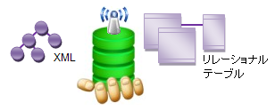

////

|metadata|
{
    "name": "xamdata-terms-data-sources",
    "controlName": ["xamDataPresenter"],
    "tags": ["Data Binding","Getting Started"],
    "guid": "{981AD815-3208-47A9-BB28-5CA2E1A59161}",  
    "buildFlags": [],
    "createdOn": "2012-01-30T19:39:52.5358603Z"
}
|metadata|
////

= データ ソース

データ ソースは、DataSource として設定できる link:http://msdn2.microsoft.com/ja-jp/library/system.collections.ienumerable.aspx[IEnumerable] インターフェイス (String 以外) を実装する任意のオブジェクトになることができます。コントロール インフラストラクチャは階層かつ異種の両データ (単一リスト内の複数のデータ タイプ) と、ツリーや XML のようなフリーフォームの構造の両方をサポートします。コントロールで link:{ApiPlatform}datapresenter{ApiVersion}~infragistics.windows.datapresenter.datapresenterbase~datasource.html[DataSource] プロパティを設定する、または link:{ApiPlatform}datapresenter{ApiVersion}~infragistics.windows.datapresenter.datapresenterbase~dataitems.html[DataItems] コレクションプロパティを直接格納することによって、いずれかのデータ バインドを実行できます。

データをコントロールに提供する方法についての詳細は、 link:xamdata-supplying-data.html[データの提供]を参照してください。

