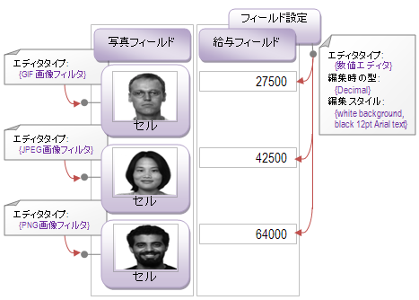

////

|metadata|
{
    "name": "xamdata-terms-editors",
    "controlName": ["xamDataPresenter"],
    "tags": ["Editing","Getting Started"],
    "guid": "{3C7509E7-CF16-4F66-AFFB-C841C9FA1201}",  
    "buildFlags": [],
    "createdOn": "2012-01-30T19:39:52.5378607Z"
}
|metadata|
////

= エディター

link:{ApiPlatform}datapresenter{ApiVersion}~infragistics.windows.datapresenter.datapresenterbase.html[DataPresenterBase] クラスから派生したすべての {ProductName} コントロールは、拡張可能な編集オブジェクト モデルにユーザーの編集体験をデリゲートするという同じパターンに従っています。これによって、状況に最も適した xamEditor コントロールにプラグインすることができます (xamTextEditor など)。どのようなコントロールを使用していようとも、エディターのプログラミングを容易にするいくつかの一般的な原則もあります。

コントロールに組み込み可能なすべてのエディターは、ValueEditor 抽象基本クラスを拡張します。次にエディターは、継承によって必要な特化した編集機能を追加します。xamEditor コントロールのグループ化は、最も頻繁に遭遇するデータ入力のシナリオのためのエディターを提供するため、固有のエディターを記述する必要はありません。この基本クラスは、すべてのエディターに編集関連イベントの一般的なセットを提供します (詳細は、ValueEditor クラスの概要を参照)。これによってエディターを操作することができます。

コントロールによって表示される値とエディターを関連付けるために使用できる 3 つのプロパティがあります。

* link:{ApiPlatform}datapresenter{ApiVersion}~infragistics.windows.datapresenter.fieldsettings~editortype.html[EditorType] -- これは、特化したエディター クラスのタイプです。ValueEditor から継承する必要があります。
* link:{ApiPlatform}datapresenter{ApiVersion}~infragistics.windows.datapresenter.fieldsettings~editastype.html[EditAsType] -- これは、データを編集する時にエディターが使用すべきタイプです。たとえば、String に格納される数値データ値を編集するためにこれを Double に設定することができます。String がスキーマを認識しない XML データ プロバイダーから生じるために、Field に数しか含まれていないとしてもこれが発生する場合があります。
* link:{ApiPlatform}datapresenter{ApiVersion}~infragistics.windows.datapresenter.fieldsettings~editorstyle.html[EditorStyle] -- これは編集モードのときにエディターの外観を制御します。

上記の図は、エディターを WPF コントロールと関連付けることができる 2 つの異なる範囲を示しています。

* フィールド レベル --  link:{ApiPlatform}datapresenter{ApiVersion}~infragistics.windows.datapresenter.fieldsettings.html[FieldSettings] で一度エディターを設定し、持っているデータ レコードの数に関係なく、そのフィールド内のすべてのセルに再利用されます。
* セル レベル --  link:{ApiPlatform}datapresenter{ApiVersion}~infragistics.windows.datapresenter.cell.html[DataRecord] の各 link:{ApiPlatform}datapresenter{ApiVersion}~infragistics.windows.datapresenter.datarecord.html[Cell] にエディターを設定します。同じ Field の異なるセルの値が異なる種類のエディターを必要とした場合にこれを実行します。

セル レベルでエディターを設定する場合には、 link:{ApiPlatform}datapresenter{ApiVersion}~infragistics.windows.datapresenter.datapresenterbase~initializerecord_ev.html[InitializeRecord] イベントを処理することを推奨します。