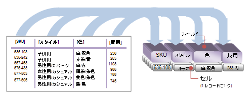
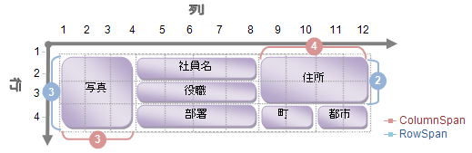

////

|metadata|
{
    "name": "xamdata-terms-fields",
    "controlName": ["xamDataPresenter"],
    "tags": ["Editing","Getting Started"],
    "guid": "{EFFDE14E-FBE6-40DB-B530-FCE3D783967F}",  
    "buildFlags": [],
    "createdOn": "2012-01-30T19:39:52.5398611Z"
}
|metadata|
////

= フィールド

link:xamdata-terms-records.html[Records] がデータ項目のプリセットのピアであるのと同様に、フィールドは DataPresenterBase 派生コントロールのデータの「属性」のピアです。

データの属性はデータ ソースのスキーマに依存します。.NET オブジェクトの列挙可能なコレクションをデータ ソースとして使用できます。これは .NET ビジネス オブジェクト、ADO.NET DataTables、および XPath 式で選択された XML ノードからデータを選択するための大きな自由を提供します。したがって、データの属性は .NET ビジネス オブジェクト、DataTable の DataColumns、または XML ノードの LocalName のプロパティで識別できます。

フィールドは、以下を含むあらゆるレコードにあるデータについての全般的な品質を記述します。

* 同じレコードのその他のフィールドと区別するローカルに固有の link:{ApiPlatform}datapresenter{ApiVersion}~infragistics.windows.datapresenter.fielditem~name.html[Name]。
* そのレコードのセルが含むデータ値の .NET Type を記述する基本の link:{ApiPlatform}datapresenter{ApiVersion}~infragistics.windows.datapresenter.field~datatype.html[DataType]。

データ バインディングの段階に続き、コントロールはデータが持つ属性をデータソースから見つけます。これによって属性から Field オブジェクトを自動生成することができます。link:{ApiPlatform}datapresenter{ApiVersion}~infragistics.windows.datapresenter.fieldlayoutsettings~autogeneratefields.html[AutoGenerateFields] プロパティを False に設定することによってこの動作を無効にできます。これによって、すべての Field オブジェクトを自身で完全に指定することができ、レイアウトにさらなる柔軟性を提供します。「 link:xamdata-terms-fields-field-layout.html[フィールド レイアウト]」のトピックでフィールドのレイアウトに関するより詳細な情報をご覧いただけます。

フィールドはシンプルな行または列ベースのテーブルよりも複雑なレイアウトを指定するために使用できます。

* link:xamdata-terms-fields-field-label.html[フィールド ラベル]をレイアウトするグリッド内の位置を決定する link:{ApiPlatform}datapresenter{ApiVersion}~infragistics.windows.datapresenter.fielditem~column.html[Column] と link:{ApiPlatform}datapresenter{ApiVersion}~infragistics.windows.datapresenter.fielditem~row.html[Row]。
* グリッドに配置されたフィールド ラベルの垂直および水平方向の範囲を決定する link:{ApiPlatform}datapresenter{ApiVersion}~infragistics.windows.datapresenter.fielditem~columnspan.html[ColumnSpan] と  link:{ApiPlatform}datapresenter{ApiVersion}~infragistics.windows.datapresenter.fielditem~rowspan.html[RowSpan]。

フィールドは link:{ApiPlatform}datapresenter{ApiVersion}~infragistics.windows.datapresenter.fielditem~visibility.html[Visibility] プロパティを False に設定することによって非表示にできます。たとえば、人が読みやすいということよりもマシンの使用を意図したデータを含むフィールドを持つ場合 (レコードの主要キーとして機能する GUID など)、ユーザーに表示せずに非表示することをお勧めします。

== 関連トピック

link:xamdata-terms-fields-field-label.html[フィールド ラベル]

link:xamdata-terms-fields-field-layout.html[フィールド レイアウト]

link:xamdata-terms-fields-field-settings.html[フィールド設定]