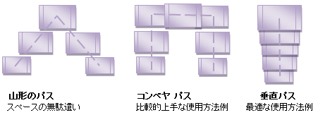

////

|metadata|
{
    "name": "xamdata-terms-presentation-formats-carousel-view",
    "controlName": ["xamDataPresenter"],
    "tags": ["Data Binding","Data Presentation"],
    "guid": "{69253280-9F72-4AF5-990C-48C92B197E92}",  
    "buildFlags": [],
    "createdOn": "2012-01-30T19:39:52.5498631Z"
}
|metadata|
////

= カルーセル ビュー

従来のビューには確認済みの限界があります。表示されるデータの量で初心者ユーザーを圧倒する可能性がある、または表示されるデータのタイプが従来のプレゼンテーションに適していないからです。したがって、単純なリスト形式のプレゼンテーションに飽き飽きしていたユーザーを感動させるために、また現在のデスクトップマシンの最新のマルチメディア機能を効果的に活用してデータを表現するためには、より洗練されたレイアウトが必要です。

カルーセル ビューは、データが近接性、連続性、そして移動することを強調します。平面のビデオ画面上に疑似の 3 次元環境の外観を作り出すために、カルーセルビューでは遠近法などや奥行きを感じさせる従来の芸術的な方式が使用されます。この体験に夢中になったユーザーは現実の視覚の能力を活用して、情報の項目が相互の関連でどのように表示されるのかということから直感的に結論を出します。情報が以下を含む要因を特徴とする時に、重要な価値を追加することができます。

* 2 つのデータ項目の相互の近さ
* 連続性における相対的な位置
* パスに沿ってアニメートする動作

これらの要因すべてが一体となって、従来のユーザー インターフェイスでは達成することのできない方法で追加の情報をユーザーに伝送します。

image::images/Terms_Presentation_Formats_Carousel_Presentation_Format_01.png[カルーセル ビューでアドレス帳の情報を表示する XamDataPresenter]

カルーセル ビューはユーザーが初めて見た時に畏敬の念を起こさせ、アプリケーションを他と差別化します。これらの利点によって、カルーセル ビューは気に入られ、感動を与え、楽しませる使用のシナリオで人気のオプションとなっています。より日常的なタスクでは、Microsoft® Windows® Vista™ や Mac の Apple® Aqua™ のような最新のユーザー インターフェイスで見慣れているのと同等の洗練性を提供することができれば、アプリケーションに対するユーザーの評価を高めることができます。

xamCarouselPanel™ コンテナー コントロールは、{ProductName} に含まれているその他のいくつかのコントロールによって採用されているカルーセル ビューを実装しており、以下にそれらを列挙します。

* xamCarouselListBox™ -- 以前は Listbox コントロールを使用するような状況で提供されるユーザー エクスペリエンスを向上します。
* xamDataCarousel™ -- xamCarouselPanel の回転動作とこれまでであれば GridView コントロールを使用したであろうマルチ フィールドのデータ レコードの管理を結合します。
* xamDataPresenter™ -- カルーセル ビューでデータを提示するために CarouselView オブジェクトを  link:{ApiPlatform}datapresenter{ApiVersion}~infragistics.windows.datapresenter.xamdatapresenter~view.html[View] プロパティに割り当てることができるプラガブルなビュー ベースのアーキテクチャ。

カルーセル ビューは長所でありながらも、その目を引く外観が欠点となる可能性もあります。一部のアプリケーションは、最大の特徴がカルーセル ビューに表示される情報の場合があります。このような場合には、視覚的なフレアが効果を発揮します。ただし、カルーセル ビューをレガシーアプリケーションなどの環境に導入するかどうかは注意深く検討する必要はありますが、これによって標準コントロールを拡張して使用することでユーザーにより良く受け止めてもらえるようになります。最も重要なことは、アプリケーションが整合性のある考え抜かれたユーザー エクスペリエンスを提示することです。そのひとつがカルーセルビューで提示されるデータが残りのユーザー エクスペリエンスにシームレスに統合されることです。アニメーションのためだけのアニメーションという考えは避けるべきです。

カルーセル ビューで情報を表示するときのもうひとつの懸念は、カルーセル ビューが画面領域の多くを使用することです。データ項目が移動できるパスの多く (円形、楕円形、対角線、ジグザグ、ハート形、V 形、U 形) は、直線、水平、垂直のリストで同じコンテンツを表示するために必要な高さと幅よりも多くの高さと幅を使用します。この画面領域は、情報密度の高いアプリケーションまたは小さい形式の要因では非常に貴重になる場合があります。このような場合には、直線の水平パスと垂直パスの両方またはいずれか一方に制限することにより、カルーセルビューが必要とする画面の領域を節約することができます。

上記の図では、シェブロン形 (V を逆さまにした形) パスのスペースの使用は最適とは言えません。最もカーブさせたパスもこのカテゴリーに含まれます。2 番目のパスは、コンベヤパスと呼ばれますが、縦と横の直線のセグメントのみを使用します。このパスが必要とする領域は長方形になるので、より効率的にスペースを使用します。このため、左側のシェブロン形と同じ量のスペースを使用するとしても、パスが 50% 長くなるので、カルーセル項目を表示するために使用できるスペースの割合が増えます。右側は垂直の直線パスです (水平の直線パスもこのカテゴリーに含まれます)。シェブロン形のパスよりも 50% 短くなりますが (したがってこのカルーセル項目の項目間はより接近して表示されます)、使用するスペースはわずか 3 分の 1 です。

Windows® Presentation Foundation アプリケーションをデザインする時に、カルーセル ビューがユーザーに提示する情報に追加するかどうかを評価します。値を追加する場所に適用して、ユーザー エクスペリエンスがシームレスなアプリケーションのユーザーインターフェイス全体に統合します。

== 関連トピック

link:xamdata-terms-presentation-formats-grid-view-format.html[グリッド ビュー]

link:xamdata-terms-presentation-formats-tree-view-format.html[ツリー ビュー]

link:xamdata-terms-presentation-formats-card-view.html[カード ビュー]