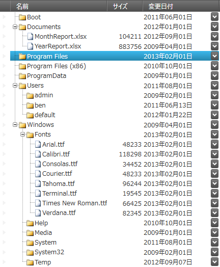

////
|metadata|
{
    "name": "xamdata-terms-presentation-formats-tree-view-format",
    "controlName": ["xamDataPresenter"],
    "tags": ["Data Binding","Data Presentation","How Do I","Templating"],
    "guid": "",
    "buildFlags": [],
    "createdOn": "2012-01-30T19:39:52.5518635Z"
}
|metadata|
////

= ツリー ビュー

ツリー ビューは、データを表形式で表示します。link:{ApiPlatform}datapresenter{ApiVersion}~infragistics.windows.datapresenter.gridviewbase.html[GridViewBase] (グリッド ビューのように) の拡張ビューがあるため、通常の列および行があります。ただし、ツリー ビューは、コントロールにバインドされた階層データのツリー表現を含むフィールドです。指定された展開インジケーターを使用してネストされたレコードを展開および縮小し、そのレベル全体をブラウズできます。

以下のスクリーンショットは、"Name" フィールドに置かれたツリーを持つレコードの階層構造を表示するツリー ビューを示しています。この例の "Name" フィールドは、各レコードのイメージを表示する link:{ApiPlatform}datapresenter{ApiVersion}~infragistics.windows.datapresenter.treecellvaluepresenter.html[TreeCellValuePresenter] に対してカスタム テンプレートを使用しています。

=== 主要機能の概要

以下の表に、グリッド ビューによりサポートされる機能以外のツリー ビューの主要機能の概要を示します。詳細は、概要表の後に記載されています。

[options="header", cols="a,a"]
|====
|機能|説明

|<<_Ref410303345,ツリー フィールド>>
|ツリーを配置するフィールドを指定できます。

|<<_Ref410303357,展開と縮小>>
|ネストされたレコードの展開と縮小

|<<_Ref410303366,ツリー選択>>
|クロスレベル レコードの選択

|<<_Ref410303373,ツリーのフィルタリング>>
|複数レベルのレコードのフィルタリング

|<<_Ref410303379,ツリーの集計>>
|複数レベルのレコードの集計

|<<_Ref410303380,データのエクスポート>>
|Microsoft® Excel® ファイル フォーマットおよび Microsoft® Word® ファイル フォーマットにデータをエクスポート

|====

[[_Ref410303345]]
=== ツリー フィールド

`FlowDirection` プロパティは、ツリーを表示するフィールドの指定、さらにフィールドへのツリーの配置 (左側または右側) を指定できます。

*関連トピック:*

link:xamtreegrid-conf-tree-field.html[ツリー フィールドの構成 (xamTreeGrid)]

[[_Ref410303357]]
=== 展開と縮小

ビューは、展開インジケーターを使用して、ネストされたレコードの展開と縮小をサポートします。展開インジケーターの初期状態を構成できます。

*関連トピック:*

link:xamtreegrid-conf-expansion-indicators.html[展開インジケーターの構成 (xamTreeGrid)]

[[_Ref410303366]]
=== ツリー選択

ビューはクロスレベル選択をサポートします。

*関連トピック:*

link:xamtreegrid-conf-selection.html[選択の構成 (xamTreeGrid)]

[[_Ref410303373]]
=== ツリーのフィルタリング

ビューは複数レベルのレコードのフィルタリングをサポートします。フィルタリング基準に一致しないレコードをビューが表示する方法を構成できます。

*関連トピック:*

link:xamtreegrid-conf-filtering.html[フィルタリングの構成 (xamTreeGrid)]

[[_Ref410303379]]
=== ツリーの集計

ビューはネストされた各レコード レベルの集計をサポートします。各フィールドについて計算式を指定できます。

*関連トピック:*

link:xamtreegrid-conf-summaries.html[集計の構成 (xamTreeGrid)]

[[_Ref410303380]]
=== データのエクスポート

他のビュー同様、ツリー ビューは Microsoft® Excel® ファイル 形式と Word® ファイル形式へのデータのエクスポートをサポートします。

*関連トピック:*

* link:xamdatapresenter-exporting-to-excel.html[Excel へエクスポート]
* link:xamdatapresenter-exporting-to-word.html[Word へのエクスポート]

== 関連トピック

link:xamdata-terms-presentation-formats-grid-view-format.html[グリッド ビュー]

link:xamdata-terms-presentation-formats-carousel-view.html[カルーセル ビュー]

link:xamdata-terms-presentation-formats-card-view.html[カード ビュー]