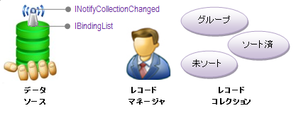

////

|metadata|
{
    "name": "xamdata-terms-record-manager",
    "controlName": ["xamDataPresenter"],
    "tags": ["Data Binding","Getting Started"],
    "guid": "{5296CD70-D35A-42A2-AC43-14D47844B8BA}",  
    "buildFlags": [],
    "createdOn": "2012-01-30T19:39:52.5558643Z"
}
|metadata|
////

= レコード マネージャ

Record Manager はデータ レコードの管理を担当します。link:xamdata-terms-data-sources.html[データ ソース]と link:{ApiPlatform}datapresenter{ApiVersion}~infragistics.windows.datapresenter.datapresenterbase.html[DataPresenterBase] クラスから派生した {ProductName} コントロールによって使用されるレコード コレクション間のデータを調整します。

Record Manager は、INotifyCollectionChanged または IBindingList インターフェイスのデータ ソースの実装をリッスンすることによってその役割を果たします。これでレコードの 3 つのコレクションを管理しますが、これらを link:{ApiPlatform}datapresenter{ApiVersion}~infragistics.windows.datapresenter.recordmanager~groups.html[Groups]、 link:{ApiPlatform}datapresenter{ApiVersion}~infragistics.windows.datapresenter.recordmanager~sorted.html[Sorted]、および link:{ApiPlatform}datapresenter{ApiVersion}~infragistics.windows.datapresenter.recordmanager~unsorted.html[Unsorted] の各プロパティを通して公開します。INotifyCollectionChanged インターフェイスの実装によって、データ レコードの同期を保持するためにこれらのコレクションでイベントを発生させます。

すべてのデータ レコードは、Record Manager への参照を保持します。その link:{ApiPlatform}datapresenter{ApiVersion}~infragistics.windows.datapresenter.datapresenterbase~recordmanager.html[RecordManager] プロパティを使用して、コントロールからルート (最上位) のレコード コレクションへの参照を保持することもできます。展開可能なフィールド レコードは link:{ApiPlatform}datapresenter{ApiVersion}~infragistics.windows.datapresenter.expandablefieldrecord~childrecordmanager.html[ChildRecordManager] プロパティをその子レコード コレクションの Record Manager に公開します。GroupBy レコードはすでにグループ化されているデータ レコードのみを含みます。したがって、子レコード コレクションのために Record Manager を公開する必要はありません。