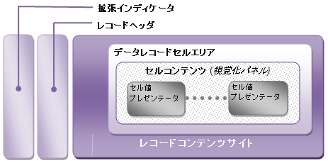

////

|metadata|
{
    "name": "xamdata-terms-records-data-record",
    "controlName": ["xamDataPresenter"],
    "tags": ["Data Binding","Getting Started"],
    "guid": "{EB546165-E987-4196-9D50-7AB06F4AFBDF}",  
    "buildFlags": [],
    "createdOn": "2012-01-30T19:39:52.5638659Z"
}
|metadata|
////

= データ レコード

xamDataCarousel™ コントロールが表示または使用する必要がある時に、データ ソースからバインドされたあらゆる情報に対してデータ レコード オブジェクトが作成されます。これらのオブジェクトはバインドされたデータ項目を表すことを担当するピア オブジェクトとして機能し、 link:{ApiPlatform}datapresenter{ApiVersion}~infragistics.windows.datapresenter.datarecord~dataitem.html[DataItem] プロパティによる利便性の高いアクセスを提供します。同時に、Data Record クラスはデータの個々の項目のプレゼンテーションに関連するその他多くのプロパティを提供します。

以下の画像は、セル内にある情報のいくつかのフィールドを表示する一般的なデータ レコードを示しています (たとえば、Photo や Employee Name)。行の観点からレコードを考えることは便利な場合がありますが、ここでは xamDataCarousel が非常に異なったレイアウトでレコードデータを提示することを可能にすることを確認できます。

データ レコードは、基本的なデータ項目に関連する多数のインタラクティブな状態を通知できます (たとえば、アクティブな状態、選択されている状態、変更された状態)。これらは、上記の画像の右向きの矢印によって占められている、レコーダ セレクターに配置されたアイコンで、または対応する Boolean プロパティ (link:{ApiPlatform}datapresenter{ApiVersion}~infragistics.windows.datapresenter.record~isselected.html[IsSelected] プロパティのような) をテストするスタイルトリガーを通して表すことができます。

以下の図は、提示される個々のデータ レコードの構成を検証します。必要ではないときに頻繁に非表示になるため、すべてのデータ レコードがここに示したすべての要素を持っているとは限りません。しかし、上記の画像は、対応する Data Record Presenter によって表示される時に、データレコードが切り分けられる方法を示します。詳細は link:xamdata-terms-presenters.html[プレゼンター]を参照してください。

個々のデータ レコードに子レコードがある場合には、展開インジケーターを表示できます (link:{ApiPlatform}datapresenter{ApiVersion}~infragistics.windows.datapresenter.record~haschildren.html[HasChildren] プロパティを参照してください)。その目的は、子バンドに存在する任意の子レコードを展開または縮小することです。詳細は link:xamdata-terms-records-expandablefieldrecord.html[ExpandableField レコード]を参照してください。

レコード ヘッダーは、データ レコードのデータの変更済み、新規追加済み、または削除の保留状態に関連付けられたアイコンが通常表示される場所です。

レコード コンテンツのサイトは、レコード セレクターとデータ レコード セル領域が配置される場所です。仮想化パネルに、データ レコードのセル領域内に、セルのコンテンツが表示されます。セルの配置は、自動生成、または link:xamdata-terms-fields-field-layout.html[フィールド レイアウト]に対して行われたカスタム設定によって管理することができます。link:{ApiPlatform}datapresenter{ApiVersion}~infragistics.windows.datapresenter.datarecordpresenter.html[DataRecordPresenter] がデータレコードのコンテンツの表示を担当するのと同じように、その Cell オブジェクトがそれぞれ link:{ApiPlatform}datapresenter{ApiVersion}~infragistics.windows.datapresenter.cellvaluepresenter.html[CellValuePresenter] によって表示されます。