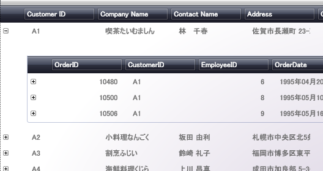
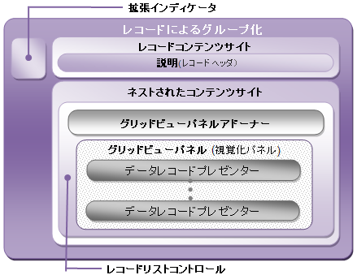

////

|metadata|
{
    "name": "xamdata-terms-records-expandablefieldrecord",
    "controlName": ["xamDataPresenter"],
    "tags": [],
    "guid": "{19ED9576-AC9C-4D40-84A0-62304046E497}",  
    "buildFlags": [],
    "createdOn": "2012-01-30T19:39:52.5658663Z"
}
|metadata|
////

= ExpandableField レコード

ExpandableFieldRecord オブジェクトは、子レコード コレクションを含むために作成されます。親レコードへの関係のため、これらの子レコードは特殊です。同じ値を持つ親レコード内のフィールドとこの子レコード コレクション内にあるすべてのレコードを関連付ける link:{ApiPlatform}datapresenter{ApiVersion}~infragistics.windows.datapresenter.expandablefieldrecord~field.html[Field] を持っています。この関係の他に、子レコードは親レコードと完全に異なるフィールド レイアウトで表示できます。

上記のスクリーンショットは、 link:xamdata-terms-presentation-formats-grid-view-format.html[グリッドビュー]を使用して、xamDataGrid または xamDataPresenter に展開可能なフィールド レコードがどのように表示されるのかを示しています。Customer レコード (上) と CustomerOrders レコード (展開されているアイランドに表示) の間の関係は、共通の CustomerID フィールド値が同じ ("ALFKI") であるため存在します。CustomerOrders レコードと Customer レコードのフィールド レイアウトも異なります。

.注:
[NOTE]
====
xamTreeGrid™ コントロールは階層データを表示できますが、ツリー フィールドの使用方法が異なります。xamTreeGrid のlink:xamtreegrid-features-overview.html[機能概要]トピックで関連情報を参照してください。
====

以下の図は、グリッド ビューで提示される個々の ExpandableFieldRecord オブジェクトの構成を検証します。link:xamdata-terms-records-data-record.html[データ レコード]と異なり、展開可能なフィールド レコードはコンテナーとして機能することを思い出してください。コントロールに構成された設定によっては、ここに表示されるすべての要素が適用されるわけではありません。この図は、対応する Expandable Field Record Presenter が表示する時に、展開可能なフィールド レコードの一部がどのように使用されるのかを理解する上で役に立ちます。詳細は link:xamdata-terms-presenters.html[プレゼンター]を参照してください。

グリッド ビューを使用して、xamDataGrid または xamDataPresenter に展開インジケーターが表示されるかどうかは、 link:{ApiPlatform}datapresenter{ApiVersion}~infragistics.windows.datapresenter.fieldsettings~expandablefieldrecordexpansionmode.html[ExpandableFieldRecordExpansionMode] プロパティによって決まります。完全に非表示にする、または親レコードの子レコード コレクションに複数の展開可能なフィールド レコード (兄弟) がある場合に限り表示することも可能です。

レコード ヘッダー (前述の「Customer Orders」ヘッダーなど) はデフォルトで表示されません。同じデータ レコードが親の複数の ExpandableFieldRecord オブジェクトを持っている場合、レコード ヘッダーを表示するように link:{ApiPlatform}datapresenter{ApiVersion}~infragistics.windows.datapresenter.fieldsettings~expandablefieldrecordheaderdisplaymode.html[ExpandableFieldRecordHeaderDisplayMode] を設定する場合に役に立ちます。

Nested Content Site は、グリッド ビューで Record List Control を使用して展開可能なコンテンツが配置される場所です。そのコンテンツは一般的に link:xamdata-terms-fields-field-layout.html[フィールド レイアウト]で定義したレイアウトでパターン化された link:xamdata-terms-fields-field-label.html[フィールド ラベル]を表示する Presenter オブジェクトを含む Adorner オブジェクトと、各子データ レコードを表示する Presenter オブジェクトを含む仮想 Panel オブジェクトで構成されます。