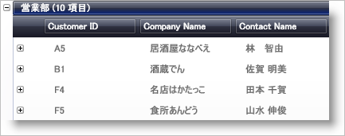

////

|metadata|
{
    "name": "xamdata-terms-records-groupbyrecord",
    "controlName": ["xamDataPresenter"],
    "tags": ["Data Binding","Getting Started","Grouping"],
    "guid": "{62E7BA1D-2739-4EF5-9F4B-BF2FE446C577}",  
    "buildFlags": [],
    "createdOn": "2012-01-30T19:39:52.5688669Z"
}
|metadata|
////

= GroupBy レコード

GroupBy レコードは、子レコード コレクションを含むために作成されます。link:{ApiPlatform}datapresenter{ApiVersion}~infragistics.windows.datapresenter.groupbyrecord~groupbyfield.html[GroupByField] 内の値がグループ化操作で一致したとして評価された (GroupBy Evaluator によって) ため、GroupByRecord オブジェクト内に含まれるすべての子レコードは関連しています。link:xamdata-terms-presentation-formats-grid-view-format.html[グリッド ビュー] で xamDataGrid または xamDataPresenter に表示される情報を再構成することを意図して、グループ化操作は、エンド ユーザーが GroupBy Field Label を GroupBy Area にドラッグした時にしばしば開始されます。

.注:
[NOTE]
====
xamTreeGrid™ コントロールはレコードのグループ化をサポートしません。
====

上記の例のデータ (Northwind データベースから) は、グリッド ビューを使用して、GroupBy レコードが xamDataGrid または xamDataPresenter にどのように表示するのかを例示します。上記のスクリーンショットにグループ化されているすべてのレコードは、Title フィールドにある共通の値を持っています ("Accounting Manager")。

以下の図は、個々の GroupByRecord オブジェクトが提示されるときの GroupByRecord オブジェクトの構成を示します。link:xamdata-terms-records-data-record.html[データ レコード] と異なり、GroupBy レコードはコンテナーとして機能することを思い出してください。コントロールで設定をどのように構成したのかによって、示されている一部の要素は非表示になったり、異なる場所で表示できます。対応する GroupBy Record Presenter が GroupBy レコードの一部を表示する時にどのように現れるのかをより良く理解するためにこの図を参照してください。詳細は link:xamdata-terms-presenters.html[プレゼンター]を参照してください。

image::images/Terms_Records_Group_By_Record_02.ong[グループ領域の図]

Record Content Site は link:{ApiPlatform}datapresenter{ApiVersion}~infragistics.windows.datapresenter.groupbyrecord~description.html[Description] が表示される場所で、デフォルトで共通の値が含まれ、一致が検出されたレコードの数がその後ろに続きます。

Nested Content Site は、グリッド ビューで Record List Control を使用して展開可能なコンテンツが配置される場所です。そのコンテンツは一般的に link:xamdata-terms-fields-field-layout.html[フィールド レイアウト]で定義したレイアウトでパターン化された link:xamdata-terms-fields-field-label.html[フィールド ラベル]を表示する Presenter オブジェクトを含む Adorner オブジェクトと、各一致するデータ レコードを表示する Presenter オブジェクトを含む仮想 Panel オブジェクトで構成されます。