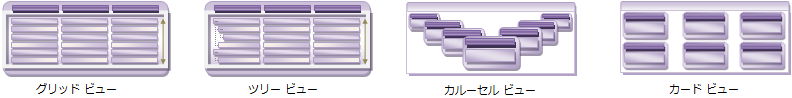

////

|metadata|
{
    "name": "xamdata-terms-views",
    "controlName": ["xamDataPresenter"],
    "tags": ["Data Presentation","Getting Started"],
    "guid": "{0A2D258E-B3A1-4FD4-B900-F119D40035B6}",  
    "buildFlags": [],
    "createdOn": "2012-01-30T19:39:52.5728677Z"
}
|metadata|
////

= ビュー

情報は多様な形式で表すことができ、場合によっては、ユーザーのために全く異なるエクスペリエンスを作成します。一見したところでは、一部のビューは全く相互に関連性がないように見えます。ビューはユーザーインターフェイスで考えられる任意の外観または動作を理論的に持つことができるため、その多様性は動物界に匹敵します。イルカと鹿は一見すると完全に無関係のように見えますが、ほ乳類という共通の先祖を共有しています。これら 2 つの種の違いは、2 つのビューの違いと同じように、生き残って繁栄する環境によるものです。

データが表している情報をエンドユーザーに最も良く表示するビューを検討し、一番適切なビューを選択します。以下の表に示すように、この選択が DataPresenterBase 派生コントロールの選択を決定します。

[options="header", cols="a,a"]
|====
|ビュー|コントロール

| link:xamdata-terms-presentation-formats-grid-view-format.html[グリッド ビュー] -- グリッドのような構造で行と列の通常の配置を提示します。
|xamDataGrid または xamDataPresenter

| link:xamdata-terms-presentation-formats-tree-view-format.html[ツリー ビュー] -- グリッド構造で行および列の配置を表示しますが、階層データをブラウズしてナビゲートするためのツリー フィールドもあります。
|xamTreeGrid™ または xamDataPresenter™

| link:xamdata-terms-presentation-formats-carousel-view.html[カルーセル ビュー] -- 事前記述したパスまたは円に沿って回転して移動するオブジェクトを提示します。
|xamDataCarousel、xamCarouselPanel、 xamCarouselListbox、または xamDataPresenter

| link:xamdata-terms-presentation-formats-card-view.html[カード ビュー] -- 矩形パターンに配置される「カード」オブジェクトを提示します。
|xamDataCards または xamDataPresenter

|(任意)
|xamDataPresenter

|====

{ProductName} コントロールはひとつのフォーマットのサポートに特化できます。xamDataCarousel および xamDataGrid の両コントロールはこの特化したカテゴリーに分類されます。将来ビューを変更するためにより大きい柔軟性を必要とする場合には、xamDataPresenter コントロールがデザインされたより一般的な事例がより良い選択となるでしょう。高度に拡張可能な link:{ApiPlatform}datapresenter{ApiVersion}~infragistics.windows.datapresenter.viewbase.html[ViewBase] クラス デザインのため、その link:{ApiPlatform}datapresenter{ApiVersion}~infragistics.windows.datapresenter.xamdatapresenter~view.html[View] プロパティによって任意のビューを提供できます。