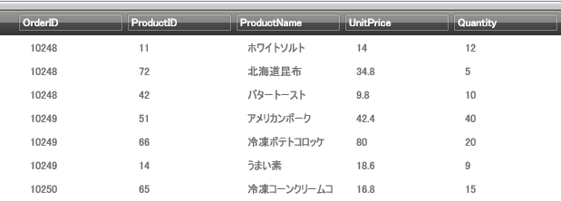

////

|metadata|
{
    "name": "xamdata-using-built-in-themes",
    "controlName": ["xamDataPresenter"],
    "tags": ["Theming"],
    "guid": "{34735165-EC4A-44FA-82A5-DC026FBE4309}",  
    "buildFlags": [],
    "createdOn": "2012-01-30T19:39:52.5778687Z"
}
|metadata|
////

= 組み込みテーマを使用

xamDataCarousel、xamDataGrid、および xamDataPresenter コントロールは、アセンブリに格納されている組み込みテキストを使用してスタイルすることができます。コントロールの link:{ApiPlatform}datapresenter{ApiVersion}~infragistics.windows.datapresenter.datapresenterbase~theme.html[Theme] プロパティを希望のテーマ名に設定するだけで、組み込みのテーマを使用できます。使用可能な組み込みテーマは以下のとおりです。

* Aero
* Generic
* IGTheme
* LunaNormal
* LunaOlive
* LunaSilver
* Metro
* Metro Dark
* Office2010Blue
* Office2013
* Office2k7Black
* Office2k7Blue
* Office2k7Silver
* Onyx
* Print Basic
* Royal Dark
* Royal Light
* Royale
* RoyaleStrong

以下の手順は、Theme プロパティを設定したいコントロールの設定をすでに持っていることが前提となります。この手順は、xamDataGrid のコンテキストで書かれていますが、xamDataCarousel と xamDataPresenter と同じように動作します。

*xamDataGrid コントロールで Theme プロパティを設定するには、次の手順に従ってください。*

[start=1]
. 以下の XAML は、コントロールに関係して Theme プロパティを設定する場所を示しています。Theme プロパティを Office2k7Black 組み込みスタイルにも設定します。

*XAML の場合:*

----
<igDP:XamDataGrid 
  ...
  Theme="Office2k7Black"/>
----

[start=2]
. Office2k7Black テーマを xamDataGrid に適用すると、コントロールは以下の画像のようになります。

