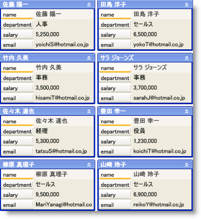

////

|metadata|
{
    "name": "xamdatacards-about-xamdatacards",
    "controlName": ["xamDataCards"],
    "tags": ["Getting Started"],
    "guid": "{D89FC732-9E81-4EF4-9441-68D31E2C185F}",  
    "buildFlags": [],
    "createdOn": "2012-01-30T19:39:52.6228777Z"
}
|metadata|
////

= xamDataCards について

xamDataCards™ コントロールでは、Microsoft® Outlook 2007 の連絡先のような「カード」を使用してフラット データを表示できます。xamDataCards コントロールは link:{ApiPlatform}datapresenter{ApiVersion}~infragistics.windows.datapresenter.datapresenterbase.html[DataPresenterBase] クラスから派生しているため、DataPresenter コントロールにある中核的な機能を継承します。ただし、xamDataCards コントロールは以下の機能をサポートしません。

* 階層データ
* 固定レコード
* グループ化
* 集計
* 固定フィールド

== 関連トピック

link:xamdatacards-adding-xamdatacards-to-your-application.html[xamDataCards をアプリケーションに追加]

link:xamdatacards-using-xamdatacards.html[xamDataCards の使用]