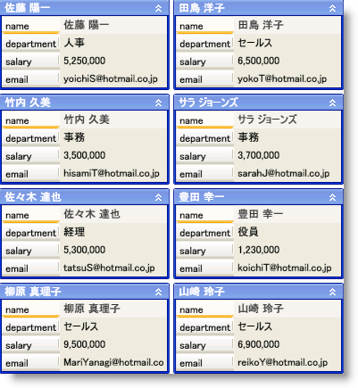

////
|metadata|
{
    "name": "xamdatacards-adding-xamdatacards-to-your-application",
    "controlName": ["xamDataCards"],
    "tags": ["How Do I"],
    "guid": "{AA112668-5C0F-46C5-957F-793B5B45E5EC}",
    "buildFlags": [],
    "createdOn": "2012-01-30T19:39:52.5918715Z"
}
|metadata|
////

= xamDataCards をアプリケーションに追加

== 始める前に

Microsoft® Windows® Presentation Foundation のコントロールと同じパターンを使用して xamDataCards™ をアプリケーションに追加できます。このパターンは、レイアウト コンテナーの使用およびレイアウト コンテナーの Children コレクションにコントロールを追加することに関わります。

== 達成すること

xamDataCards コントロールをユーザーのアプリケーションに追加します。完成したプロジェクトを実行すると、Window に以下のスクリーンショットに似た xamDataCards コントロールが表示されます。

== 次の手順を実行します

[start=1]
. WPF プロジェクトを作成します。
[start=2]
. 以下の NuGet パッケージをアプリケーションに追加します。

** Infragistics.WPF.DataGrids

NuGet フィードのセットアップと NuGet パッケージの追加の詳細については、link:nuget-feeds.html[NuGet フィード] ドキュメントを参照してください。

[start=3]
. コード ビハインドに using/Imports のディレクティブを配置するか xamDataCards の XML 名前空間定義を追加します。

*XAML の場合:*

----
xmlns:igDP="http://infragistics.com/DataPresenter"
----

*Visual Basic の場合:*

----
Imports Infragistics.Windows.DataPresenter
----

*C# の場合:*

----
using Infragistics.Windows.DataPresenter;
----

[start=4]
. Window でデフォルトのグリッド レイアウト パネルに名前を付け、コード ビハインドでそれを参照できます。

*XAML の場合:*

----
<Grid Name="LayoutRoot">
</Grid>
----

[start=5]
. xamDataCards コントロールのインスタンスをデフォルトのグリッド レイアウト パネルに追加します。プロシージャ コードでこれを行う場合、Window の Loaded イベントを処理し、イベント ハンドラーにこのコードを配置することができます。

*XAML の場合:*

----
<igDP:XamDataCards BindToSampleData="True">
</igDP:XamDataCards>
----

*Visual Basic の場合:*

----
Dim xamDataCards1 As XamDataCards
Private Sub Window_Loaded(ByVal sender As Object, ByVal e As RoutedEventArgs)
    xamDataCards1 = New XamDataCards With {.BindToSampleData = True}
    Me.LayoutRoot.Children.Add(xamDataCards1)
End Sub
----

*C# の場合:*

----
private XamDataCards xamDataCards1;
private void Window_Loaded(object sender, RoutedEventArgs e)
{
    xamDataCards1 = new XamDataCards
    {
        BindToSampleData = true
    };
    this.LayoutRoot.Children.Add(xamDataCards1);
}
----

[start=6]
. プロジェクトを実行します。

== 関連トピック

link:xamdatacards-about-xamdatacards.html[xamDataCards について]

link:xamdatacards-using-xamdatacards.html[xamDataCards の使用]