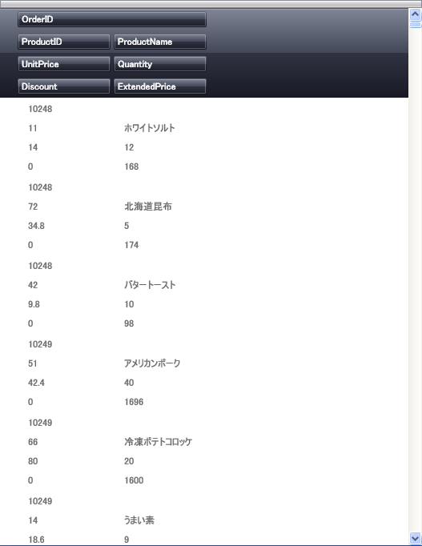

////

|metadata|
{
    "name": "xamdatagrid-changing-the-default-column-and-row-definitions",
    "controlName": ["xamDataGrid"],
    "tags": ["Data Presentation","Editing"],
    "guid": "{F5317934-129E-4372-B14B-CF18E8CB1FCA}",  
    "buildFlags": [],
    "createdOn": "2012-01-30T19:39:52.9799491Z"
}
|metadata|
////

= デフォルトの列と行の定義を変更

xamDataPresenter™ グリッド ビューによって、 link:{ApiPlatform}datapresenter{ApiVersion}~infragistics.windows.datapresenter.fieldlayout.html[FieldLayout] をカスタマイズせずにレイアウトを変更できます。link:{ApiPlatform}datapresenter{ApiVersion}~infragistics.windows.datapresenter.fielditem~row.html[Row]、 link:{ApiPlatform}datapresenter{ApiVersion}~infragistics.windows.datapresenter.fielditem~column.html[Column]、 link:{ApiPlatform}datapresenter{ApiVersion}~infragistics.windows.datapresenter.fielditem~columnspan.html[ColumnSpan]、または link:{ApiPlatform}datapresenter{ApiVersion}~infragistics.windows.datapresenter.fielditem~rowspan.html[RowSpan] を各 link:{ApiPlatform}datapresenter{ApiVersion}~infragistics.windows.datapresenter.field.html[フィールド]に設定して、 link:{ApiPlatform}datapresenter{ApiVersion}~infragistics.windows.datapresenter.record.html[レコード]のレイアウトをさらに制御できます。

以下の手順は、データバインドされた xamDataPresenter を持っていることが前提となります。詳細については、 link:xamdatapresenter-getting-started-with-xamdatapresenter.html[xamDataPresenter をアプリケーションに追加]を参照してください。

以下の手順に従って、xamDataPresenter の Fields で Row、Column、および ColumnSpan を指定します。

[start=1]
. 以下の XAML は xamDataPresenter のインスタンスを作成し名前を指定します。

*XAML の場合:*

----
<igDP:XamDataPresenter x:Name="XamDataPresenter1" ... >
        <igDP:XamDataPresenter.View>
             <igDP:GridView/>
        </igDP:XamDataPresenter.View>
        ...     
</igDP:XamDataPresenter>
----

[start=2]
. 以下の XAML を使用して、xamDataPresenter の link:{ApiPlatform}datapresenter{ApiVersion}~infragistics.windows.datapresenter.fieldlayoutsettings.html[FieldLayoutSettings] を指定して、 link:{ApiPlatform}datapresenter{ApiVersion}~infragistics.windows.datapresenter.fieldlayoutsettings~autoarrangecells.html[AutoArrangeCells] プロパティと link:{ApiPlatform}datapresenter{ApiVersion}~infragistics.windows.datapresenter.fieldlayoutsettings~autogeneratefields.html[AutoGenerateFields] プロパティを設定します。

*XAML の場合:*

----
...
        <igDP:XamDataPresenter.FieldLayoutSettings>
                <igDP:FieldLayoutSettings AutoArrangeCells="Never" 
                  AutoGenerateFields="False" />
        </igDP:XamDataPresenter.FieldLayoutSettings>
...
----

[start=3]
. FieldLayoutSettings を指定して、このコントロールに FieldLayouts を定義します。以下の XAML は FieldLayouts を指定し、次に追加の非バインド フィールドだけでなく、データ ソースから Fields を定義します。各フィールドに Row と Column を設定して、xamDataGrid が特定の Field の位置を指定するのを支援します。最初と 2 番目のフィールドはまた、2 に設定された ColumnSpan を持ち、これによってこれらのフィールドは 1 列だけではなく 2 列に及ぶことができます。ColumnSpan="2" は、これらの 2 つの列に対して Column="0" および Column="1" を指定するものとして考えることができます。

*XAML の場合:*

----
...
        <igDP:XamDataPresenter.FieldLayouts>
                <igDP:FieldLayout>
                        <igDP:FieldLayout.Fields>
                                <igDP:Field Name="ProductName" Row="0" Column="0" 
                                  ColumnSpan="2" />
                                <igDP:Field Name="CostPerUnit" Row="1" Column="0"/>
                                <igDP:Field Name="Quantity" Row="1" Column="1"/>
                                <igDP:Field Name="Discount" Row="2" Column="1"/>
                                <igDP:Field Name="ShipAndHandle" Row="2" Column="0"/>
                                <igDP:Field Name="Total" Row="3" Column="0" BindingType="Unbound"
                                  ColumnSpan="2"/>
                        </igDP:FieldLayout.Fields>
                </igDP:FieldLayout>
        </igDP:XamDataPresenter.FieldLayouts>
...
----

[start=4]
. プロジェクトをビルドして実行します。以下の画像のように、最初の列と最後の列が中にある 4 つの列の長さにまたがって xamDataPresenter が表示されます。

