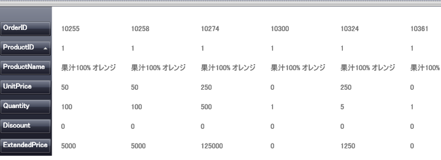

////

|metadata|
{
    "name": "xamdatagrid-changing-the-record-orientation",
    "controlName": ["xamDataGrid"],
    "tags": ["Data Presentation","Editing"],
    "guid": "{8136C48C-735A-4A54-AD4B-9FD46B9DAC9B}",  
    "buildFlags": [],
    "createdOn": "2012-01-30T19:39:52.9829497Z"
}
|metadata|
////

= レコードの方向の変更

xamDataPresenter のグリッド ビューは、垂直 (デフォルト) 方向または水平方向いずれかに  link:{ApiPlatform}datapresenter{ApiVersion}~infragistics.windows.datapresenter.record.html[Record] を表示します。水平方向にレコードを表示するには、 link:{ApiPlatform}datapresenter{ApiVersion}~infragistics.windows.datapresenter.gridviewsettings.html[GridViewSettings] の link:{ApiPlatform}datapresenter{ApiVersion}~infragistics.windows.datapresenter.gridviewsettings~orientation.html[Orientation] プロパティを設定します。

以下の手順は、方向を変更しようとしているデータ バインドされた xamDataPresenter があることを想定しています。詳細については、 link:xamdatapresenter-getting-started-with-xamdatapresenter.html[xamDataPresenter をアプリケーションに追加]を参照してください。

以下の手順に従って、グリッド ビューのレコードを水平に表示します。

[start=1]
. 以下の XAML は xamDataPresenter のグリッド ビューのインスタンスを作成し名前を指定します。XAML は XamDataGrid の link:{RootAssembly}{ApiVersion}~infragistics.windows.controls.viewsettingsbase.html[ViewSettings] オブジェクトと GridViewSettings オブジェクト (ViewSettings から派生) を定義します。これによって、Orientation プロパティを設定できます。

*XAML の場合:*

----
<igDP:XamDataPresenter x:Name="XamDataPresenter1" 
  ...
  >
        <igDP:XamDataPresenter.View>
                <igDP:GridView>
                        <igDP:GridView.ViewSettings>
                                <igDP:GridViewSettings Orientation="Horizontal" />
                        </igDP:GridView.ViewSettings>
                </igDP:GridView>
        </igDP:XamDataPresenter.View>
</igDP:XamDataPresenter>
----

[start=2]
. プロジェクトをビルドして実行します。以下の図のようにグリッド ビューが水平方向に表示します。

