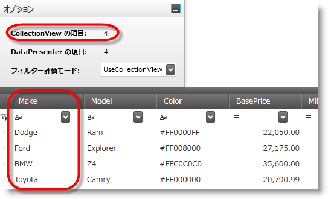
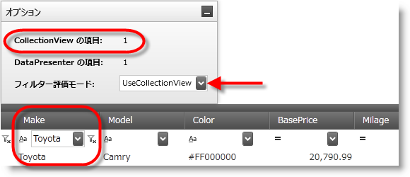
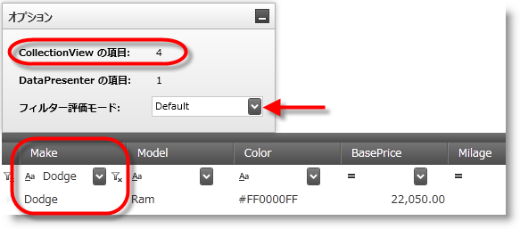

////
|metadata|
{
    "name": "xamdatagrid-external-filtering",
    "controlName": ["xamDataGrid"],
    "tags": ["Filtering","Grids"],
    "guid": "87759144-fef9-4a4b-b274-f7eae5c308cf",
    "buildFlags": [],
    "createdOn": "2012-09-17T19:52:00.43974Z"
}
|metadata|
////

= 外部フィルタリング (xamDataGrid)

== トピックの概要

=== 目的

このトピックでは、コード例を使用して _xamDataGrid™_ コントロールでレコードのフィルタリング処理を外部で行う方法を説明します。

=== 前提条件

このトピックを理解するために、以下のトピックを参照することをお勧めします。

[options="header", cols="a,a"]
|====
|トピック|目的

| link:wpf-about-the-data-presenter-family.html[Data Presenter Family について]
|このトピックでは、`DataPresenter` コントロールのグループ機能について説明します。 

`DataPresenter` コントロールはグループ機能を提供します。エンド ユーザーはグループ機能を使用して、同じ値のフィールドに基づいてレコードをグループ化することができます。

| link:xamdatagrid-understanding-xamdatagrid.html[xamDataGrid について]
|_xamDataGrid_ コントロールは、グリッド ビューを使用して、データを列と行に配置します。

| link:xamdatagrid-using-xamdatagrid.html[xamDataGrid での作業]
|このセクションでは、 _xamDataGrid_ コントロールの様々な特徴や機能を効果的に使用するための重要なタスク ベースの情報を提供します。

|====

=== このトピックの内容

このトピックは、以下のセクションで構成されます。

* <<_Ref327527325,概要>>
* <<_Ref327527435,外部フィルタリング – コード例>>
* <<_Ref327527447,関連コンテンツ>>

[[_Ref327527325]]
== 概要

=== xamDataGrid 外部フィルタリングについての紹介

以下の例では、 _xamDataGrid_   コントロールの外部フィルタリングプロセスを構成する方法を紹介します。このプロセスはユーザー インターフェイスの影響を受けずに外部で実行します。使用可能なフィルター オペランドのリストを表示するには、選択した `FilterUIType` に応じて、フィルター ラベル アイコンまたはフィルター セルのドロップダウン ボタンのいずれかをクリックします。通常は使用可能な  _xamDataGrid_   のデータ プレゼンター オペランドの一部が、現行制限のために  _xamDataGrid_   のデータ プレゼンターで使用できません。

外部操作で実行すると `DataPresenter` のリソースが使用されないため、オーバーヘッドが大幅に低下します。link:http://msdn.microsoft.com/ja-jp/library/system.windows.data.collectionview(v=VS.85).aspx[CollectionView] は要求されたフィルタリング プロセスを実行し、フィルタリングが終了すると、`CollectionView` により `DataPresenter` に通知され、結果が UI に伝達されます。

=== プレビュー

以下のスクリーンショットは、Make 列のフィルタリグ前の一般的なデータ グリッド レンダリングを示しています。この列は `CollectionView` の項目数を示します。この場合、`CollectionView` に 9 項目あります。

次のスクリーンショットは、特定の製造元でフィルター処理した場合に (この場合は Make フィールドの Honda)、同じデータ グリッドのレンダリングされる状態を示しています。また、 _UseCollectionView_   の `FilterEvaluationMode` を有効にすると、コレクション ビューが更新され、`CollectionView` にフィルター処理された項目数が表示されます。この場合、`CollectionView` に 3 項目あります。

`CollectionView` のフィルター プロパティは、フィルター処理されたレコードの結果を  _xamDataGrid_   のデータ プレゼンターに伝達します。また、データ プレゼンターは、 _xamDataGrid_   のビューに結果をレンダリングすることにより、フィルター処理の結果の変更を反映します。

以下のスクリーンショットは、概説した列フィルタリング シナリオを示していますが、今回は `FilterEvaluationMode` を  _Default_   に設定しています。`CollectionView` の項目がフィルタリング プロセスにより影響されない点に注意してください。_xamDataGrid_   のデータ プレゼンターはフィルタリングを内部的に実行します。

=== 制限

_UseCollectionView_   の `FilterEvaluationMode` を使用する場合、`ICollectionView`.`SourceCollection` が値を返さないカスタム `ICollectionView` 実装があるときは、評価のために集計された値を必要とするオペランドはサポートされません ( _Above Average, Below Average, Percentile など…_   )。

これらのオペランドがサポートできない理由は、フィルタリングの操作によりデータセット全体がデータ プレゼンターに対して使用できなくなるためです。

さらに、一意の値を持つフィルター ドロップダウン リストを生成することはできません。

表示されるドロップダウンまたはコントロールに一意の値を表示するには、最初に一意の値のリストを持つドロップダウンを生成する link:{ApiPlatform}datapresenter{ApiVersion}~infragistics.windows.datapresenter.datapresenterbase~recordfilterdropdownpopulating_ev.html[RecordFilterDropDownPopulating] イベントまたは link:{ApiPlatform}datapresenter{ApiVersion}~infragistics.windows.datapresenter.datapresenterbase~recordfilterdropdownopening_ev.html[RecordFilterDropDownOpening] イベントのいずれかを処理する必要があります。

フィルター ドロップダウンからオペランドを選択すると、`ICollectionView` データ ソースおよびフィルター自体への条件の適用とフィルター処理された項目の表示について、データ プレゼンターに通知されます。

注:

[NOTE]
====
自分自身をフィルター処理した `ICollectionView` によりデータ項目のサブセットが提供されるため、データ プレゼンターはフィルター処理で除外されたデータ項目の `DataRecord` オブジェクトを破棄します。したがって、選択されたレコードまたはアクティブ化されたレコードは、データ グリッドがリフレッシュされるときに、フィルタリング基準の削除後に選択された状態またはアクティブ化された状態を切り替えます。バインドされたデータ フィールドのフィルタリングのみを実行できます。
====

データ項目をフィルター処理する (包含および除外) 場合、 _xamDataGrid_   コントロールは `DataRecord` オブジェクトを再作成します。したがって、`DataRecord` により保存されたその他の状態とともに、非バインド フィールド値の消失が発生します。

外部フィルタリングを使用するには、最初に `FieldLayoutSettings` の `FilterEvaluationMode` を _UseCollectionView_   オプションに設定する必要があります。

以下は使用可能な `FilterEvaluationModes` の列挙体です。

[options="header", cols="a,a"]
|====
| *並べ替え条件タイプ* | *説明* 

|_Auto_
|データ プレゼンターにより実行される内部フィルタリング。

|_Default_
|Auto に解決されます。

|_Manual_
|フィルタリング基準に一致しないエントリをデータ ソースから削除することにより、ユーザーは手動でフィルタリング ロジックを実装できます。

|_UseCollectionView_
|`ICollectionView` データ ソースを使用してフィルタリング操作を実行します。 

注: 

[NOTE] 

==== 

データ ソースを実装する `ICollectionView` の `Filter` プロパティを使用するフィルタリング ロジック設定がある場合、このプロパティにより提供される xamDataGrid のフィルタリング基準によりその設定は上書きされます。 

====

|====

[[_Ref327527435]]
== 外部フィルタリング – コード例

=== 説明

この外部フィルタリング操作は、コールバック プロシージャを使用して、フィルタリング基準を `ICollectionView` に渡し、レコードをフィルター処理により除外します。

=== 前提条件

新規 WPF プロジェクトを作成し、以下の要件を実行します。

* 以下の NuGet パッケージ参照をプロジェクトに追加します。

** Infragistics.WPF.DataGrids

* _xamDataGrid_ にマークアップを配置する、ウィンドウの XAML 部分に、以下の名前空間の定義を追加します。

[source,xaml]
----
xmlns:igDP=http://infragistics.com/DataPresenter
----

* オブジェクトの関連プロパティが _public_ としてマークされ、これらのプロパティがフィルター条件を評価する際に link:http://msdn.microsoft.com/ja-jp/library/f7ykdhsy(v=vs.71).aspx[Reflection] を使用してアクセスされることを確実にします。

=== コードの説明

レコード フィルタリングの有効化。

*XAML の場合:*

[source,xaml]
----
<igDP:XamDataGrid.FieldSettings>
   <igDP:FieldSettings AllowRecordFiltering="True" />
</igDP:XamDataGrid.FieldSettings>
----

`FilterEvaluationMode` に  _UseCollectionView_   オプションを設定します。

*XAML の場合:*

[source,xaml]
----
<igDP:XamDataGrid.FieldLayoutSettings>
   <igDP:FieldLayoutSettings 
      FilterEvaluationMode="UseCollectionView"
      FilterUIType="LabelIcons" />
</igDP:XamDataGrid.FieldLayoutSettings>
----

=== 全コード

データ モデルの定義

*C# の場合:*

[source,csharp]
----
 public class DataModel : INotifyPropertyChanged
    {
        private string _make;
        public string Make
        {
            get { return _make; }
            set
            {
                if (_make != value)
                {
                    _make = value;
                    OnPropertyChanged("Make");
                }
            }
        }
        private string _model;
        public string Model
        {
            get { return _model; }
            set
            {
                if (_model != value)
                {
                    _model = value;
                    OnPropertyChanged("Model");
                }
            }
        }
        private double _price;
        public double Price
        {
            get { return _price; }
            set
            {
                if (_price != value)
                {
                    _price = value;
                    OnPropertyChanged("Price");
                }
            }
        }
        private int _mileage;
        public int Mileage
        {
            get { return _mileage; }
            set
            {
                if (_mileage != value)
                {
                    _mileage = value;
                    OnPropertyChanged("Mileage");
                }
            }
        }
        #region INotifyPropertyChanged Members
        protected void OnPropertyChanged(string propertyName)
        {
            if (PropertyChanged != null)
            {
                this.PropertyChanged(this, new PropertyChangedEventArgs(propertyName));
            }
        }
        public event PropertyChangedEventHandler PropertyChanged;
        #endregion
    }
----

*Visual Basic の場合:*

[source,vb]
----
Public Class DataModel
      Implements INotifyPropertyChanged
      Private _make As String
      Public Property Make() As String
            Get
                  Return _make
            End Get
            Set
                  If _make <> value Then
                        _make = value
                        OnPropertyChanged("Make")
                  End If
            End Set
      End Property
      Private _model As String
      Public Property Model() As String
            Get
                  Return _model
            End Get
            Set
                  If _model <> value Then
                        _model = value
                        OnPropertyChanged("Model")
                  End If
            End Set
      End Property
      Private _price As Double
      Public Property Price() As Double
            Get
                  Return _price
            End Get
            Set
                  If _price <> value Then
                        _price = value
                        OnPropertyChanged("Price")
                  End If
            End Set
      End Property
      Private _mileage As Integer
      Public Property Mileage() As Integer
            Get
                  Return _mileage
            End Get
            Set
                  If _mileage <> value Then
                        _mileage = value
                        OnPropertyChanged("Mileage")
                  End If
            End Set
      End Property
      #Region "INotifyPropertyChanged Members"
      Protected Sub OnPropertyChanged(propertyName As String)
            RaiseEvent PropertyChanged(Me, New PropertyChangedEventArgs(propertyName))
      End Sub
      Public Event PropertyChanged As PropertyChangedEventHandler
      #End Region
End Class
----

*XAML の場合:*

[source,xaml]
----
<Grid>
<Grid.RowDefinitions>
            <RowDefinition Height="30"/>
            <RowDefinition Height="*"/>
        </Grid.RowDefinitions>
        <StackPanel Grid.Row="0" Orientation="Horizontal">
            <TextBlock x:Name="textBlock1" Text="Items in CollectionView: " 
Width="165" HorizontalAlignment="Stretch" />
            <TextBlock x:Name="textBlock2" 
Width="30" HorizontalAlignment="Stretch" />
            <igEditors:XamComboEditor 
                    FontWeight="Bold"
                    ItemsSource="{DynamicResource FilterEvaluationMode}"
                    Value="{Binding ElementName=xamDataGrid1, Path=FieldLayoutSettings.FilterEvaluationMode}"/>
        </StackPanel>
        <igDP:XamDataGrid x:Name="xamDataGrid1" 
                     Grid.Row="1"
                     DataSource="{DynamicResource DataSource}" 
                     VerticalAlignment="Stretch"
                     RecordFilterChanged="xamDataGrid1_RecordFilterChanged">
            <igDP:XamDataGrid.FieldLayoutSettings>
                <igDP:FieldLayoutSettings 
                      FilterEvaluationMode="UseCollectionView"
                      FilterUIType="LabelIcons" />
            </igDP:XamDataGrid.FieldLayoutSettings>
            <igDP:XamDataGrid.FieldSettings>
                <igDP:FieldSettings AllowRecordFiltering="True" />
            </igDP:XamDataGrid.FieldSettings>
        </igDP:XamDataGrid>
</Grid>
----

*C# の場合:*

[source,csharp]
----
public partial class MainWindow : Window
    {
        public MainWindow()
        {
            InitializeComponent();
            this.Resources.Add("FilterEvaluationMode", Enum.GetValues(typeof(FilterEvaluationMode)));
            // データ ソースの新しいインスタンスを作成する
            this.CreateDataSource();
        }
        // データ ソースを作成する
        private void CreateDataSource()
        {
            var data = new ObservableCollection<DataModel>();
            data.Add(new DataModel() { Make = "Ford", Model = "Mustang", Price = 25000, Mileage = 1000 });
            data.Add(new DataModel() { Make = "Jeep", Model = "Wrangler", Price = 21000, Mileage = 200 });
            data.Add(new DataModel() { Make = "Honda", Model = "Accord", Price = 19500, Mileage = 1000 });
            data.Add(new DataModel() { Make = "Toyota", Model = "Camry", Price = 22500, Mileage = 500 });
            data.Add(new DataModel() { Make = "Ford", Model = "Escort", Price = 15000, Mileage = 15000 });
            data.Add(new DataModel() { Make = "Toyota", Model = "4Runner", Price = 31000, Mileage = 50 });
            data.Add(new DataModel() { Make = "Honda", Model = "Pilot", Price = 35000, Mileage = 18000 });
            data.Add(new DataModel() { Make = "Jeep", Model = "Patriot", Price = 22000, Mileage = 1000 });
            data.Add(new DataModel() { Make = "Honda", Model = "Civic", Price = 19500, Mileage = 30000 });
            this.Resources.Add("DataSource", new ListCollectionView(data));
        }
private void xamDataGrid1_RecordFilterChanged(object sender, Infragistics.Windows.DataPresenter.Events.RecordFilterChangedEventArgs e)
        {
            CollectionView cv = this.xamDataGrid1.DataSource as CollectionView;
            this.textBlock2.Text = cv.Count.ToString();
        }
    }
----

*Visual Basic の場合:*

[source,vb]
----
Public Partial Class MainWindow
      Inherits Window
      Public Sub New()
            InitializeComponent()
            Me.Resources.Add("FilterEvaluationMode", [Enum].GetValues(GetType(FilterEvaluationMode)))
            ' データ ソースの新しいインスタンスを作成する
            Me.CreateDataSource()
      End Sub
      ' データ ソースを作成する
      Private Sub CreateDataSource()
            ' データを生成する
            Dim data = New ObservableCollection(Of DataModel)()
            data.Add(New DataModel() With { 
                  .Make = "Ford", 
                  .Model = "Mustang", 
                  .Price = 25000, 
                  .Mileage = 1000 
            })
            data.Add(New DataModel() With { 
                  .Make = "Jeep", 
                  .Model = "Wrangler", 
                  .Price = 21000, 
                  .Mileage = 200 
            })
            data.Add(New DataModel() With { 
                  .Make = "Honda", 
                  .Model = "Accord", 
                  .Price = 19500, 
                  .Mileage = 1000 
            })
            data.Add(New DataModel() With { 
                  .Make = "Toyota", 
                  .Model = "Camry", 
                  .Price = 22500, 
                  .Mileage = 500 
            })
            data.Add(New DataModel() With { 
                  .Make = "Ford", 
                  .Model = "Escort", 
                  .Price = 15000, 
                  .Mileage = 15000 
            })
            data.Add(New DataModel() With { 
                  .Make = "Toyota", 
                  .Model = "4Runner", 
                  .Price = 31000, 
                  .Mileage = 50 
            })
            data.Add(New DataModel() With { 
                  .Make = "Honda", 
                  .Model = "Pilot", 
                  .Price = 35000, 
                  .Mileage = 18000 
            })
            data.Add(New DataModel() With { 
                  .Make = "Jeep", 
                  .Model = "Patriot", 
                  .Price = 22000, 
                  .Mileage = 1000 
            })
            data.Add(New DataModel() With { 
                  .Make = "Honda", 
                  .Model = "Civic", 
                  .Price = 19500, 
                  .Mileage = 30000 
            })
            Me.Resources.Add("DataSource", New ListCollectionView(data))
      End Sub
      Private Sub xamDataGrid1_RecordFilterChanged(sender As Object, e As Infragistics.Windows.DataPresenter.Events.RecordFilterChangedEventArgs)
            Dim cv As CollectionView = TryCast(Me.xamDataGrid1.DataSource, CollectionView)
            Me.textBlock2.Text = cv.Count.ToString()
      End Sub
End Class
----

[[_Ref327527447]]
== 関連コンテンツ

=== トピック

このトピックの追加情報については、以下のトピックも合わせてご参照ください。

[options="header", cols="a,a"]
|====
|トピック|目的

| link:xamdatagrid-external-grouping.html[外部グルーピング]
|このトピックは、 _xamDataGrid_ で外部グルーピングを使用する方法について説明します。

| link:xamdatagrid-external-sorting.html[外部ソート]
|このトピックでは、 _xamDataGrid_ コントロールを使用して外部ソートを実行する方法をコード例を使用して説明します。

| link:xamdatagrid-external-summary-calculations.html[外部集計計算]
|このトピックは、 _xamDataGrid_ の外部集計計算機能について説明します。集計は LINQ を介して計算されます。

| link:xamdatapresenter-grouping.html[グループ化 (xamDataPresenter)]
|_xamDataGrid_ コントロールのグループ化機能について説明するトピックへのリンクを提供します。

| link:xamdatapresenter-sorting.html[レコードの並べ替え (xamDataPresenter)]
|_xamDataGrid_ コントロールの並べ替え機能について説明するトピックへのリンクを提供します。

|====