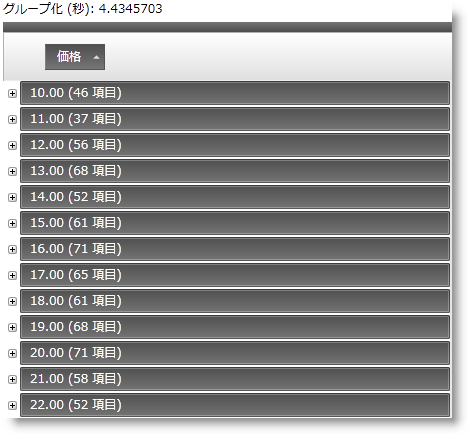

////
|metadata|
{
    "name": "xamdatagrid-external-grouping",
    "controlName": ["xamDataGrid"],
    "tags": ["Data Binding","Formatting","Grids","Grouping","Patterns and Practices"],
    "guid": "287fc05a-e08a-4a41-b72f-eb7f67c5ba69",
    "buildFlags": [],
    "createdOn": "2012-09-12T11:43:11.4786081Z"
}
|metadata|
////

= 外部でグルーピング

== トピックの概要

=== 目的

このトピックは、 _xamDataGrid_   コントロールで外部グルーピングを使用する方法について説明します。

=== 前提条件

このトピックの本題に入る前に、以下のトピックをお読みください。

[options="header", cols="a,a"]
|====
|トピック|目的

| link:xamdatagrid-getting-started-with-xamdatagrid.html[xamDataGrid をページに追加]
|このトピックは、 _xamDataGrid_ コントロールをページに追加する方法をコード例を用いて説明します。

| link:xamdatapresenter-about-grouping.html[グループ化情報]
|このトピックは、`DataPresenter` コントロールのグループ機能について説明します。 

`DataPresenter` コントロールは、グループ化機能を提供し、ユーザーは同じ値を含むフィールドに基づいてレコードをグループ化できます。

|====

=== 本トピックの内容

このトピックは以下のセクションからなります。

* <<_Introduction, はじめに >>

* <<_External_Grouping_Code_Example,  _xamDataGrid_   外部グルーピング - コード例 >>

* <<_Related_Content, 関連コンテンツ >>

[[_Introduction]]
== 概要

=== 外部グルーピングの紹介

UI の視点で、外部グルーピング機能は `xamDataGrid` のデフォルトの機能 (内部など) と似ています。ユーザーは、フィールドのドラッグ ドロップしてグループ毎の領域からフィールド毎の領域にできます。

注:

[NOTE]
====

データ プレゼンターの `GroupByMode` および `GroupByEvaluator` の設定は、グループ化処理を実行するのが  _ICollectionView_   であるためサポートされません。

更に、非バインド フィールドでグループ化もサポートされていません。
====

外部グルーピングを使用するには、 link:{ApiPlatform}datapresenter{ApiVersion}~infragistics.windows.datapresenter.datapresenterbase~fieldlayoutsettings.html[FieldLayoutSettings] の link:{ApiPlatform}datapresenter{ApiVersion}~infragistics.windows.datapresenter.fieldlayoutsettings~groupbyevaluationmode.html[GroupByEvaluationMode] を  _UseCollectionView_   オプションに設定します。以下は `GroupByEvaluationMode` 列挙体のオプションです。

[options="header", cols="a,a"]
|====
|並べ替え条件タイプ|説明

| _Default_ 
|デフォルトは Auto に解決されます。

| _Auto_ 
|グループ化が内部で発生するグループ モード

| _UseCollectionView_ 
| link:http://msdn.microsoft.com/ja-jp/library/System.ComponentModel.ICollectionView.aspx[ICollectionView] のグループ機能の使用

|====

[[_External_Grouping_Code_Example]]
== _xamDataGrid_   外部グルーピング - コード例

=== 説明

このコード例は、 _xamDataGrid_   の外部グルーピング機能を使用する方法を説明します。この例は、`ICollectionView` を実装するため、 _xamDataGrid_   データ ソースとして ListViewCollection を使用します。このコレクションは、 _xamDataGrid_   にバインドされ、外部グルーピングで使用するために `GroupByEvaluationMode` を  _UseCollectionView_   に設定する必要があります。

=== 前提条件

以下が含まれる新しい WPF アプリケーション プロジェクト タイプ  _ExternalOperations_   を開始します。

* 以下の NuGet パッケージへの参照:

** Infragistics.WPF.DataGrids

* クラス

** `Item` は INotifyPropertyChanged を継承します。このクラスの全コードは、link:xamdatagrid-item-class-code-example.html[Item クラスのコード例]を参照してください。

** `Utils` クラス、ランダム項目の `ListCollectionView` を作成します。これはデータ ソースで、 _xamDataGrid_   がバインドされます。このクラスの完全なコードについては、 link:xamdatagrid-creating-of-sample-listcollectionview-code-example.html[ListCollectionView コード例の作成] トピックを参照してください。

* ウィンドウの開始

** `ExternalGrouping.xaml` ウィンドウは、アプリケーションの開始ウィンドウとして設定します。

* 名前空間の定義を  _xamDataGrid_   にマークアップを配置する、ウィンドウの XAML 部分に追加します。

[source,xaml]
----
xmlns:igDP=http://infragistics.com/DataPresenter
----

[source,xaml]
----
xmlns:local="clr-namespace:ExternalOperations"
----

(プロジェクト の名前が  _ExternalOperations_   の場合。名前が異なる場合は、この定義を新しい名前に合わせて変更してください。)

=== プレビュー

以下の画像は、外部グルーピングを使用したコンパイル済みアプリケーションの描画を示します。UI の観点からすると、グループ化操作を外部で実行する場合と内部で実行する場合での違いはありません。

=== コード

*XAML の場合:*

[source,xaml]
----
<Window x:Class="ExternalOperations.ExternalGrouping"
        xmlns="http://schemas.microsoft.com/winfx/2006/xaml/presentation"
        xmlns:x="http://schemas.microsoft.com/winfx/2006/xaml" 
        xmlns:igDP="http://infragistics.com/DataPresenter" 
        xmlns:local="clr-namespace:ExternalOperations"
        Title="ExternalGrouping" Height="768" Width="1024">
    <DockPanel LastChildFill="True">
        <StackPanel Orientation="Vertical" VerticalAlignment="Stretch" DockPanel.Dock="Top">
            <Button FontWeight="Bold" x:Name="btn100kExternal" Content="Bind to 100k items" Click="btn100kExternal_Click" Width="120" Margin="5"/>
            <Label x:Name="lblExternalTimes" />
        </StackPanel>
        <igDP:XamDataGrid x:Name="xdg100kExternal" VerticalAlignment="Stretch" Grouping="xdg100kExternal_Grouping"
                                      DataSourceResetBehavior="DiscardExistingRecords">
            <igDP:XamDataGrid.FieldLayoutSettings>
                <!-- Here GroupByEvaluationMode is set to UseCollectionView, in order to use the external grouping feature.-->
                <igDP:FieldLayoutSettings GroupByEvaluationMode="UseCollectionView" FilterUIType="FilterRecord"/>
            </igDP:XamDataGrid.FieldLayoutSettings>
            <igDP:XamDataGrid.FieldSettings>
                <igDP:FieldSettings AllowRecordFiltering="True" AllowSummaries="True" SummaryUIType="MultiSelect"
                                                SummaryDisplayArea="BottomFixed" />
            </igDP:XamDataGrid.FieldSettings>
        </igDP:XamDataGrid>
    </DockPanel>
</Window>
----

*Visual Basic の場合:*

[source,vb]
----
Namespace ExternalOperations
      ''' 

      ''' Interaction logic for ExternalGrouping.xaml
      ''' 

      Public Partial Class ExternalGrouping
            Inherits Window
            Public Sub New()
                  InitializeComponent()
            End Sub
            Private Sub btn100kExternal_Click(sender As Object, e As RoutedEventArgs)
                  xdg100kExternal.DataSource = Utils.CreateDataSource(100000)
            End Sub
            Private Sub xdg100kExternal_Grouping(sender As Object, e As GroupingEventArgs)
                  lblExternalTimes.Content = "Grouping..."
                  Dim start As DateTime = DateTime.Now
                  Dispatcher.BeginInvoke(DispatcherPriority.Background, New Action(Function() 
                  lblExternalTimes.Content = "Time to group = "(DateTime.Now - start).TotalSeconds
End Function))
            End Sub
      End Class
End Namespace
----

*C# の場合:*

[source,csharp]
----
namespace ExternalOperations
{
    /// 

    /// Interaction logic for ExternalGrouping.xaml
    /// 

    public partial class ExternalGrouping : Window
    {
        public ExternalGrouping()
        {
            InitializeComponent();
        }
        private void btn100kExternal_Click(object sender, RoutedEventArgs e)
        {
            xdg100kExternal.DataSource = Utils.CreateDataSource(100000);
        }
        private void xdg100kExternal_Grouping(object sender, GroupingEventArgs e)
        {
            lblExternalTimes.Content = "Grouping...";
            DateTime start = DateTime.Now;
            Dispatcher.BeginInvoke(DispatcherPriority.Background,
                new Action(
                    () =>
                    {
                        lblExternalTimes.Content = "Time to group = " + (DateTime.Now - start).TotalSeconds;
                    }
                    ));
        }
    }
}
----

[[_Related_Content]]
== 関連コンテンツ

=== トピック

このトピックについては、以下のトピックも参照してください。

[options="header", cols="a,a"]
|====
|トピック|目的

| link:xamdatagrid-external-filtering.html[外部のフィルタリング]
|このトピックは、 _XamDataGrid_ コントロールのレコードのフィルタリング処理を説明します。

| link:xamdatagrid-external-sorting.html[外部ソート]
|このトピックは、 _XamDataGrid_ コントロールのレコードの外部処理を説明します。

| link:xamdatagrid-external-summary-calculations.html[外部集計計算]
|このトピックは、 _xamDataGrid_ の外部集計計算機能について説明します。

| link:xamdatagrid-grouping.html[グループ化]
|このトピックは、 _xamDataGrid_ コントロールを使用してグループ化する際に特に役立つトピックです。

|====