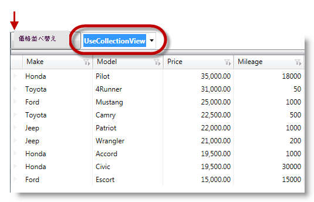
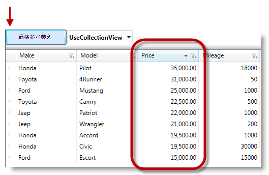

////
|metadata|
{
    "name": "xamdatagrid-external-sorting",
    "controlName": ["xamDataGrid"],
    "tags": ["Grids","Sorting"],
    "guid": "ec9ad245-1de9-487c-ad9a-ef42717274a8",
    "buildFlags": [],
    "createdOn": "2012-09-17T19:53:34.2271178Z"
}
|metadata|
////

= 外部ソート (xamDataGrid)

== トピックの概要

=== 目的

このトピックは _xamDataGrid_™ コントロールを使用して外部ソートを実行する方法をコード例を使用して説明します。

=== 前提条件

このトピックの本題に入る前に、以下のトピックをお読みください。

[options="header", cols="a,a"]
|====
|トピック|目的

| link:wpf-about-the-data-presenter-family.html[DataPresenter コントロールについて]
|{ProductName} の新しい Data Presenter Family (DPF) は、データ バインドや自動要素生成の API などによる、すばやく簡単に高いユーザー エクスペリエンスの作成を可能にします。

| link:xamdatagrid-understanding-xamdatagrid.html[xamDataGrid について]
|_xamDataGrid_ コントロールは、 link:xamdata-terms-presentation-formats-grid-view-format.html[グリッド ビュー]を使用して、データを列と行に配置します。link:xamdata-terms-records.html[レコード]は各データ項目を表すために使用され、 link:xamdata-terms-fields.html[フィールド]は各レコードを構成する属性/プロパティを記述するために使用されます。

| link:xamdatagrid-using-xamdatagrid.html[xamDataGrid の使用]
|このセクションでは、 _xamDataGrid_ コントロールの様々な特長や機能を効果的に使用するための、重要なタスク ベースの情報について説明します。

| link:xamdatapresenter-sorting.html[並べ替え]
|_xamDataGrid_ コントロールの並べ替え機能の変換についてのトピックです。

| link:xamdatapresenter-grouping.html[グループ化]
|_xamDataGrid_ コントロールのフィルタリング機能の変換についてのトピックです。

| link:external-sorting-filtering-grouping-summaries-overview-xamdatagrid.html[外部ソートフィルタリング グループと集計の概要]
|このトピックは、外部ソート、フィルタリング、グループ化、集計を含む link:{ApiPlatform}datapresenter{ApiVersion}~infragistics.windows.datapresenter.xamdatagrid_members.html[XamDataGrid] の機能の概要について説明します。

|====

=== 本トピックの内容

このトピックは以下のセクションからなります。

* <<_Ref327527325,はじめに>>
* <<_Ref327527435,外部ソート>>
* <<_Ref327527447,関連コンテンツ>>

[[_Ref327527325]]
== 概要

=== xamDataGrid 外部ソートについての紹介

_xamDataGrid_ のバインド フィールドの外部ソートは、ユーザーがフィールドを並べ替える際に、内部ソートに比べ、より高速な並べ替えを提供します。link:http://msdn.microsoft.com/ja-jp/library/system.windows.data.collectionview(v=VS.85).aspx[CollectionView] は要求操作 (並べ替え) によって動作します。操作が完了した後に`CollectionView` はデータ プレゼンターへの変更を反映し、データ プレゼンターは指定された順序でデータを再表示し、変更を反映します。

注:

[NOTE]
====
_xamDataGrid_ 外部ソート処理では、非バインド フィールドの並べ替えはサポートしません。現在の制限を考慮し、外部ソートプロセスがルートフィールドのレイアウトのみに適用され、子フィールドのレイアウトには適用されません。各子フィールド レイアウトに複数コレクションのビューがあるためです。
====

外部ソートを使用するために、`FieldSettings` の link:{ApiPlatform}datapresenter{ApiVersion}~infragistics.windows.datapresenter.fieldlayoutsettings~sortevaluationmodeproperty.html[SortEvaluationMode] を  _UseCollectionView_   オプションに設定します。利用可能な列挙体:

[options="header", cols="a,a"]
|====
| *並べ替え条件タイプ* | *説明* 

| _Auto_ 
|設定すると、データ プレゼンターが並べ替え処理を内部で実行します。

| _Default_ 
|デフォルトでは、内部並べ替えプロセスが並べ替え処理を実行します。

| _Manual_ 
|When set, the data presenter does not perform sorting and rely on external sort logic to do the sorting, by handling the link:{ApiPlatform}datapresenter{ApiVersion}~infragistics.windows.datapresenter.datapresenterbase~sorting_ev.html[Sorting] and link:{ApiPlatform}datapresenter{ApiVersion}~infragistics.windows.datapresenter.datapresenterbase~sorted_ev.html[Sorted] events.

| _UseCollectionView_ 
|When set, the data presenter reflects the user selected sort criteria to the underlaying `ICollectionView` data source. The data presenter does not perform sorting on its own and rely on the data source to perform the sorting and later re-displays the data in the specified by the data source order.

|====

=== プレビュー

以下は、 _xamDataGrid_   が `SortEvaluationMode` が `UseCollectionView` である選択オプションの概要を説明する Price 列で、並べ替えを実行する前に描画している画像です。

次は、説明列 (Price) を降順に外部ソート処理した後の画像です。

[[_Ref327527435]]
== 外部ソート - コード例

=== 説明

この例では、 _xamDataGrid_   で外部ソート処理を設定する方法を説明します。この処理でデータ プレゼンターは、`ICollectionView` の `SortDescription` に基づいて並べ替え処理を実行します。データ プレゼンターは、所定の独自のコレクションを使用して内部並べ替え処理を行いません。

以下のコード サンプルでは、並べ替え処理を外部で行うよう設定しています。データプレゼンターはリソースをレコードの並べ替えに使用しないため、オーバーヘッドが軽減されます。`CollectionView` がプロセスを実行する代わりに、処理が完了した後に `CollectionView` がデータ プレゼンターに通知することにより、データ プレゼンターが UI で最終結果を表示します。

=== 前提条件

新規 WPF プロジェクトの作成し、以下の要件を実行します。

* 以下の NuGet パッケージをアプリケーションに追加します。

** Infragistics.WPF.DataGrids

* 以下の名前空間の定義を  _xamDataGrid_   にマークアップを配置する、ウィンドウの XAML 部分に追加します。

[source,xaml]
----
xmlns:igDP=http://infragistics.com/DataPresenter
----

* オブジェクトの関連プロパティが  _public_   としてマークされ、これらのプロパティがフィルター条件を評価する際に link:http://msdn.microsoft.com/ja-jp/library/f7ykdhsy(v=vs.71).aspx[Reflection] を使用してアクセスされることを確実にします。

=== コードの説明

`SortEvaluationMode` に  _UseCollectionView_   オプションを設定します。

*XAML の場合:*

[source,xaml]
----
<igDP:XamDataGrid.FieldLayoutSettings>
  <igDP:FieldLayoutSettings SortEvaluationMode="UseCollectionView" />
</igDP:XamDataGrid.FieldLayoutSettings>
----

`SortEvaluationMode` オブジェクトを表すリソースを設定します。

*C# の場合:*
[source,csharp]
----
This.Resources.Add("SortEvaluationMode", Enum.GetValues(typeof(SortEvaluationMode)));
----

*Visual Basic の場合:*
[source,vb]
----
This.Resources.Add(SortEvaluationMode, [Enum].GetValues(GetType(SortEvaluationMode)))
----

フィールドに外部ソートを設定します

*C# の場合:*
[source,csharp]
----
ICollectionView iCollectionView = (ICollectionView)this.Resources["sort_DataSource"];
iCollectionView.SortDescriptions.Clear();
iCollectionView.SortDescriptions.Add(new SortDescription("Price", ListSortDirection.Descending));
----

*Visual Basic の場合:*
[source,vb]
----
Dim iCollectionView As ICollectionView = DirectCast(Me.Resources(sort_DataSource), ICollectionView)
iCollectionView.SortDescriptions.Clear()
iCollectionView.SortDescriptions.Add(New SortDescription(Price, ListSortDirection.Descending))
----

=== 全コード

データ モデルの定義

*C# の場合:*
[source,csharp]
----
 public class DataModel : INotifyPropertyChanged
    {
        private string _make;
        public string Make
        {
            get { return _make; }
            set
            {
                if (_make != value)
                {
                    _make = value;
                    OnPropertyChanged("Make");
                }
            }
        }
        private string _model;
        public string Model
        {
            get { return _model; }
            set
            {
                if (_model != value)
                {
                    _model = value;
                    OnPropertyChanged("Model");
                }
            }
        }
        private double _price;
        public double Price
        {
            get { return _price; }
            set
            {
                if (_price != value)
                {
                    _price = value;
                    OnPropertyChanged("Price");
                }
            }
        }
        private int _mileage;
        public int Mileage
        {
            get { return _mileage; }
            set
            {
                if (_mileage != value)
                {
                    _mileage = value;
                    OnPropertyChanged("Mileage");
                }
            }
        }
        #region INotifyPropertyChanged Members
        protected void OnPropertyChanged(string propertyName)
        {
            if (PropertyChanged != null)
            {
                this.PropertyChanged(this, new PropertyChangedEventArgs(propertyName));
            }
        }
        public event PropertyChangedEventHandler PropertyChanged;
        #endregion
    }
----

*Visual Basic の場合:*

[source,vb]
----
Public Class DataModel
      Implements INotifyPropertyChanged
      Private _make As String
      Public Property Make() As String
            Get
                  Return _make
            End Get
            Set
                  If _make <> value Then
                        _make = value
                        OnPropertyChanged("Make")
                  End If
            End Set
      End Property
      Private _model As String
      Public Property Model() As String
            Get
                  Return _model
            End Get
            Set
                  If _model <> value Then
                        _model = value
                        OnPropertyChanged("Model")
                  End If
            End Set
      End Property
      Private _price As Double
      Public Property Price() As Double
            Get
                  Return _price
            End Get
            Set
                  If _price <> value Then
                        _price = value
                        OnPropertyChanged("Price")
                  End If
            End Set
      End Property
      Private _mileage As Integer
      Public Property Mileage() As Integer
            Get
                  Return _mileage
            End Get
            Set
                  If _mileage <> value Then
                        _mileage = value
                        OnPropertyChanged("Mileage")
                  End If
            End Set
      End Property
      #Region "INotifyPropertyChanged Members"
      Protected Sub OnPropertyChanged(propertyName As String)
            RaiseEvent PropertyChanged(Me, New PropertyChangedEventArgs(propertyName))
      End Sub
      Public Event PropertyChanged As PropertyChangedEventHandler
      #End Region
End Class
----

*XAML の場合:*

[source,xaml]
----
<Grid>
  <Grid.RowDefinitions>
    <RowDefinition Height="30"/>
    <RowDefinition Height="*"/>
  </Grid.RowDefinitions>
  <StackPanel Grid.Row="0" Orientation="Horizontal">
    <Button x:Name="sortBtn" Content="Sort" Width="100" 
HorizontalAlignment="Stretch" 
       Click="OnSort_click"/>
    <Button x:Name="filterBtn" Content="Filter" Width="100" 
HorizontalAlignment="Stretch" 
              Click="OnFilter_click"/>
  </StackPanel>
  <igDP:XamDataGrid x:Name="_sortGrid" 
                    Grid.Row="1"
                    DataSource="{DynamicResource sort_DataSource}" 
                    VerticalAlignment="Stretch">
    <igDP:XamDataGrid.FieldLayoutSettings>
      <igDP:FieldLayoutSettings SortEvaluationMode="UseCollectionView" />
    </igDP:XamDataGrid.FieldLayoutSettings>
  </igDP:XamDataGrid>
</Grid>
----

*C# の場合:*

[source,csharp]
----
public partial class MainWindow : Window
    {
        public MainWindow()
        {
            InitializeComponent();
            this.Resources.Add("SortEvaluationMode", Enum.GetValues(typeof(SortEvaluationMode)));
            this.CreateSortDataSource();
        }
        private void OnSort_click(object sender, RoutedEventArgs e)
        {
            ICollectionView iCollectionView = (ICollectionView)this.Resources["sort_DataSource"];
            iCollectionView.SortDescriptions.Clear();
            iCollectionView.SortDescriptions.Add(new SortDescription("Price", ListSortDirection.Descending));
        }
        private void CreateSortDataSource()
        {
            // Populate some data
            var data = new ObservableCollection<DataModel>();
            data.Add(new DataModel() { Make = "Ford", Model = "Mustang", Price = 25000, Mileage = 1000 });
            data.Add(new DataModel() { Make = "Jeep", Model = "Wrangler", Price = 21000, Mileage = 200 });
            data.Add(new DataModel() { Make = "Honda", Model = "Accord", Price = 19500, Mileage = 1000 });
            data.Add(new DataModel() { Make = "Toyota", Model = "Camry", Price = 22500, Mileage = 500 });
            data.Add(new DataModel() { Make = "Ford", Model = "Escort", Price = 15000, Mileage = 15000 });
            data.Add(new DataModel() { Make = "Toyota", Model = "4Runner", Price = 33000, Mileage = 50 });
            data.Add(new DataModel() { Make = "Honda", Model = "Pilot", Price = 35000, Mileage = 18000 });
            data.Add(new DataModel() { Make = "Jeep", Model = "Patriot", Price = 22000, Mileage = 1000 });
            data.Add(new DataModel() { Make = "Honda", Model = "Civic", Price = 19500, Mileage = 30000 });
            // Add the ListCollectionView as a resource 
            this.Resources.Add("sort_DataSource", new ListCollectionView(data));
        }
    }
----

*Visual Basic の場合:*

[source,vb]
----
Public Partial Class MainWindow
      Inherits Window
      Public Sub New()
            InitializeComponent()
            Me.Resources.Add("SortEvaluationMode", [Enum].GetValues(GetType(SortEvaluationMode)))
            Me.CreateSortDataSource()
      End Sub
      Private Sub OnSort_click(sender As Object, e As RoutedEventArgs)
            Dim iCollectionView As ICollectionView = DirectCast(Me.Resources("sort_DataSource"), ICollectionView)
            iCollectionView.SortDescriptions.Clear()
            iCollectionView.SortDescriptions.Add(New SortDescription("Price", ListSortDirection.Descending))
      End Sub
      Private Sub CreateSortDataSource()
            ' Populate some data
            Dim data = New ObservableCollection(Of DataModel)()
            data.Add(New DataModel() With { 
                  .Make = "Ford", 
                  .Model = "Mustang", 
                  .Price = 25000, 
                  .Mileage = 1000 
            })
            data.Add(New DataModel() With { 
                  .Make = "Jeep", 
                  .Model = "Wrangler", 
                  .Price = 21000, 
                  .Mileage = 200 
            })
            data.Add(New DataModel() With { 
                  .Make = "Honda", 
                  .Model = "Accord",
                  .Price = 19500, 
                  .Mileage = 1000 
            })
            data.Add(New DataModel() With { 
                  .Make = "Toyota", 
                  .Model = "Camry", 
                  .Price = 22500, 
                  .Mileage = 500 
            })
            data.Add(New DataModel() With { 
                  .Make = "Ford", 
                  .Model = "Escort", 
                  .Price = 15000, 
                  .Mileage = 15000 
            })
            data.Add(New DataModel() With { 
                  .Make = "Toyota", 
                  .Model = "4Runner", 
                  .Price = 33000, 
                  .Mileage = 50 
            })
            data.Add(New DataModel() With { 
                  .Make = "Honda", 
                  .Model = "Pilot", 
                  .Price = 35000, 
                  .Mileage = 18000 
            })
            data.Add(New DataModel() With { 
                  .Make = "Jeep", 
                  .Model = "Patriot", 
                  .Price = 22000, 
                  .Mileage = 1000 
            })
            data.Add(New DataModel() With { 
                  .Make = "Honda", 
                  .Model = "Civic", 
                  .Price = 19500, 
                  .Mileage = 30000 
            })
            ' Add the ListCollectionView as a resource 
            Me.Resources.Add("sort_DataSource", New ListCollectionView(data))
      End Sub
End Class
----

[[_Ref327527447]]
== 関連コンテンツ

=== トピック

このトピックについては、以下のトピックも参照してください。

[options="header", cols="a,a"]
|====
|トピック|目的

| link:xamdatagrid-external-filtering.html[外部のフィルタリング]
|このトピックは、コード例を使用して _xamDataGrid_ コントロールでレコードフィルタリング処理を外部で行う方法を説明します。

| link:xamdatagrid-external-grouping.html[外部でグルーピング]
|このトピックは、 _xamDataGrid_ で外部グルーピングを使用する方法について説明します。UI の視点で、外部グルーピング機能は _xamDataGrid_ のデフォルトの機能 (内部など) と似ています。

| link:xamdatagrid-external-summary-calculations.html[外部集計計算]
|このトピックは、 _xamDataGrid_ の外部集計計算機能について説明します。集計は LINQ を介して計算されます。

|====