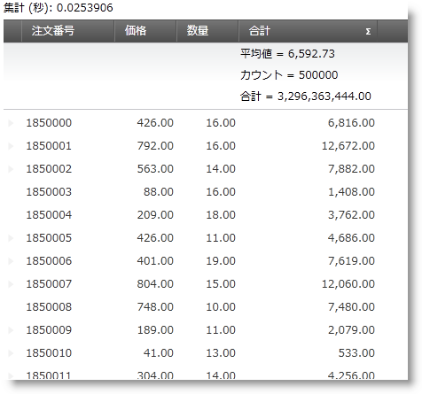

////
|metadata|
{
    "name": "xamdatagrid-external-summary-calculations",
    "controlName": ["xamDataGrid"],
    "tags": ["Calculations","Data Binding","Getting Started","Grids","Grouping"],
    "guid": "a399c3d2-505f-44bc-bab6-b924454c1e65",
    "buildFlags": [],
    "createdOn": "2012-09-12T11:45:59.7026081Z"
}
|metadata|
////

= 外部集計計算 (xamDataGrid)

[[_Ref327800609]]
== トピックの概要

=== 目的

このトピックでは、_xamDataGrid_ コントロールの外部集計計算機能についての説明とそのデモを提供します。

=== 前提条件

このトピックの本題に入る前に、以下のトピックをお読みください。

[options="header", cols="a,a"]
|====
|トピック|目的

| link:xamdatagrid-getting-started-with-xamdatagrid.html[xamDataGrid をページに追加]
|このトピックでは、ユーザーがすばやく操作に慣れることができるよう _xamDataGrid_ コントロールを追加するために必要な基本手順について説明します。

| link:xamdatagrid-row-summaries.html[行集計]
|_xamDataPresenter_ でフィールドの行集計を選択する機能をユーザーに提供します。

|====

=== 本トピックの内容

このトピックは以下のセクションからなります。

* <<_Main_Features_Summary, 主要機能の概要 >>

** <<_Summary_Evaluation_Mode,評価モードの概要>>

** <<_Query_Summary_Result,クエリ集計結果>>

** <<_Query_Summary_Result_Event_Args,クエリ集計結果 EventArgs>>

* <<_External_Summary_Calculation_Code_Example,  _xamDataGrid_   外部集計計算 - コード例 >>

* <<_Related_Content, 関連コンテンツ >>

[[_Main_Features_Summary]]
== 主要機能の概要

=== link:{ApiPlatform}datapresenter{ApiVersion}~infragistics.windows.datapresenter.summaryevaluationmode.html[SummaryEvaluationMode]

`FieldLayoutSettings` `SummaryEvaluationMode` プロパティは以下の列挙体を持ちます。 

[options="header", cols="a,a"] 

|==== 

| *設定* | *説明* 

| _Default_ 

|`SummaryEvaluationMode` のデフォルト設定は、Auto です。 

| _Auto_ 

|グループ化モード、内部集計計算を使用します。 

| _Manual_ 

|データ プレゼンターは、集計値を計算しません。データ プレゼンターの `QuerySummaryResult` イベントを介して計算を実行し、結果を提供します。 

| _UseLINQ_ 

|LINQ を使用した集計の計算 

.注
[NOTE]
====
フィルタリングは xamDataGrid で表示されるデータに影響しますが、データ ソースは変更されません。集計は、データ ソースのフィルターで表示されるデータに限らず、データ ソース全体に基づきます。データ ソースのフィルターで表示されるデータに基づいて計算される集計を実行するには、`CollectionView` に基づくデータ ソースを使用し、`FilterEvaluationMode` プロパティを `UseCollectionView` に設定します。
====

*XAML の場合:*
[source,xaml]
----
<igDP:XamDataGrid x:Name="xamDataGrid">
    <igDP:XamDataGrid.FieldLayoutSettings>
        <igDP:FieldLayoutSettings
            FilterEvaluationMode="UseCollectionView"
            SummaryEvaluationMode="UseLinq" />
    </igDP:XamDataGrid.FieldLayoutSettings>
</igDP:XamDataGrid>
----

*C# の場合:*
[source,csharp]
----
ObservableCollection<Item> Items;
var View = CollectionViewSource.GetDefaultView(Items);
this.xamDataGrid.DataSource = View;
----

*Visual Basic の場合:*
[source,vb]
----
Dim Items As ObservableCollection(Of Item)
Dim View = CollectionViewSource.GetDefaultView(Items)
Me.xamDataGrid.DataSource = View
----

|==== 

=== link:{ApiPlatform}datapresenter{ApiVersion}~infragistics.windows.datapresenter.datapresenterbase~querysummaryresult_ev.html[QuerySummaryResult]

このイベントは、データ プレゼンターが集計結果を計算するときに発生されます。

=== link:{ApiPlatform}datapresenter{ApiVersion}~infragistics.windows.datapresenter.events.querysummaryresulteventargs_members.html[QuerySummaryResultEventArgs]

`QuerySummaryResultEventArgs` クラスは、プロパティとメソッドを公開し、カスタム ロジックを使用して集計結果を計算する際に便利です。

[[_Summary_Evaluation_Mode]]

=== 評価モードの概要

`FieldLayoutSettings` で `SummaryEvaluationMode` を設定し、`UseLINQ` を外部集計計算で使用します。

.注:
[NOTE]
====
基になるデータ項目およびソースは、LINQ.をサポートする必要があります。
====

[[_Query_Summary_Result]]

=== クエリ集計結果

`DataPresenterBase` のイベント `QuerySummaryResult` は、`SummaryEvaluationMode` の設定に関係なく発生します。

カスタム ロジック使用して集計値を計算し、集計結果値をデータ プレゼンターに提供できます。

[[_Query_Summary_Result_Event_Args]]

=== クエリ集計結果 EventArgs

`QuerySummaryResultEventArgs` クラスは、以下のプロパティとメソッドを公開し、カスタム ロジックを使用して集計結果を計算する際に便利です。

[options="header", cols="a,a"]
|====
|プロパティまたはメソッド|説明

| link:{ApiPlatform}datapresenter{ApiVersion}~infragistics.windows.datapresenter.events.querysummaryresulteventargs~summary.html[Summary]
|`SummaryResult` オブジェクトを取得します。計算されるとレコードコレクションにコンテキストを提供します。

|[options="header", cols="a,a"] 

|==== 

[options="header", cols="a,a"]
|====
|メソッド|説明

| link:{ApiPlatform}datapresenter{ApiVersion}~infragistics.windows.datapresenter.events.querysummaryresulteventargs~setsummaryvalue.html[SetSummaryValue](Object value) 
|カスタム計算結果を提供することにより、データ プレゼンターが独自の計算ロジックをバイパスし、代わりの結果として提供する値を使用します。 

このメソッドは、null 以外の引数がデータ プレゼンターの計算ロジックをバイパスします。
|====

[[_External_Summary_Calculation_Code_Example]]
== _xamDataGrid_   外部集計計算 - コード例

=== 説明

この例は、 _xamDataGrid_   コントロールの外部集計計算を実行するための基本をICollectionView を使用して説明します。そのデータ ソースと LINQ を使用して集計を計算します。

=== 前提条件

以下が含まれる新しい WPF アプリケーション プロジェクト タイプ  _ExternalOperations_   を開始します。

* Infragistics NuGet パッケージ参照:

** Infragistics.WPF.DataGrids

* クラス

** `Item` は INotifyPropertyChanged を継承します。このクラスの全コードは、項目クラスのコード例を参照します。

** `Utils` クラス、ランダム項目の `ListCollectionView` を作成します。これはデータ ソースで、 _xamDataGrid_   がバインドされます。このクラスの完全なコードについては、 link:xamdatagrid-creating-of-sample-listcollectionview-code-example.html[ListCollectionView コード例の作成] を参照してください。

* ウィンドウの開始

** `ExternalSummaries.xaml` ウィンドウは、アプリケーションの開始ウィンドウとして設定します。

* 名前空間の定義を  _xamDataGrid_   にマークアップを配置する、ウィンドウの XAML 部分に追加します。

[source,xaml]
----
xmlns:igDP=http://infragistics.com/DataPresenter
----

[source,xaml]
----
xmlns:local="clr-namespace:ExternalOperations"
----

=== プレビュー

これは集計計算の表示のプレビューです。

=== コード

*XAML の場合:*

[source,xaml]
----
<Window x:Class="ExternalOperations.ExternalSummaries"
        xmlns="http://schemas.microsoft.com/winfx/2006/xaml/presentation"
        xmlns:x="http://schemas.microsoft.com/winfx/2006/xaml"
        xmlns:igDP="http://infragistics.com/DataPresenter" 
        xmlns:local="clr-namespace:ExternalOperations"
        Title="ExternalSummaries" Height="768" Width="1024">
    <DockPanel LastChildFill="True">
        <StackPanel Orientation="Vertical" VerticalAlignment="Stretch" DockPanel.Dock="Top">
            <Button FontWeight="Bold" x:Name="btnManyRecordsExternal" Content="Bind to 5 000 000 items" Click="btnManyRecordsExternal_Click"  Width="150" Margin="5"/>
            <Label x:Name="lblExternalTimes" />
        </StackPanel>
        <igDP:XamDataGrid x:Name="xdg5mlExternal" VerticalAlignment="Stretch" QuerySummaryResult="xdg5mlExternal_QuerySummaryResult"
                          DataSourceResetBehavior="DiscardExistingRecords">
            <igDP:XamDataGrid.FieldLayoutSettings>
                <!-- Here SummaryEvaluationMode is set to UseLinq in order to use external summaries feature.-->
                <igDP:FieldLayoutSettings SummaryEvaluationMode="UseLinq"/>
            </igDP:XamDataGrid.FieldLayoutSettings>
            <igDP:XamDataGrid.FieldSettings>
                <igDP:FieldSettings AllowSummaries="True" SummaryUIType="MultiSelect" SummaryDisplayArea="Top" />
            </igDP:XamDataGrid.FieldSettings>
        </igDP:XamDataGrid>
    </DockPanel>
</Window>
----

*Visual Basic の場合:*

[source,vb]
----
Namespace ExternalOperations
      Public Partial Class ExternalSummaries
            Inherits Window
            Public Sub New()
                  InitializeComponent()
            End Sub
            Private Sub btnManyRecordsExternal_Click(sender As Object, e As RoutedEventArgs)
                  xdg5mlExternal.DataSource = Utils.CreateDataSource(5000000)
            End Sub
            Private Sub xdg5mlExternal_QuerySummaryResult(sender As Object, e As Infragistics.Windows.DataPresenter.Events.QuerySummaryResultEventArgs)
                  lblExternalTimes.Content = "Calculating summaries..."
                  Dim start As DateTime = DateTime.Now
                  Dispatcher.BeginInvoke(DispatcherPriority.Background, New Action(Function() 
                  lblExternalTimes.Content = "Time to calculate = " + (DateTime.Now - start).TotalSeconds
End Function))
            End Sub
      End Class
End Namespace
----

*C# の場合:*

[source,csharp]
----
namespace ExternalOperations
{
    public partial class ExternalSummaries : Window
    {
        public ExternalSummaries()
        {
            InitializeComponent();
        }
        private void btnManyRecordsExternal_Click(object sender, RoutedEventArgs e)
        {
            xdg5mlExternal.DataSource = Utils.CreateDataSource(5000000);
        }
        private void xdg5mlExternal_QuerySummaryResult(object sender, Infragistics.Windows.DataPresenter.Events.QuerySummaryResultEventArgs e)
        {
            lblExternalTimes.Content = "Calculating summaries...";
            DateTime start = DateTime.Now;
            Dispatcher.BeginInvoke(DispatcherPriority.Background,
                new Action(
                    () =>
                    {
                        lblExternalTimes.Content = "Time to calculate = " + (DateTime.Now - start).TotalSeconds;
                    }
                    ));
        }
    }
}
----

[[_Related_Content]]
== 関連コンテンツ

=== トピック

このトピックについては、以下のトピックも参照してください。

[options="header", cols="a,a"]
|====
|トピック|目的

| link:xamdatagrid-external-filtering.html[外部のフィルタリング]
|このトピックは、 _xamDataGrid_ で外部フィルタリングを使用する方法について説明します。

| link:xamdatagrid-external-grouping.html[外部でグルーピング]
|このトピックは、外部グルーピングを _XamDataGrid_ で使用する方法について説明します。

| link:xamdatagrid-external-sorting.html[外部ソート]
|このトピックは、 _XamDataGrid_ コントロールのレコードの外部処理を説明します。

| link:external-sorting-filtering-grouping-summaries-overview-xamdatagrid.html[外部ソートフィルタリング グループと集計の概要]
|このトピックは、外部ソート、フィルタリング、グループ化、集計を含む _XamDataGrid_ の機能の概要について説明します。

|====