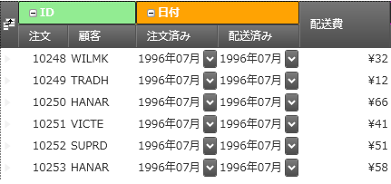

////

|metadata|
{
    "name": "xamdatagrid-field-grouping",
    "tags": ["Grouping","How Do I"],
    "controlName": ["xamDataGrid"],
    "guid": "f5c08f36-e215-4797-bc03-549758c27841",  
    "buildFlags": [],
    "createdOn": "2016-02-18T07:48:54.5045277Z"
}
|metadata|
////

= フィールドのグループ化 (xamDataGrid)

== トピックの概要

=== 目的

このトピックでは、フィールド グループ化機能を使用する方法について説明します。

=== 前提条件

本トピックの理解を深めるために、以下のトピックを参照することをお勧めします。

[options="header", cols="a,a"]
|====
|トピック|目的

| link:xamdatagrid-understanding-xamdatagrid.html[xamDataGrid について]
|このトピックは、xamDataGrid コントロールとコントロールが構成されるさまざまな要素を紹介します。

| link:xamdatapresenter-define-a-field-layout.html[フィールド レイアウトの定義]
|このトピックでは、表示するフィールドを指定し、xamDataPresenter コントロールでこれらのフィールドに関連するプロパティを設定するために、フィールドのレイアウトを定義する方法を説明します。

|====

=== このトピックの内容

このトピックは、以下のセクションで構成されます。

* <<_Ref443295000, 概要 >>
* <<_Ref443295110, ユーザー インタラクションと操作性 >>
* <<_Ref443064351, フィールド グループの縮小の構成 >>
* <<_Ref443295164, フィールド グループをプログラムによって縮小/展開 >>
** <<_Ref443295175, コマンドを使用したフィールド グループ表示の切り替え >>
** <<_Ref443295189, プロパティを使用してフィールド グループの表示を設定 >>

* <<_Ref443295205, フィールド グループ イベントの処理 >>
* <<_Ref443295236, フィールド グループのスタイル設定 >>
* <<_Ref443295245, 関連トピック >>

[[_Ref443295000]]
== 概要

=== フィールド グループ化の概要

フィールド グループ化機能は、複数のフィールドを共通フィールド グループにグループ化できます。フィールド グループを他フィールド グループの入れ子にできます。フィールド グループ機能は、水平および垂直のレコード方向がサポートされます。

以下のスクリーンショットは、共通フィールド グループ "IDs" に描画された "Order" および "Customer" フィールド、共通フィールド グループ "Dates" に描画された"Ordered" および "Shipped" フィールドを示します。

以下のコード スニペットは、上記フィールド グループ構成の定義の例です。

*XAML の場合:*

[source,xaml]
----
<igDP:XamDataGrid>
  <igDP:XamDataGrid.FieldLayouts>
    <igDP:FieldLayout>
      <igDP:FieldGroup Label="IDs">
        <igDP:Field Name="OrderID" Label="Order" Width="55" />
        <igDP:Field Name="CustomerID" Label="Customer" Width="75" />
      </igDP:FieldGroup>
      <igDP:FieldGroup Label="Dates" AllowCollapsing="True">
        <igDP:Field Name="OrderDate" Label="Ordered" Width="90" />
        <igDP:Field Name="ShippedDate" Label="Shipped" Width="90" />
      </igDP:FieldGroup>
      <igDP:Field Name="Freight" Label="Shipping Cost" Width="100" />
    </igDP:FieldLayout>
  </igDP:XamDataGrid.FieldLayouts>
</igDP:XamDataGrid>
----

ユーザーは、フィールド グループ ラベル左側の小さなボタンをクリックしてフィールド グループを縮小して展開できます。プログラムによってトピックの後で説明するコマンドやプロパティを使用してフィールド グループを縮小および展開できます。

=== フィールド グループ化のアーキテクチャ

link:{ApiPlatform}datapresenter{ApiVersion}~infragistics.windows.datapresenter.fieldlayout_members.html[FieldLayout] は以下を公開します。

* link:{ApiPlatform}datapresenter{ApiVersion}~infragistics.windows.datapresenter.fieldlayout~fielditems.html[FieldItems] プロパティ - すべてのルート レベル link:{ApiPlatform}datapresenter{ApiVersion}~infragistics.windows.datapresenter.fieldgroup_members.html[FieldGroup] およびルート レベル link:{ApiPlatform}datapresenter{ApiVersion}~infragistics.windows.datapresenter.field_members.html[Field] のコレクション。
* link:{ApiPlatform}datapresenter{ApiVersion}~infragistics.windows.datapresenter.fieldlayout~fields.html[Fields] プロパティ- すべてのフラット化 `Field` コレクション。

2 つのコレクションは内部で両方向に同期されます。

[[_Ref443295110]]
== ユーザー インタラクションと操作性

=== ユーザー インタラクションの概要表

以下の表は、フィールド グループ化機能のユーザー相互作用機能を簡単に説明します。

[options="header", cols="a,a,a,a"]
|====
|目的|方法|詳細|構成方法

|[[_Hlk377147553]] 

フィールド グループの展開/縮小
|フィールド グループ ラベル内にある展開インジケーターをクリックします。
|フィールド グループ展開/縮小状態を切り替えます。
|image::images/Yes.png[] 

<<_Ref443064351,フィールド グループの縮小の構成>>

|[[_Hlk377147649]] 

新しい位置にフィールドをドラッグ
|フィールド ラベルをクリックしてマウスでドラッグします。
|フィールドグループが移動される位置を示す矢印インジケーターが描画されます。
|image::images/Yes.png[] 

link:xamdatagrid-about-field-moving.html[フィールドの移動について]

|新しい位置にフィールドをドラッグ
|フィールド グループ ラベルをクリックしてマウスでドラッグします。
|フィールドグループが移動される位置を示す矢印インジケーターが描画されます。
|image::images/Yes.png[] 

link:xamdatagrid-about-field-moving.html[フィールドの移動について]

|ビューからフィールド グループを削除
|フィールド グループをクリックしてマウスでビューの外側へドラッグします。
|FieldLayoutSettings.AllowFieldMoving プロパティと FieldSettings.AllowHiding プロパティを True に設定します。これにより、フィールド グループとその入れ子になったフィールドグループおよびフィールドを削除します。
|image::images/No.png[]

|フィールド グループを固定 (またはフィールド)
|フィールド グループ ラベル内にある固定ハンドルをクリックします。
|フィールド グループ固定は、フィールド レイアウトのルート レベルのフィールドグループ (またはフィールド) でのみで可能です。
|image::images/Yes.png[] 

link:xamdatagrid-about-fixed-non-scrolling-fields.html[固定 (非スクロール) フィールドについて]

|====

.注:
[NOTE]
====
フィールドまたはグループは親フィールド グループ内のみ移動できます。
====

[[_Ref443064351]]
== フィールド グループの縮小の構成

=== フィールド グループ縮小構成の概要表

以下の表は、フィールド グループ化機能の構成可能な要素を簡単に説明し、それらを構成するプロパティにマップします。

[options="header", cols="a,a,a"]
|====
|構成可能な項目|プロパティ|詳細

|[[_Hlk356484826]] 

フィールド グループ縮小をグローバルで有効にする
| link:{ApiPlatform}datapresenter{ApiVersion}~infragistics.windows.datapresenter.fieldlayoutsettings~allowfieldgroupcollapsing.html[AllowFieldGroupCollapsing]
| link:{ApiPlatform}datapresenter{ApiVersion}~infragistics.windows.datapresenter.fieldlayoutsettings.html[FieldLayoutSettings] クラスのこのプロパティは、コントロール全体のフィールド グループを展開および拡張する機能を構成します。

|各フィールド グループのフィールドグループ縮小を有効にする
| link:{ApiPlatform}datapresenter{ApiVersion}~infragistics.windows.datapresenter.fieldgroup~allowcollapsing.html[AllowCollapsing]
| link:{ApiPlatform}datapresenter{ApiVersion}~infragistics.windows.datapresenter.fieldgroup.html[FieldGroup] クラスのこのプロパティは、コントロール全体のフィールド グループを展開および拡張する機能を構成します。`AllowFieldGroupCollapsing` プロパティよりも優先されます。

|====

[[_Ref443295164]]
== フィールド グループをプログラムによって縮小/展開

[[_Hlk368069110]]

=== 概要

以下のセクションは、フィールドグループをプログラミングによって縮小および展開する方法をコード例で示します。

[[_Ref443295175]]

=== コマンドを使用したフィールド グループ表示の切り替え

以下のコード スニペットは、コマンドを使用してフィールド グループ ("FieldGroup1") の展開/縮小を切り替える方法について説明します。

*XAML の場合:*

[source,xaml]
----
<Button Content="Toggle the field group"
    Command="{x:Static igDP:DataPresenterCommands.ToggleFieldGroupIsCollapsed}"
    CommandParameter="{Binding ElementName=FieldGroup1}"
    CommandTarget="{Binding ElementName=xamDataGrid1}" />
----

[[_Ref443295189]]

=== プロパティを使用してフィールド グループの表示を設定

以下のコード例は、 link:{ApiPlatform}datapresenter{ApiVersion}~infragistics.windows.datapresenter.fieldgroup~iscollapsed.html[IsCollapsed] プロパティを使用してフィールド グループ ("FieldGroup1") を展開または縮小する設定する方法を示します。

*XAML の場合:*

[source,xaml]
----
…
<igDP:FieldGroup x:Name="FieldGroup1">
…
----

*C# の場合:*

[source,csharp]
----
this.fieldGroup1.IsCollapsed = true;
----

[[_Ref443295205]]
== フィールド グループ イベントの処理

=== 概要

このセクションでは、フィールド グループ機能と関連するイベントについて説明します。

=== イベント

以下の表は、動作とそれを管理するイベントのマッピングを示します。

[options="header", cols="a,a,a"]
|====
|目的:|このイベントの使用:|イベント引数:

|フィールド グループが縮小されたときに通知
| link:{ApiPlatform}datapresenter{ApiVersion}~infragistics.windows.datapresenter.datapresenterbase~fieldgroupcollapsed_ev.html[FieldGroupCollapsed]
|フィールド グループの縮小

|フィールド グループが展開されたときに通知
| link:{ApiPlatform}datapresenter{ApiVersion}~infragistics.windows.datapresenter.datapresenterbase~fieldgroupexpanded_ev.html[FieldGroupExpanded]
|展開フィールド グループ

|====

[[_Ref443295236]]
== フィールド グループのスタイル設定

=== 概要

フィールド グループのスタイル設定:

* 暗黙にスタイルをを作成し `FieldGroupLabelPresenter` 型をターゲットにします。すべてのフィールドグループに影響します。
* `FieldLayoutSettings` link:{ApiPlatform}datapresenter{ApiVersion}~infragistics.windows.datapresenter.fieldlayoutsettings~fieldgrouplabelpresenterstyle.html[FieldGroupLabelPresenterStyle] プロパティにスタイルを設定します。データ プレゼンターのすべてのフィールド グループに影響します。
* FieldGroup の link:{ApiPlatform}datapresenter{ApiVersion}~infragistics.windows.datapresenter.fieldgroup~labelpresenterstyle.html[LabelPresenterStyle] プロパティにスタイルを設定します。フィールド グループに影響します。

=== 暗黙的なスタイルの例

以下のコード スニペットは、すべてのフィールド グループにスタイルを適用する方法を示します。

*XAML の場合:*

[source,xaml]
----
<Page
  …
  xmlns:igDP="http://infragistics.com/DataPresenter"
  …>
…
<Page.Resources>
  <ResourceDictionary>
    
  </ResourceDictionary>
</Page.Resources>
…
<igDP:XamDataGrid>
…
  <igDP:XamDataGrid.FieldLayouts>
    <igDP:FieldLayout>
      <igDP:FieldGroup>
      …
      </igDP:FieldGroup>
      <igDP:FieldGroup>
      …
      </igDP:FieldGroup>
    </igDP:FieldGroup>
  <igDP:XamDataGrid.FieldLayouts>
…
</igDP:XamDataGrid>
…
</Page>
----

=== 明示的なスタイルの例

以下のコード スニペットは、特定のフィールド グループにスタイルを適用する方法を示します。

*XAML の場合:*

[source,xaml]
----
<Page
  …
  xmlns:igDP="http://infragistics.com/DataPresenter"
  …>
…
<Page.Resources>
  <ResourceDictionary>
    
  </ResourceDictionary>
</Page.Resources>
…
<igDP:XamDataGrid>
…
  <igDP:XamDataGrid.FieldLayouts>
    <igDP:FieldLayout>
      <igDP:FieldGroup LabelPresenterStyle="{StaticResource ResourceKey=BGRed">
      …
      </igDP:FieldGroup>
      <igDP:FieldGroup>
      …
      </igDP:FieldGroup>
    </igDP:FieldGroup>
  <igDP:XamDataGrid.FieldLayouts>
…
</igDP:XamDataGrid>
…
</Page>
----

この例ではスタイルは最初のフィールド グループのみに影響します。

[[_Ref443295245]]
== 関連コンテンツ

このトピックに関連する追加情報については、以下のトピックを参照してください。

[options="header", cols="a,a"]
|====
|トピック|目的

| link:xamdatagrid-changing-the-record-orientation.html[レコードの方向の変更]
|このトピックでは、レコードの方向を変更する方法について説明します。

| link:xamdatapresenter-field-sizing.html[フィールドのサイズ変更]
|このトピックは、フィールド サイズ機能の概要を提供します。

| link:xamdatagrid-about-fixed-non-scrolling-fields.html[固定 (非スクロール) フィールドについて]
|このトピックは、固定フィールド機能の概要を提供します。

| link:xamdatapresenter-save-field-customizations.html[フィールドのカスタマイズの保存]
|このトピックは、フィールド位置、サイズ、並べ替え、グループ化などのユーザーのカスタマイズを保存する方法を説明します。

| link:xamdatapresenter-load-field-customizations.html[フィールドのカスタマイズの読み込み]
|このトピックは、フィールド位置、サイズ、並べ替え、グループ化などのユーザーのカスタマイズを読み込む方法を説明します。

|====