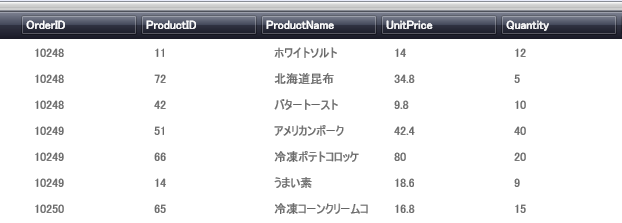

////
|metadata|
{
    "name": "xamdatagrid-getting-started-with-xamdatagrid",
    "controlName": ["xamDataGrid"],
    "tags": ["Getting Started"],
    "guid": "{0AD1128D-237A-49E6-A416-E69667BC29BE}",
    "buildFlags": [],
    "createdOn": "2012-01-30T19:39:53.0079547Z"
}
|metadata|
////

= xamDataGrid をページに追加

このトピックではユーザーができるだけ早く操作に慣れることができるよう、xamDataGrid™ を追加するために必要な基本手順について説明します。

[start=1]
. Microsoft® Windows® Presentation Foundation Window プロジェクトを作成します。

[start=2]
. 以下の NuGet パッケージをアプリケーションに追加します。

** Infragistics.WPF.DataGrids

NuGet フィードのセットアップと NuGet パッケージの追加の詳細については、link:nuget-feeds.html[NuGet フィード] ドキュメントを参照してください。

[start=3]
. xamDataGrid の名前空間宣言を追加します。

*XAML の場合:*

[source,xaml]
----
xmlns:igDP="http://infragistics.com/DataPresenter"
----

*Visual Basic の場合:*

[source,vb]
----
Imports Infragistics.Windows.DataPresenter
----

*C# の場合:*

[source,csharp]
----
using Infragistics.Windows.DataPresenter;
----

[start=4]
. Window でデフォルトのグリッド レイアウト パネルに名前を付け、コード ビハインドでそれを参照できます。

*XAML の場合:*

[source,xaml]
----
<Grid Name="layoutRoot">
</Grid>
----

[start=5]
. コード ビハインドを使用して xamGrid を追加する場合、Window の Loaded イベントにイベント ハンドラーを接続します。

*XAML の場合:*

[source,xaml]
----
<Window ... Loaded="Window_Loaded" ... >
----

[start=6]
. xamDataGrid のインスタンスを作成します。link:{ApiPlatform}datapresenter{ApiVersion}~infragistics.windows.datapresenter.datapresenterbase~bindtosampledata.html[BindToSampleData] プロパティを True に設定します。これはサンプル データで xamDataGrid を自動的に移植するので、データ ソースを設定せずに xamDataGrid コントロールをプレビューできます。xamDatgrid をメイン グリッドに追加します。

*XAML の場合:*

[source,xaml]
----
<igDP:XamDataGrid Name="xamDataGrid1" BindToSampleData="True" />
----

*Visual Basic の場合:*

[source,vb]
----
Private xamDataGrid1 as XamDataGrid
xamDataGrid1 = New XamDataGrid()
' xamDataGrid のインスタンスを
' 組み込みサンプル データを使用する代わりにデータ バインドできます
xamDataGrid1.BindToSampleData = True
Me.layoutRoot.Children.Add(xamDataGrid1)
----

*C# の場合:*

[source,csharp]
----
private XamDataGrid xamDataGrid1;
xamDataGrid1 = new XamDataGrid();
// xamDataGrid のインスタンスを
// 組み込みサンプル データを使用する代わりにデータ バインドできます
xamDataGrid1.BindToSampleData = true;
this.layoutRoot.Children.Add(xamDataGrid1);
----

[start=7]
. プロジェクトを実行して、サンプル データで移植された xamDataGrid コントロールを確認します。

== 関連トピック

link:creating-a-flat-dataset.html[フラットな DataSet の作成]

link:creating-an-objectdataprovider.html[ObjectDataProvider の作成]

link:creating-an-xmldataprovider.html[XmlDataProvider の作成]

link:using-the-data-context-for-data-binding.html[データ バインドでデータ コンテキストを使用]