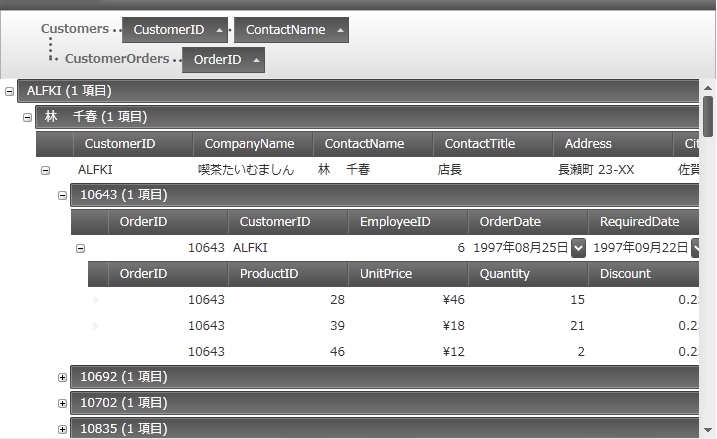
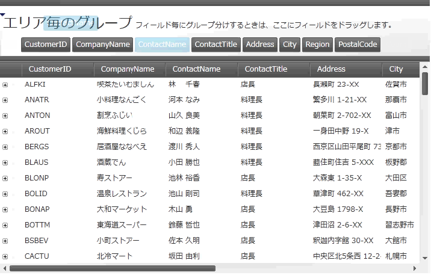

////

|metadata|
{
    "name": "xamdatagrid-grouping-overview",
    "controlName": ["xamDataGrid"],
    "tags": ["Getting Started","Grouping"],
    "guid": "3bd89112-5d4f-465f-a19e-37e7138a7e9c",  
    "buildFlags": [],
    "createdOn": "2013-02-26T13:55:29.4661465Z"
}
|metadata|
////

= グループ化の概要 (xamDataGrid)

== トピックの概要

=== 目的

このトピックは、 link:{ApiPlatform}datapresenter{ApiVersion}~infragistics.windows.datapresenter.xamdatagrid.html[ _xamDataGrid™_  ] コントロールのグループ化機能の概要を説明します。ユーザーがグループ データをより読みやすく、よりナビゲートしやすく配置できます。

=== 前提条件

このトピックを理解するためには、以下のトピックをあらかじめお読みください。

[options="header", cols="a,a"]
|====
|トピック|目的

| link:xamdatagrid-understanding-xamdatagrid.html[xamDataGrid について]
|このトピックは、 _xamDataGrid_ コントロールとコントロールが構成されるさまざまな要素を紹介します。

|====

=== このトピックの内容

このトピックは、以下のセクションで構成されます。

* <<_Ref340222659, グループ化概要 >>

* <<_Ref340222669, 主要な設定の要約 >>

** <<_Ref340222680,主要な設定の要約表>>

** <<_Ref340236978,GroupByArea>>

** <<_Ref340236982,GroupByAreaMode>>

** <<_Ref340236985,GroupByAreaMulti>>

** <<_Ref340236987,GroupByAreaLocation>>

** <<_Ref340236991,GroupByComparer>>

** <<_Ref340236994,GroupByEvaluationMode>>

** <<_Ref340236996,GroupByEvaluator>>

** <<_Ref340237000,GroupByMode>>

* <<_Ref335407927, 関連する項目 >>

[[_Ref340222659]]
== グループ化の概要

=== グループ化の概要

関連するデータをグループにして表示する機能は、 _xamDataGrid_   の重要な機能の 1 つで、UI またはコードを介して実行できます。

グループ化では、ユーザーが複数フィールド レイアウトからグループ領域へフィールド ヘッダーをドラッグできます。

2 つ目のオプションは、グループ領域の下のデフォルト レイアウトで各フィールドにボタンを表示します。ユーザーは、これらのボタンをデフォルト フィールド レイアウトでグループ領域からグループレコードにドラッグできます。ただし、ユーザーが複数のフィールド レイアウトでフィールドを使用したレコードのグループ化することはできません。このオプションは、前のリリースと下位互換性があります。

[[_Ref340222669]]
== 主要な設定の概要

[[_Ref340222680]]

=== 主要な設定の概要表

_xamDataGrid_   は、設定で詳細なユーザー構成が可能です。

[options="header", cols="a,a"]
|====
|設定|説明

| link:{ApiPlatform}datapresenter{ApiVersion}~infragistics.windows.datapresenter.fieldsettings~allowgroupby.html[AllowGroupBy]
| link:{ApiPlatform}datapresenter{ApiVersion}~infragistics.windows.datapresenter.fieldsettings.html[FieldSettings] クラス プロパティは、UI でフィールドをグループ化操作を初期化できるかどうかを決定します。 

このプロパティのデフォルト設定は、True です。

| link:{ApiPlatform}datapresenter{ApiVersion}~infragistics.windows.datapresenter.fieldsettings~cellvisibilitywhengrouped.html[CellVisibilityWhenGrouped]
|この `FieldSettings` クラス プロパティは、グループ化されたフィールド セルが表示されるかどうかを決定します。 

このプロパティのデフォルト設定は、Visible です。

| link:{ApiPlatform}datapresenter{ApiVersion}~infragistics.windows.datapresenter.datapresenterbase~groupbyarea.html[GroupByArea]
|この link:{ApiPlatform}datapresenter{ApiVersion}~infragistics.windows.datapresenter.datapresenterbase.html[DataPresenterBase] クラス プロパティは、 link:{ApiPlatform}datapresenter{ApiVersion}~infragistics.windows.datapresenter.groupbyarea.html[GroupByArea] を取得または設定します。

| link:{ApiPlatform}datapresenter{ApiVersion}~infragistics.windows.datapresenter.datapresenterbase~groupbyareamode.html[GroupByAreaMode]
|この `DataPresenterBase` クラス プロパティは、ユーザーがフィールドをグループ化する方法を取得または設定します。

| link:{ApiPlatform}datapresenter{ApiVersion}~infragistics.windows.datapresenter.datapresenterbase~groupbyareamulti.html[GroupByAreaMulti]
|この `DataPresenterBase` クラス プロパティは、複数の link:{ApiPlatform}datapresenter{ApiVersion}~infragistics.windows.datapresenter.fieldlayout.html[FieldLayout] で Outlook スタイル グループ化を作成する link:{ApiPlatform}datapresenter{ApiVersion}~infragistics.windows.datapresenter.groupbyareamulti.html[GroupByAreaMulti] コントロールを取得または設定します。

| link:{ApiPlatform}datapresenter{ApiVersion}~infragistics.windows.datapresenter.datapresenterbase~groupbyarealocation.html[GroupByAreaLocation]
|この `DataPresenterBase` クラス プロパティは、`GroupByArea` を表示する場所を決定します。 

`None` に設定した場合、`GroupByArea` は表示されません。

| link:{ApiPlatform}datapresenter{ApiVersion}~infragistics.windows.datapresenter.fieldsettings~groupbycomparer.html[GroupByComparer]
|`FieldSettings` クラスのこのプロパティは、指定すると link:{ApiPlatform}datapresenter{ApiVersion}~infragistics.windows.datapresenter.groupbyrecord.html[GroupByRecord] の次の作成を並べ替えます。この操作は、`GroupByRecord` で 2 つ目の並べ替え パスが必要となります。

| link:{ApiPlatform}datapresenter{ApiVersion}~infragistics.windows.datapresenter.fieldlayoutsettings~groupbyevaluationmode.html[GroupByEvaluationMode]
| link:{ApiPlatform}datapresenter{ApiVersion}~infragistics.windows.datapresenter.fieldlayoutsettings.html[FieldLayoutSettings] クラスのこのプロパティは、データ プレゼンターをグループ化する方法を指定します。

| link:{ApiPlatform}datapresenter{ApiVersion}~infragistics.windows.datapresenter.fieldsettings~groupbyevaluator.html[GroupByEvaluator]
|グループ化レコードのカスタム エバリュエーターを指定し、グループの分割を決定するために `FieldSettings` クラスのこのプロパティを使用します。

| link:{ApiPlatform}datapresenter{ApiVersion}~infragistics.windows.datapresenter.fieldsettings~groupbymode.html[GroupByMode]
|`FieldSettings` クラスのこのプロパティは、 link:{ApiPlatform}datapresenter{ApiVersion}~infragistics.windows.datapresenter.datarecord.html[DataRecord] グループ化を決定します。

|====

[[_Ref340236978]]

=== GroupByArea

* この `GroupByArea` プロパティを設定して、タイプ GroupByArea のコントロールを使用して外部グループ領域を link:{ApiPlatform}datapresenter{ApiVersion}~infragistics.windows.datapresenter.datapresenterbase.html[DataPresenter] にアタッチ、または `GroupByArea` コントロールのプロパティを変更できます。このグループ領域では、デフォルト フィールド レイアウトでのフィールドのグループ化のみ可能です。

注:

[NOTE]
====
Data Presenter で `GroupByArea` コントロールを使用するには、`GroupByAreaMode` プロパティを最初に `DefaultFiledLayoutOnly` に設定する必要があります。
====

[[_Ref340236982]]

=== GroupByAreaMode

このプロパティは、3 つの目的があります。

* 主要な目的として、ユーザーが複数フィールド レイアウトのフィールを使用してレコードをグループ化するかどうかを決定します。たとえば、Customer と Order データ項目のネスト階層がある場合、このプロパティはユーザーによるCustomer データ項目と Order データ項目のグループ化が可能かどうかを決定します。

* 2 つ目は、複数フィールド レイアウトのグループ化が有効な場合のグループ領域に必要なスペースを決定します。`MultipleFieldLayoutCompact` 設定を使用する場合、コントロールは、グループ領域でグループ化条件を 1 行で表示します。ただし、`MultipleFiledLayoutsFull sett``ing` では、 _xamDataGrid_   がグループ化領の別々の行での一意なフィールド レイアウトを表示します。

* 3 つ目は、 グループレコードで 2 つの異なる UI オプション間を切り替えることです。グループ化がデフォルト フィールド レイアウトのみで有効で古いグループ化 UI を優先する場合、`DefaultFieldLayoutOnly` を使用すると、グループ領域がデフォルト フィールド レイアウトでフィールドのボタンを表示します。ただし、ユーザーが複数フィールド レイアウトからグループ領域へフィールド ヘッダーをドラッグできます。

[[_Ref340236985]]

=== GroupByAreaMulti

このプロパティを設定して、タイプ `GroupByAreaMulti` のコントロールを使用して外部グループ領域を `DataPresenter` にアタッチ、または `GroupByAreaMulti` コントロールのプロパティを変更できます。

注:

[NOTE]
====
このグループ領域で `GroupByAreaMode` プロパティを使用する場合、`MultipleFieldLayoutsCompact`、または `MultipleFieldLayoutsFull` のいずれかを設定する必要があります。
====

[[_Ref340236987]]

=== GroupByAreaLocation

このプロパティは、グループ領域の場所を設定できます。

注:

[NOTE]
====
外部グループ領域を使用する場合、このプロパティはコントロールに影響しません。
====

[[_Ref340236991]]

=== GroupByComparer

このプロパティを IComparer インターフェイスを実装するためにオブジェクトに設定して、レコードでグループ化するためにカスタムな並べ替えロジックを使用できます。

[[_Ref340236994]]

=== GroupByEvaluationMode

以下は `GroupByEvaluationMode` 列挙型のメンバーです。

[options="header", cols="a,a"]
|====
|メンバー|説明

|Auto
|データ プレゼンターは、グループ化処理を内部で実行します。

|Default
|デフォルトは _Auto_ に解決されます。

|UseCollectionView
|基になるデータ ソースが ICollectionView の場合、データ プレゼンターは `GroupDescriptions` プロパティを使用してグループ化処理を実行ます。このコントロールは、`GroupDescriptions` および `SortedDescriptions` コレクション ビューを変更します。 

このモード コントロールは、重複するフィールドを除外します。

|====

[[_Ref340236996]]

=== GroupByEvaluator

このプロパティは、 link:{ApiPlatform}datapresenter{ApiVersion}~infragistics.windows.datapresenter.igroupbyevaluator.html[IGroupByEvaluator] インターフェイスのカスタム実装を設定できます。このインターフェイスには、IComparer 型の読み取り専用 `SortComparer` プロパティがあります。`IGroupByEvaluator` インターフェイスの `SortComparer` プロパティは、 link:{ApiPlatform}datapresenter{ApiVersion}~infragistics.windows.datapresenter.igroupbyevaluator~doesgroupcontainrecord.html[DoesGroupContainRecord] メソッドの実装とロジックと一致する比較演算子を返します。

つまり、並べ替え順序のロジックがグループ化ロジックと同じで、同じグループの他の `DataRecord` と比較される際に、同じグループになるすべての `DataRecord` は比較演算子の Compare メソッドから 0 を返します。

[[_Ref340237000]]

=== GroupByMode

`GroupByMode` プロパティは、 link:{ApiPlatform}datapresenter{ApiVersion}~infragistics.windows.datapresenter.fieldgroupbymode.html[FieldGroupByMode] 列挙型を取得または設定します。このプロパティは、フィールドをグループ化する際に使用するデフォルトの `GroupByEvaluators` を指定できます。

注:

[NOTE]
====
`GroupByEvaluator` を指定するとこのプロパティは無視されます。
====

設定しない場合、このプロパティは `FieldSettings` クラスの link:{ApiPlatform}datapresenter{ApiVersion}~infragistics.windows.datapresenter.fieldsettings~editastype.html[EditAsType] プロパティに基づいたオプションの 1 つによってデフォルト値に戻されます。

[options="header", cols="a,a"]
|====
|値|説明

|Text
|この値は、`EditAsType` が型文字列かどうかを設定します。

|OutlookDate
|この値は、`EditAsType` が型 DateTime かどうかを設定します。

|Value
|この値は、`EditAsType` が型文字列または DateTime でないかどうかを設定します。

|====

[[_Ref335407927]]
== 関連コンテンツ

[[_Ref335665218]]

=== トピック

このトピックにの追加情報については、以下のトピックも合わせてご参照ください。

[options="header", cols="a,a"]
|====
|トピック|目的

| link:xamdatapresenter-change-the-location-of-the-groupbyarea.html[GroupByArea の場所を変更する]
|このトピックでは、グループ領域の場所を変更する方法について説明します。

| link:xamdatapresenter-create-an-external-group-by-area.html[外部グループ領域を作成する]
|このトピックは、Data Presenter コントロールからグループ領域をデタッチし、ウィンドウで外部にグループ領域を作成する方法を説明します。

| link:xamdatapresenter-disable-groupby.html[GroupBy の無効化]
|このトピックは、グループ領域を非表示にする方法を説明します。

| link:xamdatapresenter-modify-the-group-by-area.html[グループ領域の変更]
|このトピックは、グループ領域のフィールド ヘッダーのレイアウトおよびフィールド レイアウトの説明を変更する方法を説明します。

| link:xamdatapresenter-sorting-and-grouping-fields-programmatically.html[コードでフィールドを並べ替えおよびグループ化]
|このトピックは、XAML またはコードを使用し、ユーザーによるフィールド ラベルのクリックまたはフィールド ラベルをグループ領域へドラッグして、並べ替えおよび (または) グループ化する方法を説明します。

| link:xamdatagrid-sorting-and-grouping-process-overview.html[並べ替えとグループ化プロセスの概要]
|このトピックは、 _xamDataGrid_ の内部比較演算子が、並べ替えおよびグループ化処理中に内部で実行するアクションを説明します。

| link:xamdatagrid-sorting-overview.html[並べ替え概要]
|このトピックは、xamDataGrid の並べ替え機能の概要を提供します。xamDataGrid は、並べ替えを表示および処理します。ユーザーは、列ヘッダーをクリックすることによって列をソートでき、これによって希望の順序でグリッド データを表示できます。

| link:xamdatagrid-user-interaction-sorting-records.html[レコードの並べ替えとグループ化時のユーザー操作]
|このトピックは、 _xamDataGrid_ レコード グループ化時の並べ替えレコードのユーザー操作について説明します。

|====