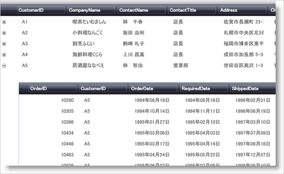
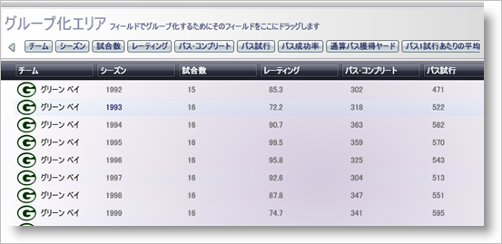

////

|metadata|
{
    "name": "xamdatagrid-understanding-xamdatagrid",
    "controlName": ["xamDataGrid"],
    "tags": ["Getting Started"],
    "guid": "{63391CE1-62BC-4F10-9DA6-6D9B52C5D1CD}",  
    "buildFlags": [],
    "createdOn": "2012-01-30T19:39:53.0239579Z"
}
|metadata|
////

= xamDataGrid について

xamDataGrid コントロールは、 link:xamdata-terms-presentation-formats-grid-view-format.html[グリッド ビュー] を使用して、データを列と行に配置します。link:xamdata-terms-records.html[レコード] は各データ項目を表すために使用され、 link:xamdata-terms-fields.html[フィールド] は各レコードを構成する属性/プロパティを記述するために使用されます。データ ソース内でレコードの各タイプを自動的に検出し、タイプごとに特定の FieldLayouts を生成します。これによって、DataSets や DataViews のような従来のデータ ソースだけでなく、XML のようなよりフリーフォームのデータ ソースの両方をサポートすることができます。

DataPresenterBase クラスから継承されたコアな機能に加えて、 link:{ApiPlatform}datapresenter{ApiVersion}~infragistics.windows.datapresenter.gridviewsettings~orientation.html[GridViewSettings.Orientation] などのグリッド ビューに指定された追加オプションを公開する link:{ApiPlatform}datapresenter{ApiVersion}~infragistics.windows.datapresenter.xamdatagrid~viewsettings.html[ViewSettings] プロパティを公開します。

== 構成図

xamDataGrid コントロールはさまざまな要素で構成されています。以下の図は、要素の関係を表しています。これによって xamDataGrid の全体的な構成をより的確に理解できます。

image::images/xamDataGrid_Composition_Diagram.png[xamDataGrid 構成図]

____
*1*   ラベルが個別の領域にある場合 (つまり、 link:{ApiPlatform}datapresenter{ApiVersion}~infragistics.windows.datapresenter.headerpresenter.html[HeaderPresenter] がある場合)、 link:{ApiPlatform}datapresenter{ApiVersion}~infragistics.windows.datapresenter.cellpresenter.html[CellPresenter] を持つことができません。代わりに、 link:{ApiPlatform}datapresenter{ApiVersion}~infragistics.windows.datapresenter.cellvaluepresenter.html[CellValuePresenter] が直接 link:{ApiPlatform}datapresenter{ApiVersion}~infragistics.windows.datapresenter.datarecordcellarea.html[DataRecordCellArea] に配置されます。ラベルとセルが link:{ApiPlatform}datapresenter{ApiVersion}~infragistics.windows.datapresenter.fieldlayoutsettings~labellocation.html[FieldLayoutSettings.LabelLocation] プロパティに基づいて一緒になる時に限り、CellPresenter が使用されます。
____

== 関連トピック

link:wpf-terms-and-concepts.html[用語と概念]

link:xamdata-theoryofoperation.html[操作の理論]