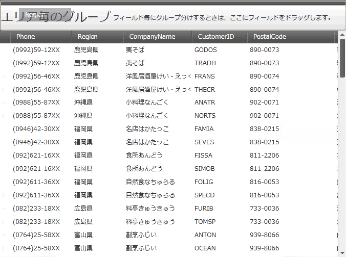
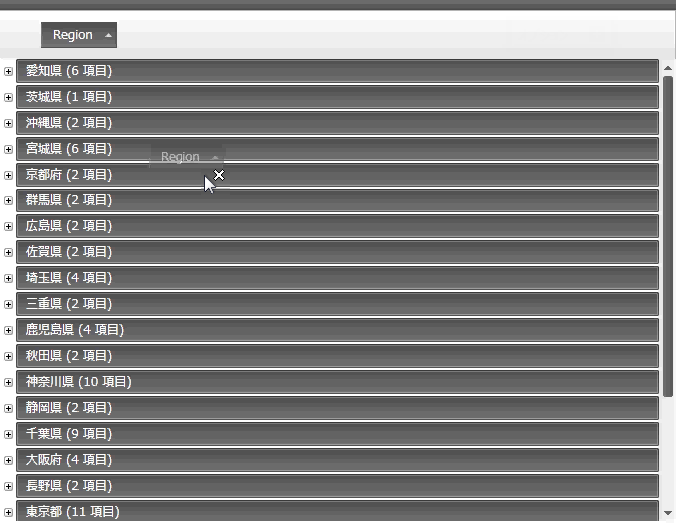
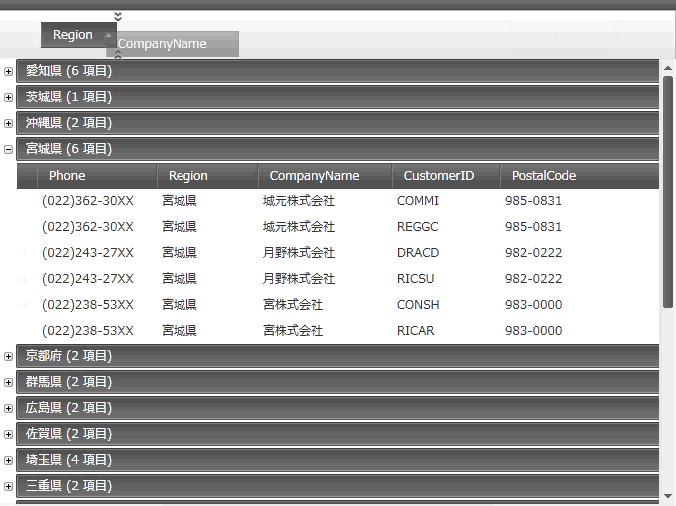

////

|metadata|
{
    "name": "xamdatagrid-user-interaction-grouping-records",
    "tags": ["Application Scenarios","Grouping","How Do I"],
    "controlName": ["xamDataGrid"],
    "guid": "29ef7b97-2295-49d3-bb92-bb75dd986fff",  
    "buildFlags": [],
    "createdOn": "2014-04-01T08:01:54.5328385Z"
}
|metadata|
////

= レコード グループ化時のユーザー操作 (xamDataGrid)

== トピックの概要

=== 目的

このトピックは、 link:{ApiPlatform}datapresenter{ApiVersion}~infragistics.windows.datapresenter.xamdatagrid.html[ _xamDataGrid™_  ] レコードのグループ化でのユーザー操作について説明します。

=== 前提条件

このトピックを理解するためには、以下のトピックを理解しておく必要があります。

[options="header", cols="a,a"]
|====
|トピック|目的

| link:xamdatagrid-understanding-xamdatagrid.html[xamDataGrid について]
|このトピックは、 _xamDataGrid_ コントロールとコントロールが構成されるさまざまな要素を紹介します。

|====

=== このトピックの内容

このトピックは、以下のセクションで構成されます。

* <<_Ref340063168, グループ化されたレコードの並べ替えでのユーザー操作 >>

** <<_Ref335665250,概要>>

** <<_Ref340063176,フィールドでグループ化>>

** <<_Ref340063180,グループ化の削除>>

** <<_Ref340063201,1 フィールド以上でグループ化>>

* <<_Ref335407927, 関連コンテンツ >>

[[_Ref340063168]]
== レコードの並べ替えとグループ化時のユーザー操作

=== 概要

以下の表は、 _xamDataGrid_   コントロールでグループ レコードの並べ替えに関連するユーザー操作の主要機能の概要です。

[options="header", cols="a,a,a,a"]
|====
|目的|方法|詳細|構成方法

|フィールドでグループ化
|マウス
|ユーザーは、複数フィールド レイアウトからグループ領域へフィールド ヘッダーをドラッグできます。
|image::images/User_Interaction_when_Sorting_Grouped_fields_1.png[] 

link:xamdatapresenter-change-the-location-of-the-groupbyarea.html[GroupByArea の場所を変更する]

|グループ化の削除
|マウス
|グループ化を解除するには、ラベル プレゼンターをグループ化領域からドラッグできます。
|image::images/User_Interaction_when_Sorting_Grouped_fields_1.png[] 

link:xamdatapresenter-change-the-location-of-the-groupbyarea.html[GroupByArea の場所を変更する]

|1 フィールド以上でグループ化
|マウス
|ユーザーは、複数フィールド ヘッダーをグループ領域へドラッグできます。
|image::images/User_Interaction_when_Sorting_Grouped_fields_1.png[] 

link:xamdatapresenter-change-the-location-of-the-groupbyarea.html[GroupByArea の場所を変更する]

|====

[[_Ref340063176]]

=== フィールドでグループ化

ユーザーは、ラベル プレゼンターをクリックし、グループ領域へドラッグしてフィールドをグループ化できます。グループ領域が表示されない場合、自動的に表示されます。

グループ化後に  _xamDataGrid_   レイアウトが変更されるためです。

==== 関連トピック:

link:xamdatapresenter-change-the-location-of-the-groupbyarea.html[GroupByArea の場所を変更する]

[[_Ref340063180]]

=== グループ化の削除

ユーザーは、ラベル プレゼンターをグループ領域外へドラッグしてグループ化を削除できます。

==== 関連トピック:

link:xamdatapresenter-change-the-location-of-the-groupbyarea.html[GroupByArea の場所を変更する]

[[_Ref340063201]]

=== 1 フィールド以上でグループ化

ユーザーは、以下の手順に従って 1 フィールド以上をグループ化できます。

[start=1]
. ラベル プレゼンターをグループ領域へドラッグしてグループを作成します。詳細についてはこのトピックの「<<_Ref340063176,フィールドでグループ化>>」セクションをご参照ください。
[start=2]
. グループ エクスパンダーをクリックしてグループを展開し、 1 つ以上の link:{ApiPlatform}datapresenter{ApiVersion}~infragistics.windows.datapresenter.groupbyrecord.html[GroupByRecord] を展開してラベルを表示します。
[start=3]
. 必要な量の追加ラベル プレゼンターをグループ領域へドラッグします。

[[_Ref335407927]]
== 関連コンテンツ

[[_Ref335665218]]

=== トピック

このトピックの追加情報については、以下のトピックも合わせてご参照ください。

[options="header", cols="a,a"]
|====
|トピック|目的

| link:xamdatapresenter-about-grouping.html[グループ化について]
|このトピックは、 _xamDataGrid_ のグループ化機能の概要を提供します。この機能は、ユーザーがデータをより管理およびナビゲーションしやすくグループ化できます。この機能は、ユーザーが列をドラッグしてデータをグループ化できるコントロールのセクションを表示します。

| link:xamdatapresenter-change-the-location-of-the-groupbyarea.html[GroupByArea の場所を変更する]
|このトピックでは、グループ領域の場所を変更する方法について説明します。

| link:xamdatapresenter-create-an-external-group-by-area.html[外部グループ領域を作成する]
|このトピックは、Data Presenter コントロールからグループ領域をデタッチし、ウィンドウで外部にグループ領域を作成する方法を説明します。

| link:xamdatapresenter-modify-the-group-by-area.html[GroupByArea の変更]
|このトピックは、グループ領域のフィールド ヘッダーのレイアウトおよびフィールド レイアウトの説明を変更する方法を説明します。

|====