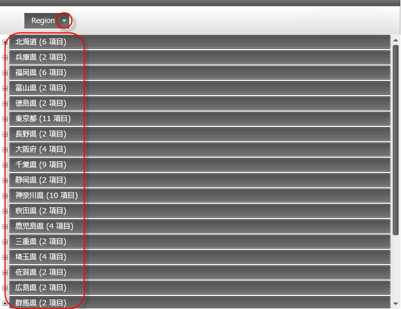
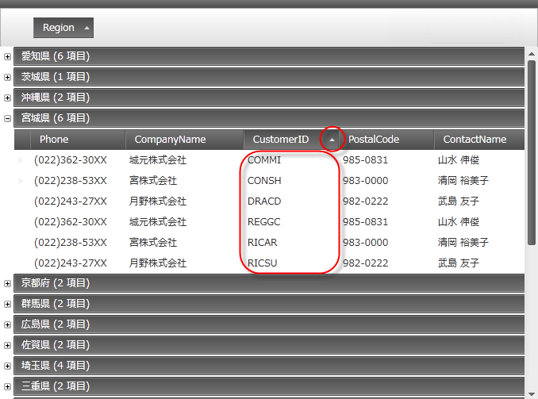
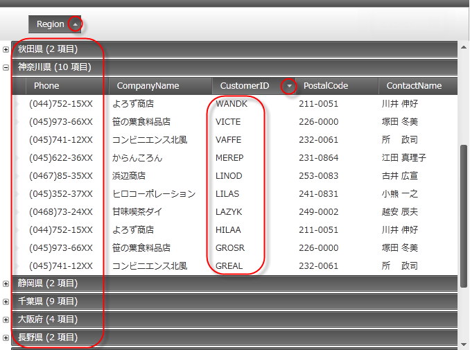
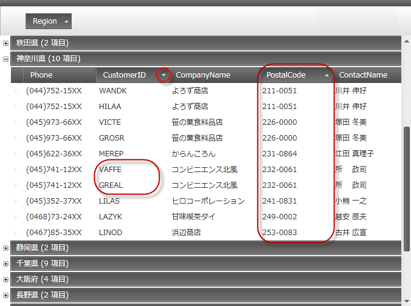

////

|metadata|
{
    "name": "xamdatagrid-user-interaction-sorting-records",
    "controlName": ["xamDataGrid"],
    "tags": ["Application Scenarios","How Do I","Sorting"],
    "guid": "ebc30cb9-9507-4d37-929c-50376c00e73e",  
    "buildFlags": [],
    "createdOn": "2013-02-26T14:04:17.0421465Z"
}
|metadata|
////

= レコードの並べ替えとグループ化時のユーザー操作 (xamDataGrid)

== トピックの概要

=== 目的

このトピックは、グループ化された link:{ApiPlatform}datapresenter{ApiVersion}~infragistics.windows.datapresenter.xamdatagrid.html[ _xamDataGrid™_  ] レコードの並べ替えでのユーザー操作について説明します。

=== 前提条件

このトピックを理解するためには、以下のトピックを理解しておく必要があります。

[options="header", cols="a,a"]
|====
|トピック|目的

| link:xamdatagrid-understanding-xamdatagrid.html[xamDataGrid について]
|このトピックは、 _xamDataGrid_ コントロールとコントロールが構成されるさまざまな要素を紹介します。

| link:xamdatagrid-user-interaction-grouping-records.html[レコード グループ化時のユーザー操作]
|このトピックは、 _xamDataGrid_ レコードのグループ化でのユーザー操作について説明します。

|====

=== このトピックの内容

このトピックは、以下のセクションで構成されます。

* <<_Ref340063168, グループ化されたレコード並べ替え時のユーザー操作 >>

** <<_Ref335665250,概要>>

** <<_Ref340063205,グループ領域内のフィールドの並べ替え>>

** <<_Ref340063210,グループ領域外のフィールドで並べ替え>>

** <<_Ref340063213,グループ領域内外の同じフィールドで並べ替え>>

** <<_Ref340063216,グループ領域外の複数フィールドで並べ替え>>

* <<_Ref335407927, 関連コンテンツ >>

[[_Ref340063168]]
== レコードの並べ替えとグループ化時のユーザー操作

=== 概要

以下の表は、 _xamDataGrid_   コントロールでグループ レコードの並べ替えに関連するユーザー操作の主要機能の概要です。

[options="header", cols="a,a,a,a"]
|====
|目的|方法|詳細|構成方法

|フィールドでグループ化
|マウス
|ユーザーは、複数フィールド レイアウトからグループ領域へフィールド ヘッダーをドラッグできます。
|image::images/User_Interaction_when_Sorting_Grouped_fields_1.png[] 

link:xamdatapresenter-change-the-location-of-the-groupbyarea.html[GroupByArea の場所を変更する]

|グループ化の削除
|マウス
|Label Presenters をグループ化慮行から非グループ化フィールドへドラッグできます。
|image::images/User_Interaction_when_Sorting_Grouped_fields_1.png[] 

link:xamdatapresenter-change-the-location-of-the-groupbyarea.html[GroupByArea の場所を変更する]

|1 フィールド以上でグループ化
|マウス
|ユーザーは、複数フィールド ヘッダーをグループ領域へドラッグできます。
|image::images/User_Interaction_when_Sorting_Grouped_fields_1.png[] 

link:xamdatapresenter-change-the-location-of-the-groupbyarea.html[GroupByArea の場所を変更する]

|グループ領域内のフィールドで並べ替え
|マウス
|ユーザーはグループ領域で Label Presenter をクリックできます。
|image::images/User_Interaction_when_Sorting_Grouped_fields_4.png[]

|グループ領域外のフィールドで並べ替え
|マウス
|ユーザーはグループ領域外で Label Presenter をクリックできます。
|image::images/User_Interaction_when_Sorting_Grouped_fields_4.png[]

|グループ領域内外の同じフィールドで並べ替え
|マウス
|ユーザーは、Label presenter をクリックしてグループ領域内のフィールドおよびグループ領域外の同じフィールドをを並べ替えることができます。
|image::images/User_Interaction_when_Sorting_Grouped_fields_4.png[]

|グループ領域外の複数フィールドで並べ替え
|マウスおよびキーボード
|ユーザーは Ctrl キーを長押しして複数の非連続な Label Presenters を選択できます。
|image::images/User_Interaction_when_Sorting_Grouped_fields_4.png[]

|====

[[_Ref340063205]]

=== グループ領域内のフィールドで並べ替え

ユーザーは、グループ領域で Label Presenter をクリックして `GroupByRecord` を並べ替えることができます。デフォルトでは、フィール ドラベルをグループ領域へドラッグすると、このフィールドでレコードが昇順に並べ替えられます。

グループ領域に既に含まれている Label Presenter をクリックすると、ユーザーは以下のスクリーンショットで示すように UI で並べ替え順を変更できます。

[[_Ref340063210]]

=== グループ領域外のフィールドで並べ替え

ユーザーは、必要なフィールドの Label Presenter をクリックし、各 `GroupByRecord` に含まれるフィールドを並べ替えできます。これを行うには、`GroupByRecord` を展開して表示してください。

[[_Ref340063213]]

=== グループ領域内外の同じフィールドで並べ替え

`GroupByRecord` Label Presenter で選択された並べ替え順は、ユーザーがフィールドでグループ化する際にレコードを昇順または降順どちらで並べ替えるかを決定します。

それぞれのグループ内でフィールドをクリックして他の並べ替え順を使用し、各グループ内の同じフィールドで並べ替えもできます。

[[_Ref340063216]]

=== グループ領域外の複数フィールドで並べ替え

ユーザーは、Ctrl キーを長押ししながら各フィールドの Label Presenter をクリックし、各 `GroupByRecord` に含まれる複数フィールドで並べ替えできます。並べ替え順の条件は、最初の選択が最初の並べ替え条件を決定するフィールドで選択された順序によって決定されます。2 つ目の選択は 2 番目の並べ替え条件になります。

.注:
[NOTE]
====
スクリーンショットは、OrderDate でグループ化したレコード順序を示します。次に "Product Name" および "OrderDate" を選択して複数フィールドの並べ替えを示します。
====

[[_Ref335407927]]
== 関連コンテンツ

[[_Ref335665218]]

=== トピック

このトピックにの追加情報については、以下のトピックも合わせてご参照ください。

[options="header", cols="a,a"]
|====
|トピック|目的

| link:xamdatapresenter-about-sorting.html[並べ替えについて]
|このトピックは、xamDataGrid の並べ替え機能の概要を提供します。xamDataGrid は、並べ替えを表示および処理します。ユーザーは、列ヘッダーをクリックすることによって列をソートでき、これによって希望の順序でグリッド データを表示できます。

|====