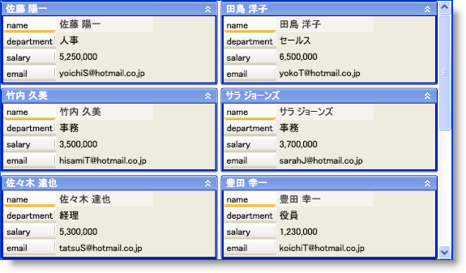

////

|metadata|
{
    "name": "xamdatapresenter-about-card-sizing",
    "controlName": ["xamDataPresenter"],
    "tags": ["How Do I","Layouts","Tips and Tricks"],
    "guid": "{8A91A23A-FA4D-4766-85EE-B1391D9646FA}",  
    "buildFlags": [],
    "createdOn": "2012-01-30T19:39:53.3620255Z"
}
|metadata|
////

= カード サイズについて

xamDataCards™ コントロールはカードの高さと幅を設定するためのいくつかの異なる方法を提供します。

* link:{ApiPlatform}datapresenter{ApiVersion}~infragistics.windows.datapresenter.cardviewsettings.html[CardViewSettings] オブジェクトの link:{ApiPlatform}datapresenter{ApiVersion}~infragistics.windows.datapresenter.cardviewsettings~cardwidth.html[CardWidth] プロパティまたは link:{ApiPlatform}datapresenter{ApiVersion}~infragistics.windows.datapresenter.cardviewsettings~cardheight.html[CardHeight] プロパティをそれぞれ設定することによって、カードの幅または高さを指定できます。
* CardViewSettings オブジェクトの link:{ApiPlatform}datapresenter{ApiVersion}~infragistics.windows.datapresenter.cardviewsettings~allowcardwidthresizing.html[AllowCardWidthResizing] プロパティまたは link:{ApiPlatform}datapresenter{ApiVersion}~infragistics.windows.datapresenter.cardviewsettings~allowcardheightresizing.html[AllowCardHeightResizing] プロパティを True に設定することによってエンドユーザーがカードの幅または高さをランタイムにリサイズすることを可能にします。xamDataCards コントロールはすべてのカードでリサイズ操作を同期します。
* CardViewSettings オブジェクトの link:{ApiPlatform}datapresenter{ApiVersion}~infragistics.windows.datapresenter.cardviewsettings~autofitcards.html[AutoFitCards] プロパティを link:{ApiPlatform}datapresenter{ApiVersion}~infragistics.windows.datapresenter.autofitcards.html[AutoFitCards] 列挙値に設定することによって、xamDataCards コントロール内で使用可能なすべてのスペースを使用するようにカードを自動的に引き伸ばすことができます。xamDataCards コントロールは水平、垂直または両方にカードを引き伸ばすことができます。

以下の例のコードはカードがすべての使用可能なスペースを自動的に使用するようにする方法を示します。

*XAML の場合:*

----
<igDP:XamDataCards Name="xamDataCards1">
    <igDP:XamDataCards.ViewSettings>
        <igDP:CardViewSettings AutoFitCards="HorizontallyAndVertically" />
    </igDP:XamDataCards.ViewSettings>
</igDP:XamDataCards>
----

*Visual Basic の場合:*

----
Imports Infragistics.Windows.DataPresenter
...
Me.xamDataCards1.ViewSettings.AutoFitCards = AutoFitCards.HorizontallyAndVertically
...
----

*C# の場合:*

----
using Infragistics.Windows.DataPresenter;
...
this.xamDataCards1.ViewSettings.AutoFitCards = AutoFitCards.HorizontallyAndVertically;
...
----

== 関連トピック

link:xamdatapresenter-about-card-settings.html[カード設定について]

link:xamdatapresenter-about-repositioning-animations.html[リポジション アニメーションについて]

link:xamdatapresenter-collapse-a-card.html[カードの縮小]

link:xamdatapresenter-collapse-an-empty-cell.html[空のセルの縮小]

link:xamdatapresenter-set-the-maximum-number-of-viewable-cards.html[表示可能なカードの最大数の設定]

link:xamdatapresenter-set-the-space-between-cards.html[カード間のスペースの設定]

link:xamdatapresenter-working-with-card-headers.html[カード ヘッダーでの作業]