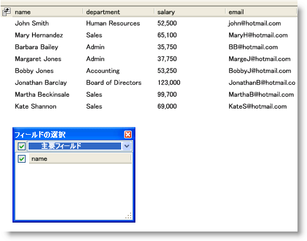

////

|metadata|
{
    "name": "xamdatapresenter-about-field-chooser-settings",
    "controlName": ["xamDataPresenter"],
    "tags": ["Data Presentation","Editing"],
    "guid": "{03C07E43-ABEC-4CBA-9275-AF05AE8D69A9}",  
    "buildFlags": [],
    "createdOn": "2012-01-30T19:39:53.0429617Z"
}
|metadata|
////

= フィールドの選択の設定について

link:{ApiPlatform}datapresenter{ApiVersion}~infragistics.windows.datapresenter.fieldchooser.html[FieldChooser] コントロールは、その動作およびスタイルを変更するために設定できるプロパティを公開します。ただし、FieldChooser コントロールを表示する方法は、そのプロパティを設定する方法を指定します。

最も簡単なケースは、FieldChooser コントロールのウィンドウ内に外部領域を作成する場合です。単純に、FieldChooser コントロールのプロパティを他のコントロールのプロパティと同じように設定します。つまり、直接コントロールに設定するか、スタイルを使用します。

フィールドの選択ボタンを使用するか、 link:{ApiPlatform}datapresenter{ApiVersion}~infragistics.windows.datapresenter.datapresenterbase~showfieldchooser.html[ShowFieldChooser] メソッドまたはコマンドを呼び出すか実行してフィールドの選択を表示している場合は、FieldChooser コントロールはウィンドウのビジュアル ツリーの一部にはなりません。そのため、ウィンドウに作成したスタイルは、FieldChooser コントロールに適用されません。スタイルを適用する、または、FieldChooser コントロールで公開されたプロパティを設定するには、DataPresenter コントロールの link:{ApiPlatform}datapresenter{ApiVersion}~infragistics.windows.datapresenter.datapresenterbase~fieldchooseropening_ev.html[FieldChooserOpening] イベントを処理する必要があります。そのイベント ハンドラーでは、 link:{ApiPlatform}datapresenter{ApiVersion}~infragistics.windows.datapresenter.events.fieldchooseropeningeventargs.html[FieldChooserOpeningEventArgs] オブジェクトが link:{ApiPlatform}datapresenter{ApiVersion}~infragistics.windows.datapresenter.events.fieldchooseropeningeventargs~fieldchooser.html[FieldChooser] プロパティを公開しており、それを使用して、FieldChooser コントロールのプロパティを設定できます。

以下は、FieldChooser コントロールで作業する際に通常使用するプロパティのリストです。

* link:{ApiPlatform}datapresenter{ApiVersion}~infragistics.windows.datapresenter.fieldchooser~displayhiddenfieldsonly.html[DisplayHiddenFieldsOnly] - FieldChooser コントロールは、DataPresenter コントロールの隠しフィールドのみを表示します。チェックボックスの代わりに、エンド ユーザーはフィールド ヘッダーを DataPresenter コントロールから FieldChooser コントロールにドラッグして、フィールドを非表示にするか、またはその逆の操作でフィールドを表示します。
* link:{ApiPlatform}datapresenter{ApiVersion}~infragistics.windows.datapresenter.fieldchooser~fielddisplayorder.html[FieldDisplayOrder] - FieldChooser コントロール内のフィールド ヘッダーの表示順序を変更できます。FieldDisplayOrderComparer プロパティは、このプロパティ設定をオーバーライドします。
* link:{ApiPlatform}datapresenter{ApiVersion}~infragistics.windows.datapresenter.fieldchooser~fielddisplayordercomparer.html[FieldDisplayOrderComparer] - 独自のカスタム並べ替えロジックを使用して、FieldChooser コントロール内のフィールド ヘッダーの表示順序を変更できます。
* link:{ApiPlatform}datapresenter{ApiVersion}~infragistics.windows.datapresenter.fieldchooser~fieldfilters.html[FieldFilters] - FieldChooser コントロールのドロップダウン リストにフィルターを追加して、エンド ユーザーがフィールド ヘッダーの小さいサブセットに集中できるようにします。フィルターにフィールド ヘッダーを含まない場合、FieldChooser コントロールはそれをドロップダウン リストに表示しません。たとえば、DateTime フィールドだけを表示するフィルター作成できます。ただし、どのフィールドもフィルター条件に一致しない場合、ドロップダウン リストにはそのフィルターが含まれません。
* link:{ApiPlatform}datapresenter{ApiVersion}~infragistics.windows.datapresenter.fieldchooser~fieldgroupselectorvisibility.html[FieldGroupSelectorVisibility] - FieldChooser コントロール内のドロップダウン リストを非表示にできます。

以下のコード例は、FieldChooserOpening イベントを処理してフィルターをフィールドの選択コントロールに追加する方法を示しています。

*XAML の場合:*

----
<igDP:XamDataPresenter 
    Name="xamDataPresenter1" 
    FieldChooserOpening="OnFieldChooserOpening" 
    BindToSampleData="True">
    <igDP:XamDataPresenter.FieldLayoutSettings>
        <igDP:FieldLayoutSettings HeaderPrefixAreaDisplayMode="FieldChooserButton" />
    </igDP:XamDataPresenter.FieldLayoutSettings>
</igDP:XamDataPresenter>
----

*Visual Basic の場合:*

----
Imports Infragistics.Windows.DataPresenter
Imports Infragistics.Windows.DataPresenter.Events
...
Private Sub OnFieldChooserOpening(ByVal sender As Object, ByVal e As FieldChooserOpeningEventArgs)
    If e.FieldChooser.FieldFilters.Count = 0 Then 
        '1.条件をテストするための Predicate オブジェクトを作成します。
        Dim primaryFieldFilterCondition As Predicate(Of Field) = New Predicate(Of Field)(Function(fieldParam As Field) fieldParam.IsPrimary)
        '2.Predicate オブジェクトを使用する FieldChooserFilter オブジェクトを作成します。
        Dim primaryFieldFilter As New FieldChooserFilter("Primary Fields", primaryFieldFilterCondition, "Show Primary Fields")
        '3.FieldChooser コントロールの FieldFilters コレクションに FieldChooserFilter オブジェクトを追加します。
        e.FieldChooser.FieldFilters.Add(primaryFieldFilter)
    End If
End Sub
...
----

*C# の場合:*

----
using Infragistics.Windows.DataPresenter;
using Infragistics.Windows.DataPresenter.Events;
...
private void OnFieldChooserOpening(object sender, FieldChooserOpeningEventArgs e)
{
    if(e.FieldChooser.FieldFilters.Count == 0)
    {
        //1.条件をテストするための Predicate オブジェクトを作成します。
        Predicate<Field> primaryFieldFilterCondition = new Predicate<Field>(field => { return field.IsPrimary; });
        //2.Predicate オブジェクトを使用する FieldChooserFilter オブジェクトを作成します。
        FieldChooserFilter primaryFieldFilter = new FieldChooserFilter("Primary Fields", primaryFieldFilterCondition, "Show Primary Fields");
        //3.FieldChooser コントロールの FieldFilters コレクションに FieldChooserFilter オブジェクトを追加します。
        e.FieldChooser.FieldFilters.Add(primaryFieldFilter);
    }
}
...
----

== 関連トピック

link:xamdatapresenter-about-the-field-chooser.html[フィールドの選択について]

link:xamdatapresenter-display-the-field-chooser.html[フィールドの選択の表示]

link:xamdatapresenter-prevent-fields-from-being-hidden.html[フィールドが非表示にされることを防止する]

link:xamdatapresenter-create-an-external-field-chooser.html[外部のフィールドの選択の作成]

link:xamdatapresenter-change-the-display-order-of-fields-in-the-field-chooser.html[フィールドの選択でフィールドの表示順序を変更]