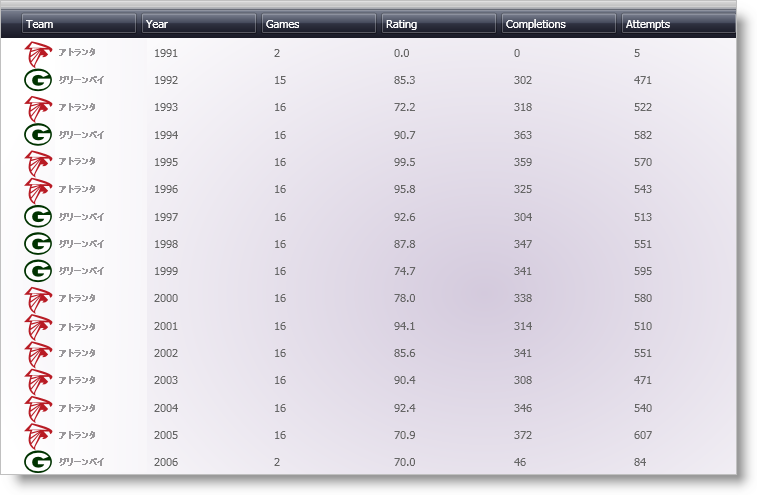

////

|metadata|
{
    "name": "xamdatapresenter-about-gridview",
    "controlName": ["xamDataPresenter"],
    "tags": ["Getting Started"],
    "guid": "{106F617A-83E5-4885-92F7-46A39EF16AC0}",  
    "buildFlags": [],
    "createdOn": "2012-01-30T19:39:53.0499631Z"
}
|metadata|
////

= GridView について

xamDataGrid コントロールのように表形式で link:{ApiPlatform}datapresenter{ApiVersion}~infragistics.windows.datapresenter.record.html[Record]を示すために xamDataPresenter に関連して link:{ApiPlatform}datapresenter{ApiVersion}~infragistics.windows.datapresenter.gridview.html[GridView] クラスを使用できます。GridView クラスおよび xamDataGrid コントロールは、両方ともがその動作を制御する共通の link:{ApiPlatform}datapresenter{ApiVersion}~infragistics.windows.datapresenter.gridviewsettings.html[GridViewSettings] オブジェクトを共有するので、xamDataGrid ViewSettings のトピックは、GridView オブジェクトを使用して xamDataPresenter コントロールにも適用されます。

たとえば、 link:xamdatagrid-changing-the-record-orientation.html[レコードの方向の変更]のトピックでコードを変更して、xamDataPresenter に適用させることができます。

*XAML の場合:*

----
<igDP:XamDataPresenter Name="xamDataPresenter1" BindToSampleData="True">
    <igDP:XamDataPresenter.View>
        <!--
        <igDP:XamDataGrid.ViewSettings>
                <igDP:GridViewSettings Orientation="Horizontal" />
        </igDP:XamDataGrid.ViewSettings>
        -->
        <igDP:GridView>
            <igDP:GridView.ViewSettings>
                <igDP:GridViewSettings Orientation="Horizontal" />
            </igDP:GridView.ViewSettings>
        </igDP:GridView>
    </igDP:XamDataPresenter.View>
</igDP:XamDataPresenter>
----

