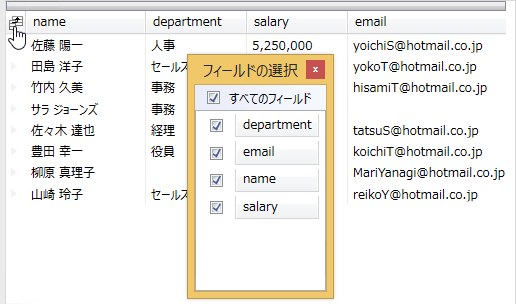

////

|metadata|
{
    "name": "xamdatapresenter-about-the-field-chooser",
    "controlName": ["xamDataPresenter"],
    "tags": ["Data Presentation"],
    "guid": "{6365CCFF-3F00-4FB2-BBBA-34594FAED896}",  
    "buildFlags": [],
    "createdOn": "2012-01-30T19:39:53.0639659Z"
}
|metadata|
////

= フィールドの選択について

link:{ApiPlatform}datapresenter{ApiVersion}~infragistics.windows.datapresenter.fieldchooser.html[FieldChooser] コントロールによってエンドユーザーは DataPresenter コントロールでフィールドの表示/非表示をランタイムに変更することができます。FieldChooser コントロールはチェックボックスとともにフィールド ヘッダーのリストを表示します。エンドユーザーはフィールド ヘッダーの横にあるチェックボックスを切り替える、または FieldChooser コントロールでまたは FieldChooser コントロールからフィールド ヘッダーをドラッグしてフィールドの表示/非表示を切り替えることができます。さらに、DataPresenter コントロールを階層的なデータ ソースにバインドしている場合、FieldChooser コントロールによってエンドユーザーはドロップダウン リストからフィールド レイアウトを選択することができます。

DataPresenter コントロールはフィールドの選択を表示するために 3 つの異なるオプションを提供します。

* DataPresenter コントロールの外側に FieldChooser コントロールを表示します。
* フィールドの選択を表示するためにエンドユーザーが選択できるヘッダー プレフィックスにフィールドの選択ボタンを表示します。
* ShowFieldChooser メソッド/コマンドを起動/実行します。

== 関連トピック

link:xamdatapresenter-display-the-field-chooser.html[フィールドの選択の表示]

link:xamdatapresenter-about-field-chooser-settings.html[フィールドの選択の設定について]

link:xamdatapresenter-prevent-fields-from-being-hidden.html[フィールドが非表示にされることを防止する]

link:xamdatapresenter-create-an-external-field-chooser.html[外部のフィールドの選択の作成]

link:xamdatapresenter-change-the-display-order-of-fields-in-the-field-chooser.html[フィールドの選択でフィールドの表示順序を変更]