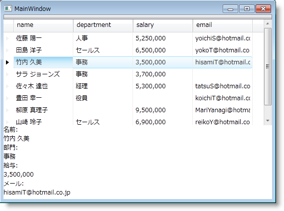

////

|metadata|
{
    "name": "xamdatapresenter-accessing-cell-values-in-the-active-record",
    "controlName": ["xamDataPresenter"],
    "tags": [],
    "guid": "{8BACE740-55E8-4FF9-9B16-3074CBFFA3C0}",  
    "buildFlags": [],
    "createdOn": "2012-01-30T19:39:53.0699671Z"
}
|metadata|
////

= アクティブ レコードでセル値にアクセス

== 始める前に

Extensible Application Markup Language (XAML) を使用して xamDataPresenter™ のアクティブ link:{ApiPlatform}datapresenter{ApiVersion}~infragistics.windows.datapresenter.cell.html[レコード]で link:{ApiPlatform}datapresenter{ApiVersion}~infragistics.windows.datapresenter.record.html[セル]値にアクセスできます。これによって、TextBox コントロールの Text プロパティにアクティブ レコードのセルの値をバインドできます。この機能を使用して、データ入力またはデータ ナビゲーションおよび表示目的のために Window でセクションを作成することができます。

== 達成すること

XAML を使用してデータ入力作業のために Window にセクションを作成します。

== 次の手順を実行します

[start=1]
. Window にデフォルトのグリッド レイアウト パネル用の RowDefinitions を作成します。

*XAML の場合:*

----
<Grid>
        <Grid.RowDefinitions>
                <RowDefinition Height="3*" />
                <RowDefinition Height="2*" />
        </Grid.RowDefinitions>
        <!--方法: ここにコントロールを追加します-->
</Grid>
----

[start=2]
. xamDataPresenter コントロールを Window に追加します。

.. xamDataPresenter コントロールに名前を付けると、後で参照できます。
.. link:{ApiPlatform}datapresenter{ApiVersion}~infragistics.windows.datapresenter.datapresenterbase~bindtosampledata.html[BindToSampleData] プロパティを True に設定します。このトピックは、目前のトピックに集中するためにサンプル データを使用します。
.. 添付 Grid.Row プロパティを 0 に設定します。

*XAML の場合:*

----
...
<igDP:XamDataPresenter Name="xamDataPresenter1" BindToSampleData="True" Grid.Row="0">
</igDP:XamDataPresenter>
...
----

[start=3]
. セル値を修正するために TextBox コントロールを使用するので、xamDataPresenter コントロールの編集を無効にします。

.. xamDataPresenter のタグ内の FieldSettings プロパティにタグを宣言します。
.. FieldSettings プロパティのタグ内の link:{ApiPlatform}datapresenter{ApiVersion}~infragistics.windows.datapresenter.fieldsettings.html[FieldSettings] オブジェクトを追加します。
.. FieldSettings オブジェクトの link:{ApiPlatform}datapresenter{ApiVersion}~infragistics.windows.datapresenter.fieldsettings~allowedit.html[AllowEdit] プロパティを False に設定します。

*XAML の場合:*

----
...
<igDP:XamDataPresenter.FieldSettings>
        <igDP:FieldSettings AllowEdit="False" />
</igDP:XamDataPresenter.FieldSettings>
...
----

[start=4]
. StackPanel レイアウト コンテナーを Window に追加します。

.. 添付 Grid.Row プロパティを 1 に設定します。
.. バインディング表現を使用して、StackPanel コンテナの DataContext プロパティを xamDataPresenter1 コントロールの link:{ApiPlatform}datapresenter{ApiVersion}~infragistics.windows.datapresenter.datapresenterbase~activerecord.html[ActiveRecord] プロパティに設定します。親コンテナーの DataContext を設定することで、よりシンプルなバインディング表現を使用して子にプロパティを設定できます。

*XAML の場合:*

----
...
<StackPanel
	Grid.Row="1"
	DataContext="{Binding ElementName=xamDataPresenter1, Path=ActiveRecord}">
        <!--方法: ここにデータ入力コントロールを追加します-->
</StackPanel>
...
----

[start=5]
. TextBlock コントロールを StackPanel レイアウト コンテナーに追加し、TextBlock の Text プロパティを設定します。

*XAML の場合:*

----
...
<TextBlock Text="Name:" />
...
----

[start=6]
. TextBox コントロールを StackPanel レイアウト コンテナに追加し、Text プロパティを link:{ApiPlatform}datapresenter{ApiVersion}~infragistics.windows.datapresenter.cellcollection.html[Cells コレクション]のセルの link:{ApiPlatform}datapresenter{ApiVersion}~infragistics.windows.datapresenter.cell~value.html[Value] プロパティにバインドするためにバインディング表現を使用します。

親レイアウト コンテナの DataContext を xamDataPresenter1 コントロールの ActiveRecord プロパティに設定するので、プロパティ パスを使用してセルから値を取得できます。

*XAML の場合:*

----
...
<TextBox Text="{Binding Path=Cells[name].Value}" />
...
----

[start=7]
. 手順 6 と 7 を表示および/または編集したい各フィールドで繰り返します。

*XAML の場合:*

----
...
<TextBlock Text="Department:" />
<TextBox Text="{Binding Path=Cells[department].Value}" />
<TextBlock Text="Salary:" />
<TextBox Text="{Binding Path=Cells[salary].Value}" />
<TextBlock Text="Email Address:" />
<TextBox Text="{Binding Path=Cells[email].Value}" />
...
----

[start=8]
. プロジェクトを実行し、[レコード] をクリックして起動します。クリックしたレコードのセルの値が TextBox コントロールに表示されるはずです。TextBox の値を修正し、TextBox がフォーカスを失う場合、対応するセルの値も更新されます。

== 関連トピック

link:xamdatapresenter-accessing-cell-values-in-the-recordactivated-event.html[RecordActivated イベントでセル値にアクセス]

link:xamdata-changing-field-record-cell-selection-behavior.html[フィールド、レコード、またはセル選択の動作を変更]

link:xamdata-default-editor-types-for-different-data-types.html[異なるデータタイプのデフォルトのエディター タイプ]

link:xamdatapresenter-validating-edited-cell-data-in-xamdatapresenter.html[xamDataPresenter で編集したセル データを検証]