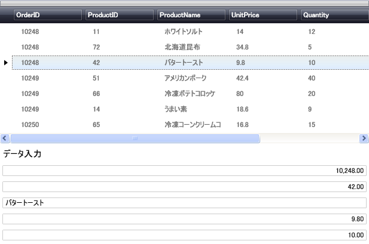

////

|metadata|
{
    "name": "xamdatapresenter-accessing-cell-values-in-the-recordactivated-event",
    "controlName": ["xamDataPresenter"],
    "tags": [],
    "guid": "{6C6A75F4-AAF6-456F-84ED-402B1FAB692C}",  
    "buildFlags": [],
    "createdOn": "2012-01-30T19:39:53.0719675Z"
}
|metadata|
////

= RecordActivated イベントでセル値にアクセス

xamDataPresenter™ の link:{ApiPlatform}datapresenter{ApiVersion}~infragistics.windows.datapresenter.datapresenterbase~recordactivated_ev.html[RecordActivated] イベントによってアクティブな Record 内のセル値にアクセスできます。たとえば、Page/Window にデータ入力領域を作成している場合には、このイベントを使用して、エンド ユーザーが選択したアクティブな link:{ApiPlatform}datapresenter{ApiVersion}~infragistics.windows.datapresenter.record.html[Record] に基づいて入力領域内のフィールドを埋めることができます。

[NOTE]
====
*注:* このトピックで述べられている xamNumericEditor が使用可能なのは、{ProductName} フル バージョンのみです。ただし、ここに示した概念はエクスプレス バージョンで使用可能なエディターに適用できます。
====

以下の手順は、データ バインドされた xamDataPresenter を持っており、コントロールの RecordActivated イベントを処理しエンド ユーザーのアクティブ レコードに基づいて Page/Window でエディターを移植したいことが前提となっています。詳細については、 link:xamdatapresenter-getting-started-with-xamdatapresenter.html[xamDataPresenter をアプリケーションに追加]を参照してください。

[start=1]
. xamDataPresenter のインスタンスを作成し名前を指定します。RecordActivated イベントをイベントが発生する時に使用するイベント ハンドラー メソッドに設定します。Label、xamTextEditor、および 4 つの xamNumericEditors を定義します。各エディターは、表示するフィールドに基づいて名前が指定されます。コントロールそれぞれでマージンを設定し、より読みやすいように広げます。

*XAML の場合:*

----
<igDP:XamDataPresenter x:Name="XamDataPresenter1" 
  ...
  RecordActivated="XamDataPresenter1_RecordActivated">
        <igDP:XamDataPresenter.View>
                <igDP:GridView/>
        </igDP:XamDataPresenter.View>
</igDP:XamDataPresenter>
<Label x:Name="Label1" Content="Data Entry" Margin="0,5,0,0" FontSize="15.0"/>
<igEditors:XamTextEditor x:Name="ProductName" Margin="0,5,0,0"/>
<igEditors:XamNumericEditor x:Name="CostPerUnit" Margin="0,5,0,0"/>
<igEditors:XamNumericEditor x:Name="Quantity" Margin="0,5,0,0"/>
<igEditors:XamNumericEditor x:Name="Discount" Margin="0,5,0,0"/>
<igEditors:XamNumericEditor x:Name="ShipandHandle" Margin="0,5,0,0"/>
----

[start=2]
. コードの記述を開始する前にコード ビハインドに using/Imports のディレクティブを配置します。そうすれば、メンバーは完全に記述された名前を常にタイプする必要がなくなります。

*Visual Basic の場合:*

----
Imports Infragistics.Windows.DataPresenter.Events
Imports Infragistics.Windows.DataPresenter
----

*C# の場合:*

----
using Infragistics.Windows.DataPresenter.Events;
using Infragistics.Windows.DataPresenter;
----

[start=3]
. 手順 4 で RecordActivated イベントに定義されるイベント ハンドラー メソッドを作成します。このメソッドは各レコードをチェックして、タイプ DataRecord であるかどうかを確認します。レコードがタイプ DataRecord の場合、レコードのインスタンスが作成されます。DataRecord の新しいインスタンスを使用して、このメソッドが DataRecord のセルから適切なエディターに値を割り当てます。

*Visual Basic の場合:*

----
Sub XamDataPresenter1_RecordActivated(ByVal sender As Object, _
  ByVal e As RecordActivatedEventArgs)
        ' 選択したレコードが DataRecord かどうかを確認するためにチェックします。
        If TypeOf e.Record Is DataRecord Then
                ' DataRecord として渡されたレコードをキャストします。
                Dim myRecord As DataRecord = CType(e.Record, DataRecord)
                ' 適切なエディターで選択したレコード値を
                ' 表示します。
                Me.ProductName.Text = myRecord.Cells(0).Value.ToString()
                Me.CostPerUnit.Value = myRecord.Cells(1).Value
                Me.Quantity.Text = myRecord.Cells(2).Value.ToString()
                Me.Discount.Text = myRecord.Cells(3).Value.ToString()
                Me.ShipandHandle.Value = myRecord.Cells(4).Value
        End If
End Sub
----

*C# の場合:*

----
void XamDataPresenter1_RecordActivated(object sender, RecordActivatedEventArgs e)
{
        // 選択したレコードが DataRecord かどうかを確認するためにチェックします。
        if (e.Record is DataRecord)
        {
                // DataRecord として渡されたレコードをキャストします。
                DataRecord myRecord = (DataRecord)e.Record;
                // 適切なエディターで選択したレコード値を
                // 表示します。
                this.ProductName.Text = myRecord.Cells[0].Value.ToString();
                this.CostPerUnit.Value = myRecord.Cells[1].Value;
                this.Quantity.Text = myRecord.Cells[2].Value.ToString();
                this.Discount.Text = myRecord.Cells[3].Value.ToString();
                this.ShipandHandle.Value = myRecord.Cells[4].Value;
        }
}
----

[start=4]
. プロジェクトをビルドして実行します。その下に 5 つのエディターがある xamDataPresenter が表示されます。xamDataPresenter 内のレコードを選択すると、選択されたレコードのデータがエディターに移植されます。

== 関連トピック

link:xamdatapresenter-accessing-cell-values-in-the-active-record.html[アクティブレコードでセル値にアクセス]

link:xamdata-changing-field-record-cell-selection-behavior.html[フィールド、レコード、またはセル選択の動作を変更]

link:xamdata-default-editor-types-for-different-data-types.html[異なるデータタイプのデフォルトのエディター タイプ]

link:xamdatapresenter-validating-edited-cell-data-in-xamdatapresenter.html[xamDataPresenter で編集したセル データを検証]