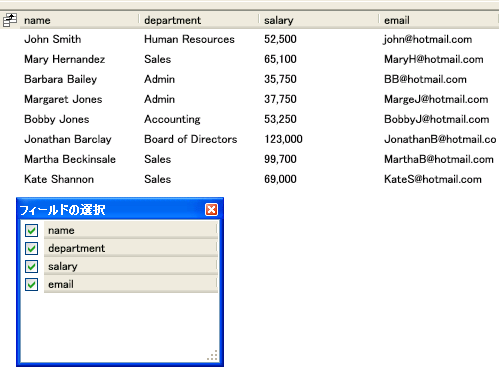

////

|metadata|
{
    "name": "xamdatapresenter-change-the-display-order-of-fields-in-the-field-chooser",
    "controlName": ["xamDataPresenter"],
    "tags": ["Editing","Layouts","Tips and Tricks"],
    "guid": "{A17372FC-ADA0-4052-9BBF-D47CD815AE07}",  
    "buildFlags": [],
    "createdOn": "2012-01-30T19:39:53.1059743Z"
}
|metadata|
////

= フィールドの選択でフィールドの表示順序を変更

link:{ApiPlatform}datapresenter{ApiVersion}~infragistics.windows.datapresenter.fieldchooser.html[FieldChooser] コントロールは、フィールドヘッダーをアルファベット順に構成します。ただし、FieldChooser コントロールの link:{ApiPlatform}datapresenter{ApiVersion}~infragistics.windows.datapresenter.fieldchooser~fielddisplayorder.html[FieldDisplayOrder] プロパティまたは link:{ApiPlatform}datapresenter{ApiVersion}~infragistics.windows.datapresenter.fieldchooser~fielddisplayordercomparer.html[FieldDisplayOrderComparer] プロパティを設定することによって、フィールド ヘッダーの順序を変更できます。FieldDisplayOrder プロパティを使用すると、アルファベット順または DataPresenter コントロールのフィールド順序に基づく順序の 2 つの共通の設定を使用してフィールドヘッダーを構成できます。一方で、FieldDisplayOrderComparer プロパティは、FieldChooser コントロール内のフィールド ヘッダーの構成に関する完全なコントロールを提供します。FieldChooser コントロールのフィールド ヘッダーに独自の並べ替えロジックを提供するには、.NET Framework. に見られる IComparer インターフェイスを実装するクラスを作成しなければなりません。

FieldChooser が公開する設定を変更する方法の詳細については、 link:xamdatapresenter-about-field-chooser-settings.html[フィールドの選択設定での作業] のトピックを参照してください。

以下のコード例は、FieldChooser コントロールでフィールドの表示順序を変更する方法を示します。

*XAML の場合:*

----
<igDP:XamDataPresenter 
    Name="xamDataPresenter1" 
    BindToSampleData="True" 
    FieldChooserOpening="OnFieldChooserOpening">
    <igDP:XamDataPresenter.FieldLayoutSettings>
        <igDP:FieldLayoutSettings HeaderPrefixAreaDisplayMode="FieldChooserButton" />
    </igDP:XamDataPresenter.FieldLayoutSettings>
</igDP:XamDataPresenter>
----

*Visual Basic の場合:*

----
Imports Infragistics.Windows.DataPresenter
Imports Infragistics.Windows.DataPresenter.Events
...
Private Sub OnFieldChooserOpening(ByVal sender As Object, ByVal e As FieldChooserOpeningEventArgs) 
    e.FieldChooser.FieldDisplayOrder = FieldChooserDisplayOrder.SameAsDataPresenter 
End Sub
----

*C# の場合:*

----
using Infragistics.Windows.DataPresenter;
using Infragistics.Windows.DataPresenter.Events;
...
private void OnFieldChooserOpening(object sender, FieldChooserOpeningEventArgs e)
{
    e.FieldChooser.FieldDisplayOrder = FieldChooserDisplayOrder.SameAsDataPresenter;
}
----

== 関連トピック

link:xamdatapresenter-about-the-field-chooser.html[フィールドの選択について]

link:xamdatapresenter-display-the-field-chooser.html[フィールドの選択の表示]

link:xamdatapresenter-about-field-chooser-settings.html[フィールドの選択の設定について]

link:xamdatapresenter-prevent-fields-from-being-hidden.html[フィールドが非表示にされることを防止する]

link:xamdatapresenter-create-an-external-field-chooser.html[外部のフィールドの選択の作成]