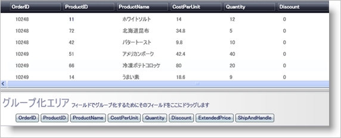

////

|metadata|
{
    "name": "xamdatapresenter-change-the-location-of-the-groupbyarea",
    "controlName": ["xamDataPresenter"],
    "tags": ["Grouping","How Do I","Layouts"],
    "guid": "{C8099EAD-2D12-456F-BC3E-8EF364113A42}",  
    "buildFlags": [],
    "createdOn": "2012-01-30T19:39:53.1079747Z"
}
|metadata|
////

= GroupByArea の位置の変更

xamDataPresenter コントロールは、デフォルトでデータの上に link:{ApiPlatform}datapresenter{ApiVersion}~infragistics.windows.datapresenter.groupbyarea.html[GroupByArea] を表示します。link:{ApiPlatform}datapresenter{ApiVersion}~infragistics.windows.datapresenter.datapresenterbase~groupbyarealocation.html[GroupByAreaLocation] プロパティを設定することによって、GroupByArea の位置を変更できます。

以下の手順は、データ バインドされた xamDataGrid があり、その GroupByArea の位置を変更しようとしていることを想定しています。詳細については、 link:xamdatapresenter-getting-started-with-xamdatapresenter.html[xamDataPresenter をアプリケーションに追加]を参照してください。

[start=1]
. 以下の XAML は xamDataPresenter のインスタンスを作成し名前を指定します。これで XAML は GroupByAreaLocation プロパティを BelowDataArea に設定します。

*XAML の場合:*

----
<igDP:XamDataPresenter x:Name="XamDataPresenter1" 
  ...
  GroupByAreaLocation="BelowDataArea"/>
----

[start=2]
. プロジェクトをビルドして実行します。一番下に group-by 領域バーがあります。それを展開すると、以下の画像のようになります。

== 関連トピック

link:xamdatapresenter-about-sorting.html[並べ替えについて]

link:xamdatapresenter-about-grouping.html[グループ化情報]

link:xamdatapresenter-sorting-and-grouping-fields-programmatically.html[フィールドのプログラムによる並べ替えおよびグループ化]

link:xamdatapresenter-modify-the-group-by-area.html[Group-By 領域の修正]

link:xamdatapresenter-create-an-external-group-by-area.html[外部の Group-By 領域の作成]

link:xamdatapresenter-disable-groupby.html[グループ化を無効にする]