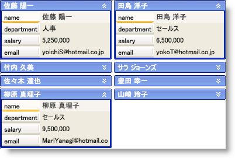

////

|metadata|
{
    "name": "xamdatapresenter-collapse-a-card",
    "controlName": ["xamDataPresenter"],
    "tags": ["Editing","How Do I","Tips and Tricks"],
    "guid": "{9933EA9D-E043-4EF7-8A47-182830E3D32C}",  
    "buildFlags": [],
    "createdOn": "2012-01-30T19:39:53.3670265Z"
}
|metadata|
////

= カードの縮小

xamDataCards™ コントロールによって、エンドユーザーはカードを縮小する (非表示にする) ことができます。これによりカードのヘッダーのみが表示されます。以下の技術のいずれかを使用してカードを縮小できます。

* link:{ApiPlatform}datapresenter{ApiVersion}~infragistics.windows.datapresenter.cardviewsettings.html[CardViewSettings] オブジェクトの link:{ApiPlatform}datapresenter{ApiVersion}~infragistics.windows.datapresenter.cardviewsettings~shouldcollapsecards.html[ShouldCollapseCards] プロパティを True に設定してすべてのカードを縮小できます。
* link:{ApiPlatform}datapresenter{ApiVersion}~infragistics.windows.datapresenter.record.html[Record] オブジェクトの link:{ApiPlatform}datapresenter{ApiVersion}~infragistics.windows.datapresenter.record~iscontainingcardcollapsed.html[IsContainingCardCollapsed] プロパティを True に設定して個々のカードを縮小できます。
* link:{ApiPlatform}datapresenter{ApiVersion}~infragistics.windows.datapresenter.datapresentercommands.html[DataPresenterCommands] クラスによって公開されている link:{ApiPlatform}datapresenter{ApiVersion}~infragistics.windows.datapresenter.datapresentercommands~togglecardcollapsedstate.html[ToggleCardCollapsedState] コマンドを実行できます。このコマンドはパラメーターとして Record オブジェクトを必要とします。これは特定のカードの縮小された状態を切り替えます。
* CardViewSettings オブジェクトの link:{ApiPlatform}datapresenter{ApiVersion}~infragistics.windows.datapresenter.cardviewsettings~collapsecardbuttonvisibility.html[CollapseCardButtonVisibility] プロパティを Visible に設定して各カードのヘッダーに縮小ボタンを表示できます。エンドユーザーはボタンをクリックして特定のカードの縮小された状態を切り替えることができます。

カードの方向を水平に設定する (つまり CardViewSettings.Orientation が Orientation.Horizontal に設定される) 場合、xamDataCards コントロールはエンドユーザーが行のすべてのカードを縮小するまで縮小されたカードの下の空のスペースを埋めるためにカードを再配置しません。ただし、カードの方向を垂直に設定する場合、次のカードを保持するのに十分なスペースがある場合には、xamDataCards コントロールは新たに縮小されたカードが使用できるスペースを埋めるためにカードを再配置します。

以下のコード例は、カードの縮小方法を示します。Button コントロールの CommandParameter プロパティは xamDataCards コントロールの link:{ApiPlatform}datapresenter{ApiVersion}~infragistics.windows.datapresenter.datapresenterbase~activerecord.html[ActiveRecord] プロパティにバインドされます。

*XAML の場合:*

----
<Button 
    Content="Collapse or Expand the Active Card" 
    Command="{x:Static igDP:DataPresenterCommands.ToggleCardCollapsedState}" 
    CommandParameter="{Binding ElementName=xamDataCards1, Path=ActiveRecord}" 
    CommandTarget="{Binding ElementName=xamDataCards1}" />
<igDP:XamDataCards Name="xamDataCards1" BindToSampleData="True"> 
    <igDP:XamDataCards.ViewSettings>
        <igDP:CardViewSettings CollapseCardButtonVisibility="Visible" ShouldCollapseCards="True" />
    </igDP:XamDataCards.ViewSettings>
</igDP:XamDataCards>
----

*Visual Basic の場合:*

----
Me.xamDataCards1.ViewSettings.CollapseCardButtonVisibility = Visibility.Visible
Me.xamDataCards1.ViewSettings.ShouldCollapseCards = True
----

*C# の場合:*

----
this.xamDataCards1.ViewSettings.CollapseCardButtonVisibility = Visibility.Visible;
this.xamDataCards1.ViewSettings.ShouldCollapseCards = true;
----

== 関連トピック

link:xamdatapresenter-about-card-settings.html[カード設定について]

link:xamdatapresenter-about-card-sizing.html[カード サイズについて]

link:xamdatapresenter-about-repositioning-animations.html[リポジション アニメーションについて]

link:xamdatapresenter-collapse-an-empty-cell.html[空のセルの縮小]

link:xamdatapresenter-set-the-maximum-number-of-viewable-cards.html[表示可能なカードの最大数の設定]

link:xamdatapresenter-set-the-space-between-cards.html[カード間のスペースの設定]

link:xamdatapresenter-working-with-card-headers.html[カード ヘッダーでの作業]