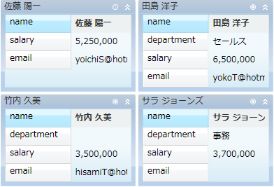

////

|metadata|
{
    "name": "xamdatapresenter-collapse-an-empty-cell",
    "controlName": ["xamDataPresenter"],
    "tags": ["Editing","How Do I","Tips and Tricks"],
    "guid": "{3DEA2677-AC6B-4D0D-8930-4FC6E04A8F5B}",  
    "buildFlags": [],
    "createdOn": "2012-01-30T19:39:53.3690269Z"
}
|metadata|
////

= 空のセルの縮小

xamDataCards™ コントロールによってエンドユーザーはカードの空のセルを縮小する (非表示にする) ことができます。以下の技術のいずれかを使用してこの機能を有効にできます。

* link:{ApiPlatform}datapresenter{ApiVersion}~infragistics.windows.datapresenter.cardviewsettings.html[CardViewSettings] オブジェクトの link:{ApiPlatform}datapresenter{ApiVersion}~infragistics.windows.datapresenter.cardviewsettings~shouldcollapseemptycells.html[ShouldCollapseEmptyCells] プロパティを True に設定してすべてのカードの空のセルを縮小できます。
* link:{ApiPlatform}datapresenter{ApiVersion}~infragistics.windows.datapresenter.record.html[Record] オブジェクトの link:{ApiPlatform}datapresenter{ApiVersion}~infragistics.windows.datapresenter.record~shouldcollapseemptycells.html[ShouldCollapseEmptyCells] プロパティを True に設定して特定のカードの空のセルを非表示にできます。
* link:{ApiPlatform}datapresenter{ApiVersion}~infragistics.windows.datapresenter.datapresentercommands.html[DataPresenterCommands] クラスによって公開されている link:{ApiPlatform}datapresenter{ApiVersion}~infragistics.windows.datapresenter.datapresentercommands~toggleemptycardcellscollapsedstate.html[ToggleEmptyCardCellsCollapsedState] コマンドを実行できます。このコマンドはパラメーターとして Record オブジェクトを必要とします。これは特定のカードの空のセルの表示/非表示を切り替えます。
* CardViewSettings オブジェクトの link:{ApiPlatform}datapresenter{ApiVersion}~infragistics.windows.datapresenter.cardviewsettings~collapseemptycellsbuttonvisibility.html[CollapseEmptyCellsButtonVisibility] プロパティを Visible に設定して各カードのヘッダーにボタンを表示できます。エンドユーザーはこのボタンをクリックして特定のカードの空のセルの表示/非表示を切り替えることができます。

link:{ApiPlatform}datapresenter{ApiVersion}~infragistics.windows.datapresenter.fieldsettings.html[FieldSettings] オブジェクトの link:{ApiPlatform}datapresenter{ApiVersion}~infragistics.windows.datapresenter.fieldsettings~collapsewhenempty.html[CollapseWhenEmpty] プロパティを False に設定することによって、エンドユーザーがフィールドのセルを縮小できないようにすることも可能です。

以下のコード例は、カードの縮小方法を示します。Button コントロールの CommandParameter プロパティは xamDataCards コントロールの link:{ApiPlatform}datapresenter{ApiVersion}~infragistics.windows.datapresenter.datapresenterbase~activerecord.html[ActiveRecord] プロパティにバインドされます。

*XAML の場合:*

----
<Button 
    Content="Collapse or Expand Empty Cells in the Active Card" 
    Command="{x:Static igDP:DataPresenterCommands.ToggleEmptyCardCellsCollapsedState}" 
    CommandParameter="{Binding ElementName=xamDataCards1, Path=ActiveRecord}" 
    CommandTarget="{Binding ElementName=xamDataCards1}" />
<igDP:XamDataCards Name="xamDataCards1" BindToSampleData="True"> 
    <igDP:XamDataCards.ViewSettings>
        <igDP:CardViewSettings CollapseEmptyCellsButtonVisibility="Visible" ShouldCollapseEmptyCells="True" />
    </igDP:XamDataCards.ViewSettings>
</igDP:XamDataCards>
----

*Visual Basic の場合:*

----
Me.xamDataCards1.ViewSettings.CollapseEmptyCellsButtonVisibility = Visibility.Visible
Me.xamDataCards1.ViewSettings.ShouldCollapseEmptyCells = True
----

*C# の場合:*

----
this.xamDataCards1.ViewSettings.CollapseEmptyCellsButtonVisibility = Visibility.Visible;
this.xamDataCards1.ViewSettings.ShouldCollapseEmptyCells = true;
----

== 関連トピック

link:xamdatapresenter-about-card-settings.html[カード設定について]

link:xamdatapresenter-about-card-sizing.html[カード サイズについて]

link:xamdatapresenter-about-repositioning-animations.html[リポジション アニメーションについて]

link:xamdatapresenter-collapse-a-card.html[カードの縮小]

link:xamdatapresenter-set-the-maximum-number-of-viewable-cards.html[表示可能なカードの最大数の設定]

link:xamdatapresenter-set-the-space-between-cards.html[カード間のスペースの設定]

link:xamdatapresenter-working-with-card-headers.html[カード ヘッダーでの作業]