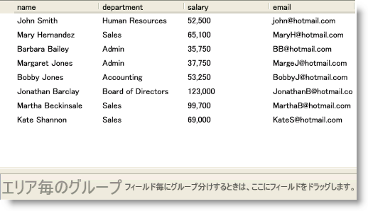

////

|metadata|
{
    "name": "xamdatapresenter-create-an-external-group-by-area",
    "controlName": ["xamDataPresenter"],
    "tags": ["Grouping","How Do I","Layouts"],
    "guid": "{4FC9C1B7-461B-42F5-A11F-486122B44CEB}",  
    "buildFlags": [],
    "createdOn": "2012-01-30T19:39:53.1199771Z"
}
|metadata|
////

= 外部の Group-By 領域の作成

DataPresenter コントロールの一番上に付けられたグループ化領域を使用する代わりに、DataPresenter コントロールを切り離して Window に外部の group-by 領域を作成することができます。link:{ApiPlatform}datapresenter{ApiVersion}~infragistics.windows.datapresenter.groupbyarea.html[GroupByArea] コントロールまたは link:{ApiPlatform}datapresenter{ApiVersion}~infragistics.windows.datapresenter.groupbyareamulti.html[GroupByAreaMulti] コントロールを Window に追加して、DataPresenter コントロールの link:{ApiPlatform}datapresenter{ApiVersion}~infragistics.windows.datapresenter.datapresenterbase~groupbyarea.html[GroupByArea] プロパティまたは link:{ApiPlatform}datapresenter{ApiVersion}~infragistics.windows.datapresenter.datapresenterbase~groupbyareamulti.html[GroupByAreaMulti] プロパティをそれぞれ設定するだけです。

GroupByArea コントロールは、エンドユーザーがデフォルトのフィールド レイアウトでフィールドを使用してレコードをグループすることだけを可能にします。エンドユーザーが group-by 領域にドラッグできるボタンとして各フィールド ヘッダーを表します。一方、GroupByAreaMulti コントロールによって、エンドユーザーは複数のフィールド レイアウトから group-by 領域にフィールド ヘッダーをドラッグできます。

[NOTE]
====
*注:* XAML で DataPresenter コントロールの GroupByArea または GroupByAreaMulti プロパティを設定している場合には、DataPresenter コントロールの宣言の前に group-by 領域コントロールの XAML 宣言を配置する必要があります。ただし、コードで DataPresenter コントロールの GroupByArea または GroupByAreaMulti プロパティを設定している場合にはこの制約は適用されません。
====

この機能を使用するときには、以下の制約を認識する必要があります:

* group-by 領域コントロールの単一のインスタンスを複数の DataPresenter コントロールに、またはその逆に接続できません。
* DataPresenter コントロールの link:{ApiPlatform}datapresenter{ApiVersion}~infragistics.windows.datapresenter.datapresenterbase~isgroupbyareaexpanded.html[IsGroupByAreaExpanded] プロパティは group-by 領域コントロールの IsExpanded プロパティと同期されます。
* ヘッダーを表示しない場合、エンドユーザーは GroupByAreaMulti コントロールを使用できなくなります。

以下の例のコードは、外部の group-by 領域を作成する方法を示します。

*XAML の場合:*

----
<DockPanel Name="dockPanel1">
    <igDP:GroupByAreaMulti Name="groupByAreaMulti1" DockPanel.Dock="Bottom" />
    <igDP:XamDataPresenter 
        Name="xamDataPresenter1" 
        BindToSampleData="True" 
        GroupByAreaMulti="{Binding ElementName=groupByAreaMulti1}">
    </igDP:XamDataPresenter>
    <!--
    DataPresenter コントロールの GroupByArea または GroupByAreaMulti プロパティをコードで指定しない限り、DataPresenter コントロールの宣言の後にグループ化領域を追加した場合に動作しません。
    -->
</DockPanel>
----

*Visual Basic の場合:*

----
Imports Infragistics.Windows.DataPresenter
...
' GroupByAreaMulti コントロールをコードでインスタンス化する必要がありません。 
' XAML で宣言し、コードで GroupByAreaMulti プロパティを設定することによって、XAML パーサーの制限を省略します。
'Dim groupByAreaMulti1 As New GroupByAreaMulti()
'Me.dockPanel1.Children.Add(groupByAreaMulti1)
'DockPanel.SetDock(groupByAreaMulti1, Dock.Bottom)
Me.xamDataPresenter1.GroupByAreaMulti = groupByAreaMulti1
...
----

*C# の場合:*

----
using Infragistics.Windows.DataPresenter;
...
// GroupByAreaMulti コントロールをコードでインスタンス化する必要がありません。 
// XAML で宣言し、コードで GroupByAreaMulti プロパティを設定することによって、XAML パーサーの制限を省略します。
//GroupByAreaMulti groupByAreaMulti1 = new GroupByAreaMulti();
//this.dockPanel1.Children.Add(groupByAreaMulti1);
//DockPanel.SetDock(groupByAreaMulti1, Dock.Bottom);
this.xamDataPresenter1.GroupByAreaMulti = groupByAreaMulti1;
...
----

== 関連トピック

link:xamdatapresenter-about-sorting.html[並べ替えについて]

link:xamdatapresenter-about-grouping.html[グループ化情報]

link:xamdatapresenter-sorting-and-grouping-fields-programmatically.html[フィールドのプログラムによる並べ替えおよびグループ化]

link:xamdatapresenter-modify-the-group-by-area.html[Group-By 領域の修正]

link:xamdatapresenter-disable-groupby.html[グループ化を無効にする]

link:xamdatapresenter-change-the-location-of-the-groupbyarea.html[GroupByArea の位置の変更]