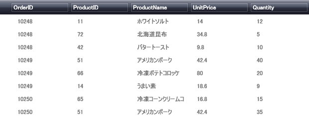

////

|metadata|
{
    "name": "xamdatapresenter-disable-groupby",
    "controlName": ["xamDataPresenter"],
    "tags": ["Grouping","How Do I"],
    "guid": "{0F1D18ED-44F3-4DB7-A54A-AE0117323C46}",  
    "buildFlags": [],
    "createdOn": "2012-01-30T19:39:53.1459823Z"
}
|metadata|
////

= グループ化を無効にする

xamDataPresenter コントロールは、データ領域の上に link:{ApiPlatform}datapresenter{ApiVersion}~infragistics.windows.datapresenter.groupbyarea.html[GroupByArea] を表示します。link:{ApiPlatform}datapresenter{ApiVersion}~infragistics.windows.datapresenter.datapresenterbase~groupbyarealocation.html[GroupByAreaLocation] プロパティを設定することによって、GroupByArea を表示しないようにすることができます。

以下の手順は、データ バインドされた xamDataPresenter があり、エンドユーザーがフィールドをグループ化できないように、GroupByArea を非表示にすることを想定しています。詳細については、 link:xamdatapresenter-getting-started-with-xamdatapresenter.html[xamDataPresenter をアプリケーションに追加]を参照してください。

[start=1]
. 以下の XAML は xamDataPresenter のインスタンスを作成し名前を指定します。これで XAML は GroupByAreaLocation プロパティを None に設定します。

*XAML の場合:*

----
<igDP:XamDataPresenter x:Name="XamDataPresenter1" 
  ...
  GroupByAreaLocation="None"/>
----

[start=2]
. プロジェクトをビルドして実行します。以下の画像のように group-by 領域なしで xamDataPresenter が表示されます。

== 関連トピック

link:xamdatapresenter-about-sorting.html[並べ替えについて]

link:xamdatapresenter-about-grouping.html[グループ化情報]

link:xamdatapresenter-sorting-and-grouping-fields-programmatically.html[フィールドのプログラムによる並べ替えおよびグループ化]

link:xamdatapresenter-modify-the-group-by-area.html[Group-By 領域の修正]

link:xamdatapresenter-create-an-external-group-by-area.html[外部の Group-By 領域の作成]

link:xamdatapresenter-change-the-location-of-the-groupbyarea.html[GroupByArea の位置の変更]