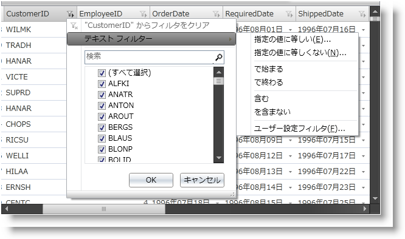

////

|metadata|
{
    "name": "xamdatapresenter-enable-excelstyle-record-filtering",
    "controlName": ["xamDataPresenter"],
    "tags": [],
    "guid": "7d03f04c-9775-446d-9486-3cbd868d0ef8",  
    "buildFlags": [],
    "createdOn": "2012-04-19T12:43:54.8894231Z"
}
|metadata|
////

= Excel スタイル レコード フィルタリングを有効にする

link:{ApiPlatform}datapresenter{ApiVersion}~infragistics.windows.datapresenter.fieldsettings.html[FieldSettings] オブジェクトの link:{ApiPlatform}datapresenter{ApiVersion}~infragistics.windows.datapresenter.fieldsettings~allowrecordfiltering.html[AllowRecordFiltering] プロパティを True に設定し、 link:{ApiPlatform}datapresenter{ApiVersion}~infragistics.windows.datapresenter.fieldsettings~filterlabelicondropdowntype.html[FilterLabelIconDropDownStyle] を MultiSelectExcelStyle に設定することによって、DataPresenter コントロールのレコード フィルタリングを有効にします。link:{ApiPlatform}datapresenter{ApiVersion}~infragistics.windows.datapresenter.fieldlayoutsettings.html[FieldLayoutSettings] オブジェクトの link:{ApiPlatform}datapresenter{ApiVersion}~infragistics.windows.datapresenter.fieldlayoutsettings~filteruitype.html[FilterUIType] プロパティを LabelIcons に設定する必要もあります。

[NOTE]
====
*注:* xamDataCarousel コントロールではフィルター レコードとフィルター アイコンを使用できません。ただし、XAML またはプロシージャ コードでフィルター条件を xamDataCarousel に追加してデータをフィルターすることができます。
====

以下のコード例は、レコード フィルタリングを有効にする方法を示します。例のコードが xamDataPresenter コントロールを使用しているとしても、xamDataGrid コントロールを代わりに使用できます。

*XAML の場合:*

----
<igDP:XamDataPresenter Name="xamDataPresenter1">
    <igDP:XamDataPresenter.FieldSettings>
        <igDP:FieldSettings AllowRecordFiltering="True"
               FilterLabelIconDropDownType="MultiSelectExcelStyle"/>
    </igDP:XamDataPresenter.FieldSettings>
    <igDP:XamDataPresenter.FieldLayoutSettings>
        <igDP:FieldLayoutSettings FilterUIType="LabelIcons"/>
    </igDP:XamDataPresenter.FieldLayoutSettings>
</igDP:XamDataPresenter>
----

*Visual Basic の場合:*

----
Me.xamDataPresenter1.FieldSettings.AllowRecordFiltering = True
Me.xamDataPresenter1.FieldSettings.FilterLabelIconDropDownType = FilterLabelIconDropDownType.MultiSelectExcelStyle
----

*C# の場合:*

----
this.xamDataPresenter1.FieldSettings.AllowRecordFiltering = true;
this.xamDataPresenter1.FieldSettings.FilterLabelIconDropDownType = FilterLabelIconDropDownType.MultiSelectExcelStyle;
----

== 関連トピック

link:xamdatapresenter-about-record-filtering.html[レコード フィルタリングについて]

link:xamdatapresenter-enable-record-filtering.html[レコード フィルタリングを有効にする]

link:xamdatapresenter-add-filter-conditions.html[フィルター条件の追加]

link:xamdatapresenter-modify-the-list-of-operators.html[演算子のリストの修正]

link:xamdatapresenter-modify-the-look-of-filtered-records.html[フィルターされたレコードの外観を修正]