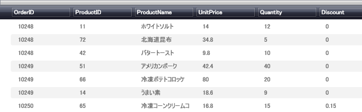

////

|metadata|
{
    "name": "xamdatapresenter-enabling-alternating-row-colors",
    "controlName": ["xamDataPresenter"],
    "tags": ["Editing","How Do I"],
    "guid": "{F7C51660-5805-478E-8F8D-87B5ED1D2403}",  
    "buildFlags": [],
    "createdOn": "2012-01-30T19:39:53.1889909Z"
}
|metadata|
////

= 隔行の色を有効にする

xamDataPresenter のグリッド ビューは、エンド ユーザーが行間の区別をより簡単にできるよう、隔行 (レコード) のスタイル化を行うことができます。この機能は、 link:{ApiPlatform}datapresenter{ApiVersion}~infragistics.windows.datapresenter.fieldlayoutsettings~highlightalternaterecords.html[HighlightAlternateRecords] プロパティを True に設定することによって、 link:{ApiPlatform}datapresenter{ApiVersion}~infragistics.windows.datapresenter.fieldlayoutsettings.html[FieldLayoutSettings] オブジェクトから簡単に有効にできます。

以下の手順は、データ バインドされた xamDataPresenterがあり、その隔行の色を有効にしたいことが前提となります。詳細については、 link:xamdatapresenter-getting-started-with-xamdatapresenter.html[xamDataPresenter をアプリケーションに追加]を参照してください。

[start=1]
. 以下の XAML は xamDataPresenter のインスタンスを作成し名前を指定します。XAML は xamDataPresenter FieldLayoutSettings オブジェクトを指定し、HighlightAlternateRecords プロパティを True に設定します。

*XAML の場合:*

----
<igDP:XamDataPresenter x:Name="XamDataPresenter1" 
  ...
  >
        <igDP:XamDataPresenter.FieldLayoutSettings>
                <igDP:FieldLayoutSettings HighlightAlternateRecords="True" />
        </igDP:XamDataPresenter.FieldLayoutSettings>
</igDP:XamDataPresenter>
----

[start=2]
. プロジェクトをビルドして実行します。以下の画像のように隔行を使用して xamDataPresenter のグリッド ビューが表示されます。

