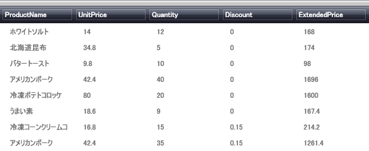

////
|metadata|
{
    "name": "xamdatapresenter-getting-started-with-xamdatapresenter",
    "controlName": ["xamDataPresenter"],
    "tags": ["Getting Started"],
    "guid": "{D7BEF284-9683-4121-8317-4ECBFE227F82}",
    "buildFlags": [],
    "createdOn": "2012-01-30T19:39:53.2159963Z"
}
|metadata|
////

= xamDataPresenter をアプリケーションに追加

このトピックは、プロシージャー コードを使用して xamDataPresenter™ コントロールを作成および追加する方法を示します。

== プロシージャー コードで xamDataPresenter を作成するには：

[start=1]
. Microsoft® Windows® Presentation Foundation Window プロジェクトを作成します。
[start=2]
. 以下の NuGet パッケージをアプリケーションに追加します。

** Infragistics.WPF.DataGrids

NuGet フィードのセットアップと NuGet パッケージの追加の詳細については、link:nuget-feeds.html[NuGet フィード] ドキュメントを参照してください。

[start=3]
. デフォルトのグリッド レイアウト パネルに名前を付けると、コード ビハインドで参照できます。

*XAML の場合:*

[source,xaml]
----
<Grid Name="layoutRoot">
</Grid>
----

[start=4]
. コード ビハインドを使用して xamDataPresenter を追加する場合、Window の Loaded イベントにイベント ハンドラーをアタッチします。

*XAML の場合:*

[source,xaml]
----
<Window ... Loaded="Window_Loaded"  ... >
----

[start=5]
. xamDataPresenter のための名前空間宣言および using/Imports のディレクティブを追加します。

*XAML の場合:*

[source,xaml]
----
xmlns:igDP="http://infragistics.com/DataPresenter"
----

*Visual Basic の場合:*

[source,vb]
----
Imports Infragistics.Windows.DataPresenter
----

*C# の場合:*

[source,csharp]
----
using Infragistics.Windows.DataPresenter;
----

[start=6]
. XAML 内またはコードビハインドの Window_Loaded イベント ハンドラー内に xamDataPresenter のインスタンスを作成します。link:{ApiPlatform}datapresenter{ApiVersion}~infragistics.windows.datapresenter.datapresenterbase~bindtosampledata.html[BindToSampleData] プロパティを True に設定します。これはサンプル データで xamDataPresenter を自動的に移植するので、データ ソースを設定せずに xamDataPresenter コントロールをプレビューできます。

*XAML の場合:*

[source,xaml]
----
<igDP:XamDataPresenter Name="xamDataPresenter1" BindToSampleData="True" />
----

*Visual Basic の場合:*

[source,vb]
----
Private xamDataPresenter1 as XamDataPresenter
xamDataPresenter1 = New XamDataPresenter()
' xamDataPresenter のインスタンスを
' 組み込みサンプル データを使用する代わりにデータ バインドできます
xamDataPresenter1.BindToSampleData = True
Me.layoutRoot.Children.Add(xamDataPresenter1)
----

*C# の場合:*

[source,csharp]
----
private XamDataPresenter xamDataPresenter1;
xamDataPresenter1 = new XamDataPresenter();
// xamDataPresenter のインスタンスを
// 組み込みサンプル データを使用する代わりにデータ バインドできます
xamDataPresenter1.BindToSampleData = true;
this.layoutRoot.Children.Add(xamDataPresenter1);
----

[start=7]
. プロジェクトを実行して、サンプル データで移植された xamDataPresenter コントロールを確認します。

== 関連トピック

link:creating-a-flat-dataset.html[フラットな DataSet の作成]

link:creating-an-objectdataprovider.html[ObjectDataProvider の作成]

link:creating-an-xmldataprovider.html[XmlDataProvider の作成]

link:using-the-data-context-for-data-binding.html[データ バインドでデータ コンテキストを使用]