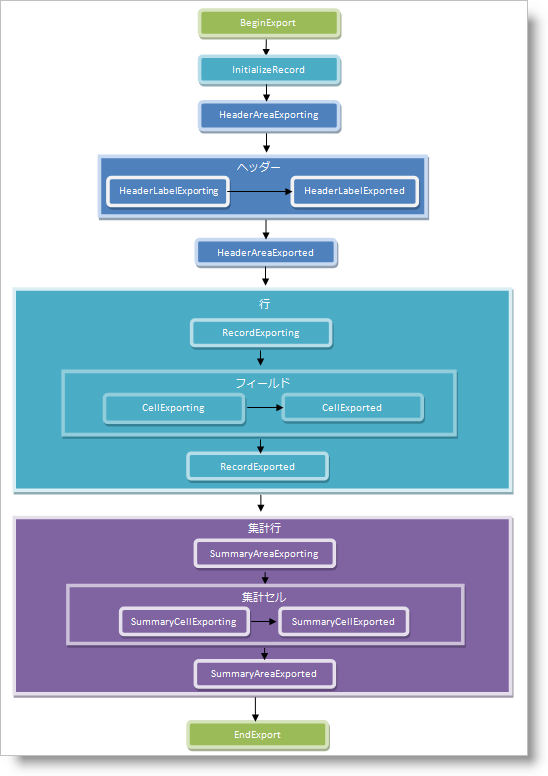

////

|metadata|
{
    "name": "xamdatapresenter-handle-exporting-events",
    "controlName": ["xamDataPresenter"],
    "tags": ["Events","Exporting"],
    "guid": "{3C83C7B1-CEDF-4E27-8955-FFD97D39CBD2}",  
    "buildFlags": [],
    "createdOn": "2012-01-30T19:39:53.2209973Z"
}
|metadata|
////

= エクスポート イベントの処理

link:{ApiPlatform}datapresenter.excelexporter{ApiVersion}~infragistics.windows.datapresenter.excelexporter.datapresenterexcelexporter.html[DataPresenterExcelExporter] オブジェクトは、エクスポート処理を変更するために処理可能なイベントをいくつか公開します。DataPresenterExcelExporter オブジェクトは、エクスポート処理中にペアでイベントを発生させます。要素をエクスポートする前に、「-ing」で終わるイベントを発生させます。要素をエクスポートした後に、「-ed」で終わる対応するイベントを発生させます。たとえば、エクスポーターがセルをエクスポートする前に、 link:{ApiPlatform}datapresenter.excelexporter{ApiVersion}~infragistics.windows.datapresenter.excelexporter.datapresenterexcelexporter~cellexporting_ev.html[CellExporting] イベントを発生させます。エクスポーターがセルをエクスポートした後に、 link:{ApiPlatform}datapresenter.excelexporter{ApiVersion}~infragistics.windows.datapresenter.excelexporter.datapresenterexcelexporter~cellexported_ev.html[CellExported] イベントを発生させます。ただし、InitializeRecord イベントはこのパターンに従いません。

「-ing」で終わるイベントによって、エクスポーターが要素をエクスポートする前にエクスポート処理を変更できます。たとえば、エクスポートをキャンセルしたり、書式設定を適用したり、エクスポートされる値を変更できます。エクスポートイベントをキャンセルする場合、エクスポーターは対応する「-ed」イベントを発生させません。たとえば、 link:{ApiPlatform}datapresenter.excelexporter{ApiVersion}~infragistics.windows.datapresenter.excelexporter.datapresenterexcelexporter~recordexporting_ev.html[RecordExporting] イベントをキャンセルする場合、エクスポーターは link:{ApiPlatform}datapresenter.excelexporter{ApiVersion}~infragistics.windows.datapresenter.excelexporter.datapresenterexcelexporter~recordexported_ev.html[RecordExported] イベントを発生させません。

以下の図は、下部に集計のあるフラットな DataPresenter コントロールをエクスポートするときに、エクスポーターが発生させるイベントの順序を示します。

エクスポーターは DataPresenter コントロールを上から下へトラバースするので、ネストしたレコード (階層的なレコードまたはグループ化レコード)、上部の集計、フィールドラベルが各セルにある場合、イベントの順序が変化する場合があります。たとえば、階層的なレコードがある場合、エクスポーターが最初の親レコードをエクスポートし、関連するイベントを発生させた後で、親レコードのネストした子のヘッダー イベントを発生させます。DataPresenter コントロールの構成でのイベントの順序を理解する最も簡単な方法は、すべてのレコードを展開した DataPresenter コントロールを描くことです。DataPresenter コントロールの上から開始し、下へと進めます。フィールドヘッダー、レコード、および集計レコードが現れる順序が、エクスポーターがそれらの要素に関連するイベントを発生させる順序です。

以下のコード例は、CellExporting イベントを処理してフォーマットをセルに適用する方法を示します。

*XAML の場合:*

----
<Window.Resources>
    <igExcelExporter:DataPresenterExcelExporter x:Key="excelExporter1" CellExporting="exporter_CellExporting" />
</Window.Resources>
----

*Visual Basic の場合:*

----
Imports Infragistics.Documents.Excel
...
Private Sub exporter_CellExporting(ByVal sender As Object, ByVal e As CellExportingEventArgs)
    e.FormatSettings.FillPattern = FillPatternStyle.Solid
    e.FormatSettings.FillPatternForegroundColor = Colors.Green
End Sub
----

*C# の場合:*

----
using Infragistics.Documents.Excel;
...
private void exporter_CellExporting(object sender, CellExportingEventArgs e)
{
    e.FormatSettings.FillPattern = FillPatternStyle.Solid;
    e.FormatSettings.FillPatternForegroundColor = Colors.Green;
}
----

== 関連トピック

link:xamdatapresenter-export-a-datapresenter-control-to-excel.html[DataPresenter コントロールを Excel にエクスポート]

link:xamdatapresenter-apply-formats-for-exporting.html[エクスポートするフォーマットを適用]

link:xamdatapresenter-exclude-datapresenter-settings-when-exporting.html[エクスポート時に DataPresenter 設定を除外]