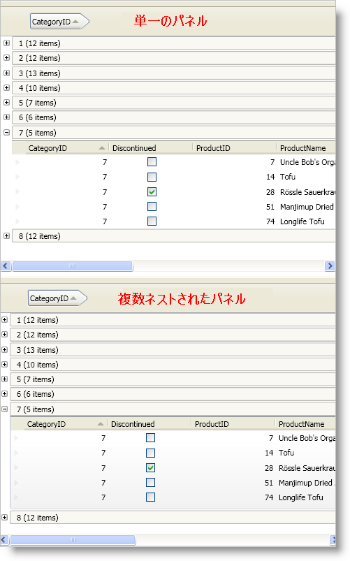

////

|metadata|
{
    "name": "xamdatapresenter-hierarchical-records-and-performance",
    "controlName": ["xamDataPresenter"],
    "tags": ["Data Binding","Performance"],
    "guid": "{AA2CCF35-28CA-41F1-BFA2-F24FA82E83E9}",  
    "buildFlags": [],
    "createdOn": "2012-01-30T19:39:53.2259983Z"
}
|metadata|
////

= 階層的なレコードとパフォーマンス

xamDataGrid™ および xamDataPresenter™ コントロールは、バージョン 9.2 以降、単一のルート レベルパネルを使用してレコードを配置します。このため、ネストしたレコードを扱うときのパフォーマンスが向上します。ただし、以下のリストに示すように、単一のパネルのアプローチには、ネストしたパネルに比べて視覚的な欠点があります。

* ネストしたレコードはクロムで囲まれません。
* ネストしたレコードを扱う link:{ApiPlatform}datapresenter{ApiVersion}~infragistics.windows.datapresenter.recordpresenter.html[RecordPresenter] オブジェクトのテンプレート内のトリガーは無視されます。
* ネストしたレコードを扱う RecordPresenter オブジェクトのテンプレート内のアニメーションは無視されます。

次のスクリーン ショットは、単一のパネルを使用する xamDataGrid コントロールとネストしたパネルを使用する xamDataGrid コントロールの違いを示しています。単一パネルのシナリオでは、グループ化レコードの子がクロムで囲まれないことに注意してください。

以下のコード例は、デフォルトの単一パネルの代わりに複数のネストしたパネルを使用する方法を示します。ネストしたパネルを使用する場合、階層的なパフォーマンスを含むシナリオではパフォーマンスが犠牲になります。パフォーマンスが犠牲になることに加え、WPF には要素のネストの深さに制限があります。そのため、エンドユーザーはネストしたレコードを (約) 10 レベルを超えてドリルダウンすることはできないでしょう。

*XAML の場合:*

----
<igDP:XamDataPresenter Name="xamDataPresenter1">
    <igDP:XamDataPresenter.View>
        <igDP:GridView>
            <igDP:GridView.ViewSettings>
                <igDP:GridViewSettings UseNestedPanels="True" />
            </igDP:GridView.ViewSettings>
        </igDP:GridView>
    </igDP:XamDataPresenter.View>
</igDP:XamDataPresenter>
<!-- xamDataGrid 用の XAML
<igDP:XamDataGrid Name="xamDataGrid1">
    <igDP:XamDataGrid.ViewSettings>
        <igDP:GridViewSettings UseNestedPanels=" />
    </igDP:XamDataGrid.ViewSettings>
</igDP:XamDataGrid>
-->
----

*Visual Basic の場合:*

----
Dim gridview1 As New Infragistics.Windows.DataPresenter.GridView()
gridview1.ViewSettings.UseNestedPanels = True
Me.xamDataPresenter1.View = gridview1
' xamDataGrid コントロールの設定を変更する
'xamDataGrid1.ViewSettings.UseNestedPanels = true;
----

*C# の場合:*

----
Infragistics.Windows.DataPresenter.GridView gridview1 = new Infragistics.Windows.DataPresenter.GridView();
gridview1.ViewSettings.UseNestedPanels = true;
this.xamDataPresenter1.View = gridview1;
// xamDataGrid コントロールの設定を変更する
//xamDataGrid1.ViewSettings.UseNestedPanels = true;
----