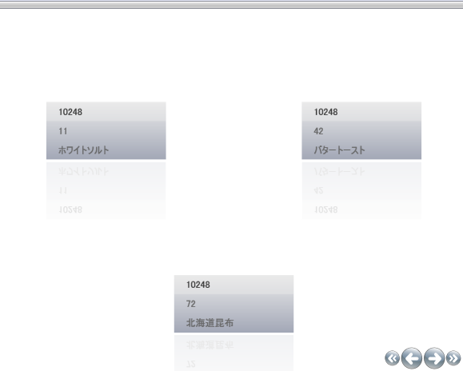

////

|metadata|
{
    "name": "xamdatapresenter-limiting-the-number-of-items-viewed-on-xamdatapresenters-path",
    "controlName": ["xamDataPresenter"],
    "tags": ["Editing","Layouts"],
    "guid": "{031E9163-4D8D-4D72-BC6E-6A4C7D405A5F}",  
    "buildFlags": [],
    "createdOn": "2012-01-30T19:39:53.2440019Z"
}
|metadata|
////

= xamDataPresenter のパス上で表示される項目数を制限

xamDataPresenter™ のカルーセル ビューはパスに沿って多数のレコードを表示します。CarouselViewSettings の link:{RootAssembly}{ApiVersion}~infragistics.windows.controls.carouselviewsettings~itemsperpage.html[ItemsPerPage] プロパティを設定することによって表示されるレコードの量を変更できます。

以下の XAML を使用して一度に 3 つのレコードを表示します。

*XAML の場合:*

----
<igDP:XamDataPresenter.View>
        <igDP:CarouselView>
                <igDP:CarouselView.ViewSettings>
                        <igWindows:CarouselViewSettings ItemsPerPage="3" />
                </igDP:CarouselView.ViewSettings>
        </igDP:CarouselView>
</igDP:XamDataPresenter.View>
----

link:xamdatapresenter-getting-started-with-xamdatapresenter.html[xamDataPresenter をアプリケーションに追加]のトピックで xamDataPresenter を開くタグ内にこのコードを配置すると、以下の画像のような結果になります。

